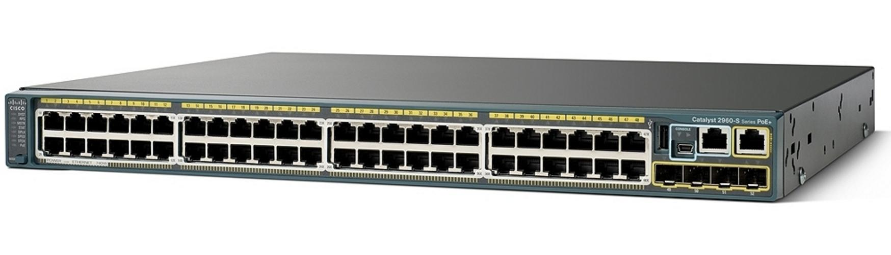
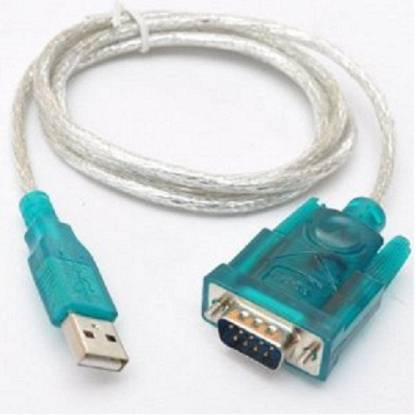

## Documentation et versions

Cisco IOS Software, Version 15.0(2)SE4 [Documentation en français](https://www.cisco.com/c/fr_ca/td/docs/switches/lan/catalyst2960/hardware/quick/guide/ol14970.html)

## Présentation

Un switch ou commutateur est un équipement de base du réseau informatique. Il travaille au niveau des couches 1 et 2 du modèle OSI, il est chargé du transport de trames entre les différentes machines auquel il est connecté. Il est composé d’une multitude de ports RJ45 destinés à être connectés aux carte réseaux de ses équipements voisins. Il utilise les adresses MAC qui sont des adresses physiques unique à chaque machine pour savoir à qui envoyer ses trames.

Pour ce faire, il a en son sein une table d’adresse MAC, qu’il remplit au fur et à mesure qu’il reçoit les trames des équipements voisins, ce qui lui permet par la suite d'éviter d’effectuer des requêtes Broadcast ( 1 vers plusieurs ) mais plutôt d’utiliser des requêtes Unicast ( 1 vers 1 ).

Un switch permet de créer un réseau virtuel appelé VLAN pour Virtual Local Area Network pour segmenter un LAN ou réseau local permettant par exemple d'interdire la communication entre deux ordinateurs présents sur le même réseau local. On implémente donc un réseau logique par dessus un réseau physique.



Il y a plusieurs manières d'accéder à l'interface du switch, certaines plus sécurisées que d'autre. Pour un environnement de production, on privilégiera l'accès par SSH, plus sécurisé et contrôlable mais qui nécessite le plus de configuration.

## Accès console

Il est permis au moyen d’un câble console DB9 vers RJ45 ou USB.




Sur Windows, une fois la connexion faite, se rendre dans le gestionnaire de périphérique, on peut trouver le port attribué dans périphériques nommé COMx. On aura ensuite besoin d'une application pour communiquer avec le port du switch. Sur windows, Putty est capable d'effectuer cela, on lancera une connexion en Serial avec le port attribué :

### Connexion cliente via Putty


## Accès Telnet

_Telnet_ pour _Terminal Network_ est un protocole qui utilise les couches TCP/IP pour communiquer sur le réseau. Il fonctionne par l'envoi et la réception de lignes de texte. Ce protocole est assez vieux, il date des débuts d'internet c'est pourquoi il n'est pas du tout sécurisé, on lui préférera le protocole SSH cependant il nécéssite beaucoup moins de configuration. On l'utilisera dans un environnement de test.

### Vlan d'administration

On doit configurer le switch pour permettre un accès à distance via une adresse IP, on doit absolument configurer un VLAN pour car un switch travaille au niveau 2 de la couche OSI et ne peut pas accepter une adresse IP.

```
Switch>en
Switch#conf t
Enter configuration commands, one per line.  End with CNTL/Z.
Switch(config)#int vlan 1
Switch(config-if)#ip address 192.168.1.10 255.255.255.0
Switch(config-if)#no shut

Switch(config-if)#
%LINK-5-CHANGED: Interface Vlan1, changed state to up

%LINEPROTO-5-UPDOWN: Line protocol on Interface Vlan1, changed state to up
```

Bien que l'adresse IP soit configurée, si on tente de se connecter au switch on obtiendra cette erreur :

```
telnet 192.168.1.10
Trying 192.168.1.10 ...Open
[Connection to 192.168.1.10 closed by foreign host]
```

### Création d'un utilisateur

```
Switch#conf t
Switch(config)#username alex secret cisco
Switch(config)#username alex privilege 15
```

On crée l'utilisateur _alex_ avec un mot de passe chiffré _cisco_, on lui donne le niveau de privilège maximum. Ensuite, on sélectionne toutes les Virtual Teletype de 0 à 15, on indique qu'elle seront utilisées avec le protocole telnet et devront utiliser l'authentification en local définie précédemment.

Lorsque l'on arrive sur le terminal, nous sommes en _User Exec Mode_ ou l'utilisateur peut taper des commandes de bases mais pour modifier la configuration du commutateur, il est nécessaire d'entrer en _Privilege Mode_, raison pour laquelle nous avons donner les privilèges maximum à l'utilisateur alex. Sans ce privilège, on resterait bloqué avec le message suivant :

```
Switch>en
% No password set
Switch>
```

[Voir la documentation de cisco sur les privilèges](https://www.cisco.com/c/en/us/td/docs/switches/lan/catalyst2960x/software/15-0_2_EX/security/configuration_guide/b_sec_152ex_2960-x_cg/b_sec_152ex_2960-x_cg_chapter_0100.html)

### Activation du protocole Telnet

Pour autoriser la connexion, on doit utiliser les VTY pour Virtual TeletYpe qui sont des interfaces en ligne de commande virtuelles. On peut autoriser plusieurs connexions simultanément en spécifiant le nombre. On précisera un utilisateur et un mot de passe et enfin le protocole à utiliser pour les connexions entrantes.

```
Switch#conf t
Switch(config)#line vty 0 15
Switch(config-line)#transport input telnet
Switch(config-line)#login local
Switch(config-line)#exit
```

### Test

On effectue un test depuis un poste connecté sur le même réseau. Sur Windows, il suffit de lancer l'invite de commande via _cmd_, et de taper le nom du protocole suivi de l'adresse IP du switch que l'on souhaite joindre :

```
telnet 192.168.1.10
Trying 192.168.1.10 ...Open

User Access Verification

Username: alex
Password:
Switch#
```

## Accès SSH

L'accès SSH est celui que l'on privilégira en production pour un accès à distance, il est le plus sécurisé mais nécessite la création d'une paire de clé privée et publique.

A noter qu'il est nécessaire de créer [Un utilisateur](#IIIa) et [un vlan d'administration](#IIIb) avec une adresse IP.

Il sera nécessaire de spécifier nom de domaine pour la création des clés ainsi qu'un nom d'hôte.

### Définir un nom d'hôte

```
Switch#conf t
Enter configuration commands, one per line.  End with CNTL/Z.
Switch(config)#hostname Sw1
```

### Définir un nom de domaine

```
Switch#conf t
Enter configuration commands, one per line.  End with CNTL/Z.
Switch(config)#ip domain-name cisco.fr
```

### Génération des paires de clés asymétriques

```
Switch#conf t
Enter configuration commands, one per line.  End with CNTL/Z.
Sw1(config)#crypto key generate rsa
The name for the keys will be: Sw1.cisco.fr
Choose the size of the key modulus in the range of 360 to 2048 for your
  General Purpose Keys. Choosing a key modulus greater than 512 may take
  a few minutes.

How many bits in the modulus [512]: 1024
% Generating 1024 bit RSA keys, keys will be non-exportable...[OK]
```

Les clés générés utilisent l'algorythme de chiffrement RSA et sont de taille 1024 bit.

### Activation du protocole SSH en version 2

```
Switch#conf t
Enter configuration commands, one per line.  End with CNTL/Z.
Sw1(config)#ip ssh version 2
Sw1(config)#line vty 0 15
Sw1(config-line)#transport input ssh
Sw1(config-line)#login local
```

### test

On effectue un test de connexion ssh avec notre ordinateur client :

```
C:\>ssh -l alex 192.168.1.10

Password:

Sw1#
```

Ou bien plus moderne :

```
C:\>ssh alex@192.168.1.10

Password:

Sw1#
```

## Configuration basique

### Commande de bases CLI

Ceci est l'écran de base d'un CLI Cisco, après avoir taper la touche _entrée_, on inscrit la commande _enable_ ou _en_ pour rentrer dans le menu principale.

```
Switch con0 is now available

Press RETURN to get started.

Switch>en
Switch#
```

Si on ne sait pas quoi taper, on peut rentrer un _?_ pour afficher les commandes disponibles :

```
Switch#?
Exec commands:
  clear       Reset functions
  clock       Manage the system clock
  configure   Enter configuration mode
  connect     Open a terminal connection
  copy        Copy from one file to another
  debug       Debugging functions (see also 'undebug')
  delete      Delete a file
  dir         List files on a filesystem
  disable     Turn off privileged commands
  disconnect  Disconnect an existing network connection
  enable      Turn on privileged commands
  erase       Erase a filesystem
  exit        Exit from the EXEC
  logout      Exit from the EXEC
  more        Display the contents of a file
  no          Disable debugging informations
  ping        Send echo messages
  reload      Halt and perform a cold restart
  resume      Resume an active network connection
  setup       Run the SETUP command facility
  show        Show running system information
--More--
Switch#
```

Puis taper la barre d'espace pour afficher le reste.

### Désactiver la recherche dns

Lorsque que l'on se trompe dans une commande, l'interface Cisco ne reconnait pas la commande et lance une recherche dans le domaine, cela a pour effet de bloquer l'interface pendant de longues secondes.

```
Switch#typo
Translating "typo"...domain server (255.255.255.255)
% Unknown command or computer name, or unable to find computer address
```

Voici comment désactiver la recherche :

```
Switch1#conf t
Enter configuration commands, one per line. End with CNTL/Z.
Switch1(config)#no ip domain-lookup
```

### Effectuer un ping

Il est possible d'effectuer ping entre des équipements de réseaux Cisco, d'un commutateur à un router par exemple.

### Adresse de passerelle

Voici comment stipuler une adresse de passerelle, utile pour effectuer des tests de ping entre équipements de réseaux différents.

```
Sw1#conf t
Enter configuration commands, one per line.  End with CNTL/Z.
Sw1(config)#ip default-gateway 192.168.1.254
```

### Sauvegarder la configuration

On peut sauvegarder notre configuration avec la commande _wr_ en mode _enable_.

## Sécuriser

### Sécuriser l'accès console

La sécurisation de l’accès au port console se fait avec la commande suivante :

```
Switch1#conf t
Switch(config)#line console 0
Switch(config-line)#password cisco
Switch(config-line)#login
```

### Sécuriser le mode Enable

L'entrée d'un mot de passe pour l’accès au mode _enable_. Pour ce faire, on se met en mode _conf t_ et on saisie la commande suivante :

```
Switch1>en
Switch1#conf t
Enter configuration commands, one per line. End with CNTL/Z.
Switch1  (config)#enable password mdpenclair
```

Comme laisse supposer le mot de passe choisi, celui-ci s’affichera en clair dans _show run_.

```
Switch1>enable
Switch1#show run
Building configuration...

Current configuration : 1072 bytes
!
version 12.2
no service timestamps log datetime msec
no service timestamps debug datetime msec
no service password-encryption
!
hostname Switch1
!
enable password mdpenclair
```

On va donc rentrer un 2ème de mot de passe chiffré celui-ci avec la commande suivante :

```
Switch1#conf t
Enter configuration commands, one per line. End with CNTL/Z.
Switch(config)#enable secret mdpchiffre
```

A nouveau dans _show run_ :

```
Switch1>enable
Switch1#show run
Building configuration...

Current configuration : 1072 bytes
!
version 12.2
no service timestamps log datetime msec
no service timestamps debug datetime msec
no service password-encryption
!
hostname Switch1
!
enable secret 5 $1$mERr$xE2TP0YuuB/G65aIdWeMu.
enable password mdpenclair
```

On voit bien nos 2 mots de passe _password_ et _enable_ mais c’est le 2ème qui sera pris en compte car il est plus sécurisé.

### Sécuriser l'accès VTY

Sécurisation de l’accès VTY **Virtual Terminal** pour une seule connexion en Telnet , mais on pourrait en autoriser plusieurs :

```
Switch#conf t
Switch(config)#username admin password telnet
Switch(config)#line vty 0
Switch(config-line)#login local
Switch(config-line)#transport input telnet
```

### Chiffrement des mots de passe

Pour chiffrés tous les mots de passes dans le mode _show run_, on fera :

```
Switch#conf t
Enter configuration commands, one per line.  End with CNTL/Z.
Switch(config)#service password-encryption
```

Dans _show run_ :

```
Switch1#sh run
Building configuration...

Current configuration : 1290 bytes
!
version 12.2
no service timestamps log datetime msec
no service timestamps debug datetime msec
service password-encryption
!
hostname Switch1
!
enable secret 5 $1$mERr$xE2TP0YuuB/G65aIdWeMu.
enable password 7 082C485E0C17061B13021E
(…)
username admin privilege 1 password 7 08354942071C11
(…)
line con 0
password 7 0822455D0A16
login
```

Tous nos mots de passe sont bien cryptés.

## Mémoires et configuration

Il y différentes mémoires au sein du commutateur :

- Une mémoire NVRAM est une mémoire RAM non volatile car elle garde ce qui a été enregistrée après extinction.
- Une mémoire DRAM pour dynamique RAM sert uniquement à l'éxecution et ne retient pas les informations.

La configuration appelée startup-config est la configuration utilisée au démarrage du switch.
La configuration dite running-config est la configuration courante utilisée par le switch.
Ainsi, au démarrage du switch, les configurations startup-config et running-config sont les mêmes.

Si une modification de configuration est réalisée, la running-config sera modifiée. Par contre, la startup-config ne sera pas modifiée. Pour modifier la configuration de démarrage, il faudra enregistrer la configuration courante (running-config) dans la startup-config.
Par conséquent, toute modification effectuée et non enregistrée sera annulée au prochain démarrage du switch.

Cette caractéristique est intéressante en cas de problème grave suite à une modification de configuration (par exemple une perte de lien). Il suffira de redémarrer le switch pour revenir à l'état précédent la modification.\*

### Afficher la configuration startup-config

```
Switch#show startup-config
Using 783 out of 65536 bytes
!
version 12.2
no service pad
service timestamps debug datetime msec
service timestamps log datetime msec
no service password-encryption
!
hostname Switch
!
boot-start-marker
boot-end-marker
--More--
```

### Afficher la configuration running-config

```
Switch#show running-config
Building configuration...

Current configuration : 783 bytes
!
version 12.2
no service pad
service timestamps debug datetime msec
service timestamps log datetime msec
no service password-encryption
!
hostname Switch
!
boot-start-marker
boot-end-marker
--More--
```

## Réinitialisation

### Mode bouton

Il y a un bouton _mode_ en façade du commutateur, on l’utilise pour réinitialiser le switch matériellement :

- Débrancher le câble d'alimentation.
- Le rebrancher tout en restant appuyé sur le _bouton mode_ jusqu’à ce que le commutateur réagisse.
- Initialiser la mémoire flash avec la commande : _flash_init_
- On va aller voir ce que contient la mémoire NVRAM avec la commande _dir flash:_ **Il ne faut surtout pas toucher au fichier c2960 car il sert pour démarrer le switch.**
  - _Config.text_ contient la configuration NVRAM.
  - _Vlan.dat_ contient la config des VLANs.
- Pour supprimer, on fait : _del flash:config.text_ et _del flash:vlan.dat_
- Redémarrer le switch avec la commande : _boot_
- On ne veut pas de l’assistant de configuration : **Would you like to enter the initial config dialog ?** Choisir _non_ car on veut le configurer soit même.
- Pour vérifier qu’il n’a plus rien sur notre switch :
  - En mode privilégié : _show running-config_ ou _sh run_ affiche la configuration présente sur la DRAM.
  - En mode privilégié : _show flash_ ou _sh flash_ affiche la configuration présente sur la NVRAM. Le fichier _config.text_ devrait être absent.
- Si on fait _wr_ puis _sh flash_, le fichier _config.text_ devrait être présent.

### Mode CLI IOS

- Pour configurer le switch en plus du mode enable, on passe en mode configuration terminal avec la commande _conf t_.
- Supprimer le _config.text_ en CLI IOS avec la commande _erase startup-config_.
- Supprimer le _vlan.dat_ avec la commande _delete flash:vlan.dat_.
- Rechargé l’IOS avec la commande _reload_ et ne pas sauvegarder la configuration car sinon on retourne en arrière. On ne veut pas sauvegarder la DRAM vers NVRAM, c’est-à-dire la running-config vers la startup-config (config.text).
- On ne veut toujours pas de l’assistant de config : **Would you like to enter the initial config dialog ?**
- Sauvegarder la config en NVRAM avec _wr_.
