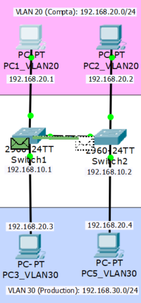

## Documentation et versions

Cisco IOS Software, Version 15.0(2)SE4 [Documentation en français](https://www.cisco.com/c/fr_ca/td/docs/switches/lan/catalyst2960/hardware/quick/guide/ol14970.html)

## Présentation

Un réseau local virtuel, communément appelé VLAN pour _Virtual Local Area Network_, est un réseau informatique logique indépendant. De nombreux VLAN peuvent coexister au sein d'un même commutateur en établissant un réseau logique virtuel par-dessus le réseau physique. Les VLAN permettent de :

- Séparer les flux.
- Segmenter et réduire la taille d'un domaine de broadcast.
- Créer un ensemble logique isolé pour améliorer la sécurité. Le seul moyen pour communiquer entre des machines appartenant à des VLAN différents est alors de passer par un routeur.

Le standard _IEEE 802.1Q_ définit le contenu de la balise de VLAN avec laquelle on complète l'en-tête de trame Ethernet. Il permet de propager plusieurs VLANs sur un même lien physique (trunk).

Par conséquent, les VLAN permettent aussi d'améliorer la gestion du réseau et d'optimiser la bande passante.

### Mise en situation

Les VLANS sont habituellement utilisées pour segmenter les fonctions d'une entreprise, on separera la production, le service informatique, la compta par des VLANS différents, ce qui permettra d'appliquer des politiques de sécurité et gestion.


Le réseau de cette entreprise est séparé en 4 réseaux IP distincts :

- Le réseau Admin qui a pour adresse de réseau : 192.168.10.0/24. Il compte seulement une machine, pc4.
- Le réseau Compta qui a pour adresse de réseau : 192.168.20.0/24. Il comporte 2 machines, pc1 et pc2.
- Le réseau Production qui a pour adresse de réseau : 192.168.30.0/24. Il compte 2 machines, pc3 et pc5.
- Le réseau de Services qui a pour adresse de réseau : 172.16.0.0/16. Il compte 3 serveurs http, dhcp, dns et 1 routeur cisco 1841.

Dans notre schéma ci-dessus, nous pouvons remarquer que pc1 et pc2 sont supposés être sur le même VLAN 20 de la comptabilité. Il nous faut donc mettre en place le VLAN 20 pour que pc1 et pc2 puissent communiquer sans que les trames broadcast des commutateur 1 et 2 n’aillent vers pc3 et pc5.

On établira les mêmes VLANs aux mêmes ports pour les commutateurs 1, 2 et 3, à savoir :

- Port 1 à 10 : VLAN 20
- Port 11 à 23 : VLAN 30
- Port 24 : VLAN 10

## Configuration

### Création des VLANs

Sur chaque commutateur, on effectuera les commandes suivantes :

```
Switch>enable
Switch#conf t
Enter configuration commands, one per line. End with CNTL/Z.
Switch(config)#int range fastEthernet 0/1-1
Switch(config-if-range)#switchport mode access
Switch(config-if-range)#switchport access vlan 20
% Access VLAN does not exist. Creating vlan 20
Switch(config-if-range)#exit
Switch(config)#vlan 20
Switch(config-vlan)#name COMPTA
```

_switchport mode access_ selectionne pour les ports concernés le _trunking mode_, ces ports ne serviront pas à faire transiter des trames inter-vlans, ce qui est le rôle des _trunks_

On répétera ces commandes pour les autres VLAN 10 et 30. Ensuite on vérifie que les VLANs ont bien été créés avec la commande « show vlan » en mode enable :

```
VLAN Name                             Status    Ports
---- -------------------------------- --------- -------------------------------
1    default                          active    Gig0/2
10   ADMIN                            active    Fa0/24
20   COMPTA                           active    Fa0/1, Fa0/2, Fa0/3, Fa0/4
                                                    Fa0/5, Fa0/6, Fa0/7, Fa0/8
                                                    Fa0/9, Fa0/10
30   PRODUCTION                       active    Fa0/11, Fa0/12, Fa0/13, Fa0/14
                                                    Fa0/15, Fa0/16, Fa0/17, Fa0/18
                                                    Fa0/19, Fa0/20, Fa0/21, Fa0/22
                                                    Fa0/23
1002 fddi-default                     active
1003 token-ring-default               active
1004 fddinet-default                  active
1005 trnet-default                    active
```

On constate que les VLANs 10, 20 & 30 ont bien été créés avec leur nom respectif et que les ports ont bien été attribués. Mais on remarque qu’il y a un VLAN par défaut, le numéro 1 qui comporte les 2 ports Gigabits. On va le supprimer et lui enlever l’attribution d’adresse IP :

```
Switch#conf t
Enter configuration commands, one per line. End with CNTL/Z.
Switch(config)#interface vlan 1
Switch(config-if)#no ip address
Switch(config-if)#shutdown
```

### Nom d'hôte et suffixe DNS

On donne un nom d'hôte et suffixe DNS :

```
Switch#conf t
Enter configuration commands, one per line. End with CNTL/Z.
Switch(config)#hostname Switch1
Switch1(config)#
```

```
Switch1#conf t
Enter configuration commands, one per line. End with CNTL/Z.
Switch1(config)#ip domain-name sio.local
```

### Port en mode Trunk

Un _trunk_ est un mode attribué à un port d'un commutateur lui permettant de faire circluer des trames de VLANs différentes, c'est donc un port inter-VLAN. Sur chaque commutateur, on dédie un ou plusieurs ports à la circulation des trames inter-VLANS. Evidemment, on prendra les ports qui sont le plus rapide vu qu'ils relient les différents réseaux. Ici on choisit les ports Gigabit 1 et 2 sur chaque Commutateur.

```
Switch1>enable
Switch1#conf t
Enter configuration commands, one per line. End with CNTL/Z.
Switch1(config)#interface range gigabitEthernet 0/1-2
Switch1(config-if-range)#switchport mode ?
access 	Set trunking mode to ACCESS unconditionally
dynamic 	Set trunking mode to dynamically negotiate
 		access or trunk mode
trunk 	Set trunking mode to TRUNK unconditionally

Switch1(config-if-range)#switchport mode trunk

%LINEPROTO-5-UPDOWN: Line protocol on Interface GigabitEthernet0/1, changed state to down

%LINEPROTO-5-UPDOWN: Line protocol on Interface GigabitEthernet0/1, changed state to up
```

Il y a 2 manières d’activer le mode Trunk, soit un mode dynamique qui se chargera de faire les changements automatiquement et le mode Trunk inconditionnel.

La commande _show run_ en mode enable permet de voir que notre configuration a bien été prise en compte :

```
Switch1>en
Switch1#sh run
Building configuration...

Current configuration : 2451 bytes
!
version 12.2
no service timestamps log datetime msec
no service timestamps debug datetime msec
no service password-encryption
!
hostname Switch1
!
!
!
no ip domain-lookup
ip domain-name sio.local
!
!
!
spanning-tree mode pvst
spanning-tree extend system-id
!
interface FastEthernet0/1
 switchport access vlan 20
 switchport mode access
!
interface FastEthernet0/2
 switchport access vlan 20
 switchport mode access
!
interface FastEthernet0/3
 switchport access vlan 20
 switchport mode access
(...)
interface FastEthernet0/22
 switchport access vlan 30
 switchport mode access
!
interface FastEthernet0/23
 switchport access vlan 30
 switchport mode access
!
interface FastEthernet0/24
 switchport access vlan 10
 switchport mode access
!
interface GigabitEthernet0/1
 switchport mode trunk
!
interface GigabitEthernet0/2
 switchport mode trunk
!
interface Vlan1
 no ip address
 shutdown
!
!
!
!
line con 0
!
line vty 0 4
 login
line vty 5 15
 login
!
!
!
!
end
```

Notre configuration est bonne.

À présent, il faut configurer le switch2 pour qu’il ait les mêmes ports attribués au mêmes VLANs que le schéma. Pour ce faire, on peut copier la configuration présente dans « sh run » et la coller dans le mode « conf t » du switch2. En revanche, cette méthode ne prend pas en compte le nom des VLANs. Il faudra donc le faire manuellement comme vu précédemment.

## Segmentation du réseau

Nos VLANs sont en place sur tous les commutateurs, on effectuera un test pour vérifier que les trames du vlan 20 ne sont pas diffusées sur les ports dédiés au vlan 30. Pour cela, on utilisera les pcs 1, 2, 3 et 5, on leur attribuera une adresse ip située dans le même réseau. On s’assurera que les PCs 1 et 2 communiquent bien ensemble au moyen de la commande _ping_.

On s’assurera également que les tables _Mac_ des commtateurs 1 et 2 et que les tables _Arp_ de pc1 et pc2 sont vides, sinon on ne verrait pas clairement que les vlans sont actifs.

### MAC - Contrôle d'accès au support

La table _mac_ d'un commutateur est un table qui permet de faire correspondre un port à un adresse _media control access_. La sous-couche de contrôle d'accès au support (MAC en français) est la moitié basse de la couche de liaison de données du modèle OSI, selon les standards de réseaux informatiques IEEE 802.x. Elle sert d'interface entre la partie logicielle contrôlant la liaison d'un nœud (Contrôle de la liaison logique) et la couche physique (matérielle). Par conséquent, elle est différente selon le type de média physique utilisé (Ethernet, Token Ring, WLAN, …)

Une adresse MAC comporte une suite de 6 octets (souvent représentée sous la forme hexadécimale 01:23:45:67:89:ab) qui identifie de façon unique chaque interface réseau.

<table>
  <tbody>
    <tr>
      <td colspan="3">Organizationally Uniquer Identifier</td>
      <td colspan="3">Universally Administered Address</td>
    </tr>
    <tr>
      <td>00</td>
      <td>1A</td>
      <td>3F</td>
      <td>F1</td>
      <td>4C</td>
      <td>C6</td>
    </tr>
  </tbody>
</table>

### ARP - Protocole de résolution d'adresse

L’Address Resolution Protocol (ARP, protocole de résolution d’adresse) est un protocole utilisé pour traduire une adresse de protocole de couche réseau (typiquement une adresse IPv4) en une adresse de protocole de couche de liaison (typiquement une adresse MAC). Il se situe à l’interface entre la couche réseau (couche 3 du modèle OSI) et la couche de liaison (couche 2 du modèle OSI). Le protocole ARP est nécessaire au fonctionnement d’IPv4 utilisé au-dessus d’un réseau de type Ethernet.

### Test sur Cisco Packet Tracer

La table MAC contient les couples d’enregistrement d’adresse MAC au ports pour que le commutateur envoit sa trame directement sur la bonne machine afin de ne pas inonder le réseau avec des trames broadcast.

```
Switch2>enable
Switch2#show mac-address-table
          Mac Address Table
-------------------------------------------

Vlan    Mac Address       Type        Ports
----    -----------       --------    -----

   1    0001.c786.6319    DYNAMIC     Gig0/2
   1    0007.ec56.0619    DYNAMIC     Gig0/1
  20    0060.472a.e2d2    DYNAMIC     Gig0/1
  20    00d0.ba24.9d58    DYNAMIC     Fa0/1
Switch2#clear mac-address-table
Switch2#show mac-address-table
Mac Address Table
-------------------------------------------

Vlan Mac Address Type Ports
---- ----------- -------- -----
```

Ici, il y 4 entrés dans la table d'addresse mac qui correspondent aux PCs 1 et 2 ( VLAN 20 ) et au commutateurs 1 et 2 ( VLAN 1 ), puis on efface la table avec la commande _clear mac-address-table_ puis on affiche la nouveau la table pour s'apercevoir qu'elle est vide.

Maintenant que la table vide, le commutateur sera obligé d'envoyer des trames broadcast c'est à dire à toutes les machines pour connaitre les emplacements de celle-ci et savoir où envoyer ses trames.

Sur pc1, on fera les commandes suivantes pour vider la table ARP :

```
PC1>arp -a
Internet Address Physical Address Type
192.168.20.2 00d0.ba24.9d58 dynamic
PC1>arp -d
PC1>arp -a
No ARP Entries Found
```

La table Arp contient des enregistrements de couple adresse IPv4 – adresse mac. Elle lui sert à ne pas inonder le réseau avec des trames broadcast.

Sur PC1, on effectue un test de ping ICMP avec PC2 en utilisant son adresse IP :

```
PC>ping 192.168.20.2

Pinging 192.168.20.2 with 32 bytes of data:

Reply from 192.168.20.2: bytes=32 time=0ms TTL=128
Reply from 192.168.20.2: bytes=32 time=0ms TTL=128
Reply from 192.168.20.2: bytes=32 time=0ms TTL=128
Reply from 192.168.20.2: bytes=32 time=0ms TTL=128

Ping statistics for 192.168.20.2:
Packets: Sent = 4, Received = 4, Lost = 0 (0% loss),
Approximate round trip times in milli-seconds:
Minimum = 0ms, Maximum = 0ms, Average = 0ms

```

Sur Cisco Packet Tracer, on peut utiliser le mode simulation et appliquer des filtres pour mieux discerner le trafic. Ici on a mis le filtre _ARP_.



<div class="framed">

#### Donnée d'entrée du commutateur 1 & 2

1. The frame source MAC address does not exist in the MAC table of Switch. Switch adds a new MAC entry to its table.
2. The frame destination MAC address is broadcast. The Switch processes the frame.
3. The frame's destination MAC address matches the receiving ports MAC address, the broadcast address, or a multicast address.
4. The device decapsulates the PDU from the Ethernet frame.
5. The frame is an ARP frame. The ARP process processes it.
6. The active VLAN interface is not up. The ARP process ignores the frame.

</div>

<div class="framed">

#### Donnée de sortie du commutateur 1 & 2

1. This is a broadcast frame. The Switch sends out the frame to all ports in the same VLAN except the receiving port.

</div>

On remarque que la trame qui provient de PC est diffusée en broadcast et que le commutateur remplit sa table MAC avec le couple d’adresse Mac-Port de PC1. Comme la trame sortant de switch 1 est broadcast, on voit clairement qu’elle ne va pas en direction de pc3 car il appartient au Vlan 30 bien que sa trame soit broadcast. On a donc la preuve que les Vlans segmentent bien le réseau.

## VTP - Vlan Truncking Protocol

Ce protocole permet de créer, modifier et supprimer des VLANs en désignant un commutateur qui sera le VTP Server ( maître ) tandis que les autres seront des VTP Client ( esclave ), permettant le transport des mêmes réglages de vlans à tous les commutateurs présents dans un même domaine de VTP. En revanche, les affections de ports au vlans ne seront pas effectuées et devront être faite individuellement sur chaque switch car elles restent des liaisons physiques et non logiques. Il faudra faire attention aux conflits en cas de plusieurs VTP Server et n’en désigner qu’un seul.

### Domaine de VTP

Affectation d'un commutateur à un domaine de VTP :

```
Switch#conf t
Enter configuration commands, one per line. End with CNTL/Z.
Switch(config)#vtp domain sio
Changing VTP domain name from NULL to sio
```

### Mot de passe VTP

Affectation du mot de passe du domaine de VTP :

```
Switch(config)#vtp password sio
Setting device VLAN database password to sio
```

### Rôle Serveur

Affectation du rôle Server ( Maître ) :

```
Switch(config)#vtp mode server
Setting device to VTP SERVER mode.
```

### Rôle Client

Affectation du rôle Client ( Esclave ) :

```
Switch(config)#vtp mode client
Setting device to VTP CLIENT mode.
```

### Rôle Transparent

Affectation du rôle Transparent, il fera suivre les fichiers VTP mais ne les utilisera pas :

```
Switch(config)#vtp mode transparent
Setting device to VTP TRANSPARENT mode.
```

Pour que les commutateurs puissent se transmettre les informations liées aux VLANs, un même nom de domaine et un même mot de passe doivent inscrits sur tous les commutateurs.as

## Conclusion

Nos commutateurs sont désormais correctement bien configurés et segmentent la circulation des trames via les VLANs, mais si une personne de la comptabilité veut communiquer avec la production, il ne pourra pas, car non seulement il n’est pas situé dans le même VLAN mais en plus il n’est pas sur le réseau IP. C’est pourquoi, il va nous falloir configurer un routeur, c'est que ce que nous allons voir dans l'article suivant : [Routeur Cisco - Routage inter VLAN et ACL](/blog/cisco/routeur-cisco-1841-routage-inter-vlan-et-acl)
