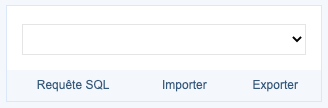
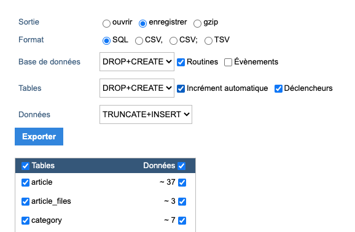

## Documentation et versions

Licence open source - [Documentation](https://mariadb.com/kb/en/documentation/)

## Présentation

MariaDB est l'une des bases de données relationnelles open source les plus populaires. Elle est conçue par les développeurs originaux de MySQL et garantie de rester open source. Elle fait partie de la plupart des offres cloud et est la base de données par défaut de la plupart des distributions Linux.

Un système de gestion de base de données (abr. SGBD) est un logiciel système servant à stocker, à manipuler ou gérer, et à partager des données dans une base de données, en garantissant la qualité, la pérennité et la confidentialité des informations, tout en cachant la complexité des opérations.

Un SGBD (en anglais DBMS pour database management system) permet d'inscrire, de retrouver, de modifier, de trier, de transformer ou d'imprimer les informations de la base de données. Il permet d'effectuer des comptes rendus des informations enregistrées et comporte des mécanismes pour assurer la cohérence des informations, éviter des pertes d'informations dues à des pannes, assurer la confidentialité et permettre son utilisation par d'autres logiciels. Selon le modèle, le SGBD peut comporter une simple interface graphique jusqu'à des langages de programmation sophistiqués.

Plus concrètement, une base de données est un service qui demeure sur un serveur et qui permet dans le cadre d'un site web de faire persister des données, c'est à dire de les maintenir dans le temps. Ces données peuvent être extraites vers une autre base de données, elles sont donc indépendentes du site web. Le port par défaut de MariaDB est le 3306.

#### Topologie

| Machine                       | OS          | Distribution  | Version | Rôle                    | Nom d'hôte | IP           |
| ----------------------------- | ----------- | ------------- | ------- | ----------------------- | ---------- | ------------ |
| Machine Virtuelle Virtual Box | GNU / Linux | Debian        | 10.5    | Serveur Web             | web1       | 192.168.1.66 |
| Machine Virtuelle Virtual Box | GNU / Linux | Debian        | 10.5    | Serveur mariaDB maître  | bdd1       | 192.168.1.66 |
| Machine Virtuelle Virtual Box | GNU / Linux | Debian        | 10.5    | Serveur mariaDB esclave | bdd1       | 192.168.1.66 |
| Dell Latitude 3500            | Windows     | 10 Entreprise | 1903    | Client Web              | L019-163   | 192.168.1.29 |

## Installation de mariaDB

### Installation des extensions sur le serveur web

En reprenant notre exemple prédécent on a donc apache2 et PHP installé sur le serveur *web1*. On doit installer sur ce serveur une extension MySQL pour php :

<AP>apt install php7.3-mysql</AP>

On va télécharger un outil de management pour base de données écrit en php et qui dispose d'une interface graphique. C'est outil s'appelle [Adminer.](https://www.adminer.org/)

On va se placer dans le dossier */var/www/html/monsite1.fr* et effectuer la commande suivante pour le télécharger :

<AP>wget https://github.com/vrana/adminer/releases/download/v4.7.7/adminer-4.7.7-mysql.php</AP>

On va renommer le fichier adminer pour plus de facilité :

<AP>mv adminer-4.7.7-mysql.php adminer.php</AP>

Par défaut, tous les fichiers présents dans le dossier *monsite1.fr* sont accessibles en ajourant un */* puis le nom du fichier à l'adresse IP ou au nom de domaine. On écrivra donc : *http://192.168.1.66/adminer.php*, on obtient cette interface :


Si on clique sur *Authentification*, on obtient le message d'erreur suivant :


Ce message est normal car les extensions MySQL ne sont pas activés dans le fichier *php.ini*. Il nous faut ouvrir le fichier suivant */etc/php/7.3/apache2/php.ini* et décommenter les lignes suivantes :

```make
;extension=curl  
;extension=fileinfo  
;extension=gd2  
;extension=gettext  
;extension=gmp  
;extension=intl  
;extension=imap  
;extension=interbase  
;extension=ldap  
;extension=mbstring  
;extension=exif ; Must be after mbstring as it depends on it  
extension=mysqli
;extension=oci8_12c ; Use with Oracle Database 12c Instant Client  
;extension=odbc  
;extension=openssl  
;extension=pdo_firebird  
extension=pdo_mysql
;extension=pdo_oci  
;extension=pdo_odbc  
;extension=pdo_pgsql  
;extension=pdo_sqlite
;extension=pgsql  
;extension=shmop
```

Puis redémarrer Apache2 :

<AP>systemctl restart apache2</AP>

Par défaut MariaDB n'admet pas les connexions depuis l'extérieur mais uniquement en localhost. Il va donc falloir changer ce comportement. On va maintenant s'occuper du serveur de base de données.

### Installation sur le serveur de base de données

Sur le serveur mariaDB *bdd1*, on installe mariaDB :

<AP>apt install mariadb-server</AP>

On va sécuriser l'accès à MySQL avec un script, en stipulant qu'on veut utiliser un mot de passe ainsi que quelques options supplémentaires :

<AP>mysql\_secure\_installation</AP>

```make
Setting the root password ensures that nobody can log into the MariaDB  
root user without the proper authorisation.  

Set root password? [Y/n] Y  
New password:  
Re-enter new password:  
Password updated successfully!  
Reloading privilege tables..  
... Success!  
#On vient de coller un mot de passe pour l'utilisateur root.

By default, a MariaDB installation has an anonymous user, allowing anyone  
to log into MariaDB without having to have a user account created for  
them. This is intended only for testing, and to make the installation  
go a bit smoother. You should remove them before moving into a  
production environment.  

Remove anonymous users? [Y/n] Y  
... Success!  
#On supprime les utilisateurs anonymes s'il y en a dans la base.  

Normally, root should only be allowed to connect from 'localhost'. This  
ensures that someone cannot guess at the root password from the network.  

Disallow root login remotely? [Y/n] Y  
... Success!  
#Pour des raisons de sécurités, on indique que l'utilisateur root ne peut pas se connecter autrement qu'en local.

By default, MariaDB comes with a database named 'test' that anyone can  
access. This is also intended only for testing, and should be removed  
before moving into a production environment.  
Remove test database and access to it? [Y/n] Y  
- Dropping test database...  
... Success!  
- Removing privileges on test database...  
... Success!  
#On supprime la base de test.  

Reloading the privilege tables will ensure that all changes made so far  
will take effect immediately.  

Reload privilege tables now? [Y/n] Y  
... Success!  
#On recharge les privilèges.
```

On vient d'interdire à l'utilisateur root de se connecter depuis l'extérieur donc il va falloir créer un utilisateur mysql qui pourra lui accéder à la bdd mysql depuis l'extérieur. On se connecte au shell MySQL avec la commande suivante, *-u* pour spécifier un utilisateur et *-p* pour spécifier un mot de passe :

<AP>mysql -u root -p</AP>

```make
Welcome to the MariaDB monitor. Commands end with ; or \g.  
Your MariaDB connection id is 36  
Server version: 10.3.23-MariaDB-0+deb10u1 Debian 10  

Copyright (c) 2000, 2018, Oracle, MariaDB Corporation Ab and others.  

Type 'help;' or '\h' for help. Type '\c' to clear the current input statement.  

MariaDB [(none)]>
```

Nous sommes maintenant dans un shell mysql et il n'accepte que des commandes SQL. Aucune base de données n'est sélectionnée, pour afficher les bases de données existante, on utilisera la commande suivante :

<AP a="SQL">show databases;</AP>

```make
+--------------------+  
| Database |  
+--------------------+  
| information_schema |  
| mysql |  
| performance_schema |  
+--------------------+  
3 rows in set (0.001 sec)  

MariaDB [(none)]>
```

Par défaut, il y a 3 bases de données :  
*mysql* - contient des tables concernant les informations requises pour fonctionnement le serveur MySQL.  
*information_schema* - fournit un accès aux metadatas des bases de données.  
*performance_schema* - est une fonctionnalité pour monitorer l'éxecution du serveur MySQL à bas niveau dans le système.

La base de données qui nous intéresse ici est *mysql*, on va donc l'utiliser :

<AP a="SQL">USE mysql;</AP>

```make
Database changed  
MariaDB [(mysql)]>
```

On va créer un utilisateur nommé *alex* qui aura le droit d'accès uniquement à la bdd mysql mais qui pourra y accéder depuis l'extérieur.

<AP a="SQL">CREATE USER 'alex'@'%' IDENTIFIED BY 'monsupermotdepasse';</AP>

Le charactère *%* sert à spécifier n'importe quelle adresse IP, mais on pourrait indiquer l'adresse de notre serveur web pour sécuriser l'accès.

<AP a="SQL">GRANT ALL PRIVILEGES ON mysql.&ast; TO 'alex'@'%';</AP>

On octroie à l'utilisateur alex tous les privilèges sur toutes les tables de la bdd mysql spécifié par *mysql.**. Ceci est du type *bdd.table* Donc on peut restreindre l'accès par table pour chaque utilisateur.

On aurait pu condenser les 2 commandes précédentes en faisant :

<AP a="SQL">GRANT ALL PRIVILEGES ON mysql.&ast; TO 'alex'@'%' identified by 'monsupermotdepasse';</AP>

On a donc créé un utilisateur mais par défaut MariaDB n'écoute qu'en localhost sur le port 3306, il va falloir modifier cela dans la configuration de MariaDB:

<AP>nano /etc/mysql/mariadb.conf.d/50-server.cnf</AP>

```make
#  
# * Basic Settings  
#  
user = mysql  
pid-file = /run/mysqld/mysqld.pid  
socket = /run/mysqld/mysqld.sock  
#port = 3306
basedir = /usr  
datadir = /var/lib/mysql  
tmpdir = /tmp  
lc-messages-dir = /usr/share/mysql  
#skip-external-locking  

# Instead of skip-networking the default is now to listen only on  
# localhost which is more compatible and is not less secure.  
*bind-address = 0.0.0.0*
```

On changera *bind-address* par *0.0.0.0* pour permettre à toutes les machines de se connecter à nos bases de données. Mais on pourrait uniquement indiquer l'adresse de nos serveurs webs. On remarque aussi que le port est commenté, dans un environnement de production on changera le port pour des raisons de sécurité.

Si on a tout configurer correctement, on devrait pouvoir se connecter avec l'utilisateur alex depuis adminer depuis la machine web.

## Importer une base de données

### Depuis Adminer

On se connecte à nos bases de données depuis le serveur web avec l'utilisateur précédemment créé nommé alex :


Cliquer sur *importer* en haut à gauche.


Puis sur *Sélect. fichiers*, choisir un fichier au format *sql*.


La base de données *bdd_vehicules* s'est correctement importée.

### Depuis le serveur en CLI

Il faut tout d'abord importer un fichier *sql* depuis l'extérieur. Par exemple :

<AP>wget https://launchpad.net/test-db/employees-db-1/1.0.6/+download/employees_db-full-1.0.6.tar.bz2</AP>

Les fichiers au format *tar.gz* sont des fichiers compressés. Voici la commande pour la décompression :

<AP>tar -xvf employees_db-full-1.0.6.tar.bz2</AP>

L'option *-x* permet d'effectuer l'extraction du fichier, l'option *-v* veut dire verbose, on veut afficher les fichiers extraits dans le terminal et l'option *-f* permet de spécifier le fichier à extraire.

Se placer dans le dossier contenant le fichier *employees_db* et effectuer cette commande pour charger la bdd dans le serveur MySQL :

<AP>mysql -u alex -p < employees.sql</AP>

Pour vérifier que la bdd s'est bien importée, faire:

<AP>mysql -u alex -p employees</AP>

```make
MariaDB [employees] Ctrl-C -- exit!
```

La bdd s'est bien importée !

## Exporter une bdd ou effectuer un dump

### Depuis Adminer

Sur le menu à gauche, cliquez sur `exporter`:



Sélectionner la sortie `enregistrer` et le format `sql`. Les options suivantes dépendent de vos besoins mais il est possible de sélectionner une à une les tables à exporter ainsi que les données associées.



### Depuis le serveur en CLI

Pour effectuer un dump de la bdd, on fera:

<AP>mysqldump -u root -p [Nom de la BDD] > [fichier de dump]</AP>

Rajouter l'option *-C* pour un dump compressé.

## Réplication sur un serveur MariaDB esclave

On veut sauvegarder les requêtes qui sont faites sur le maître vers le serveur esclave, dans le but d'effectuer une sauvegarde de notre base de données. Le mode standard est Master vers Slave mais on peut aussi utiliser une configuration Master vers Master. La réplication est basée sur les logs binaires dit journaux de transactions qui sont toutes les modifications apportées à une base de données.

### Copie de la base de donnée

Pour pouvoir effectuer une réplication correcte, on va interdire toutes les accès en écriture sur le serveur maître en attendant que la réplication soit effectuée, cependant la base restera accessible en lecture. On fera donc :

<AP a="SQL">USE employees;</AP>

<AP a="SQL">FLUSH TABLES WITH READ LOCK;</AP>

<AP>mysqldump -u root -p employees > /home/alex/employees.sql</AP>

On l'envoie le dump sur le serveur esclave avec le protocole scp qui utilise ssh.

<AP>scp /home/alex/employees.sql alex@[ipDuServeurEsclave]:/home/alex</AP>

Puis sur le sevreur esckave, on importe la base :

<AP>mysql -u alex -p < employees.sql</AP>

### Configuration coté serveur maître

Il faut configurer le serveur maître et renseigner certaines informations relatives à la réplication :

<AP>nano /etc/mysql/mariadb.cnf</AP>

```make
[mariadb]  
server_id=1  
log-bin=/var/log/mysql/mysql-bin.log  
bind-address=192.168.1.111 (Adresse IP du MASTER)  
binlog-do-db=employees
```

C'est le *server_id* le plus petit qui est considéré comme maître. On redémarre MariaDB :

<AP>systemctl restart mariadb</AP>

Nous allons créer un utilisateur, un compte de service qui sera chargé d'effectuer la réplication.

<AP a="SQL">GRANT REPLICATION SLAVE ON &ast;.&ast; TO ‘repuser’@’%’ IDENTIFIED BY 'repuser';</AP>

<AP a="SQL">FLUSH PRIVILEGES;</AP>

<AP a="SQL">SHOW MASTER STATUS;</AP>

La réplication est prête coté serveur maître. MariaDB vient de créer le fameux fichier binaire dans */var/log/mysql/*. Cette dernière commande permet d'obtenir des informations relatives au fichier binaire.

### Configuration coté serveur eslave

```make
[mariadb]  
server_id=2  
log-bin=/var/log/mysql/mysql-bin.log  
bind-address=192.168.1.111 (Adresse IP du SLAVE)  
binlog-do-db=employees
```

<AP a="SQL">CHANGE MASTER TO MASTER\_HOST='192.168.1.111’, MASTER\_USER='repuser', MASTER\_PASSWORD='repuser', MASTER\_LOG\_FILE='mysql-bin.000001', MASTER\_LOG\_POS=622;</AP>

<AP a="SQL">START SLAVE;</AP>

<AP a="SQL">SHOW SLAVE STATUS;</AP>

Si la manoeuvre a bien fonctionné, le serveur *Slave_IO_State* devrait affiché : *Waiting for master to send event*.

### Test de la réplication

Sur le serveur Master, on va autoriser à nouveau les accès en écriture sur la base de données :

<AP a="SQL">USE employees;</AP>

<AP a="SQL">UNLOCK TABLES;</AP>

On effectuer une modification de la base :

<AP a="SQL">INSERT INTO ...;</AP>

A présent sur le serveur esclave, vérifier que l'entrée a bien été répliquée :

<AP a="SQL">SELECT &ast; FROM ...;</AP>