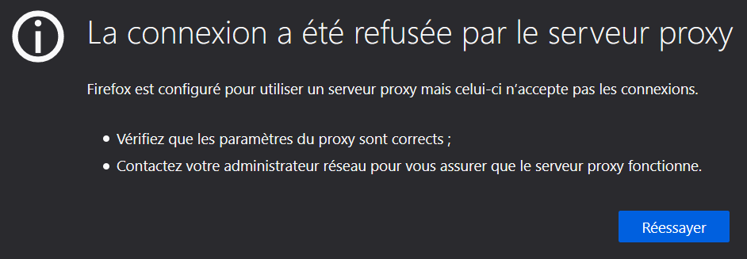

## Documentations et versions

Licence open source - 4.6 - [Squid Doc](http://www.squid-cache.org/Doc/config/) - [SquidGuard Doc](squidguard.org/Doc/)

## Présentation

### Topologie

| Machine                       | OS          | Distribution  | Version | Rôle          | Nom d'hôte | IP            |
| ----------------------------- | ----------- | ------------- | ------- | ------------- | ---------- | ------------- |
| Machine Virtuelle Virtual Box | GNU / Linux | Debian        | 10.5    | Serveur Proxy | proxy01    | 172.16.200.20 |
| Dell Latitude 3500            | Windows     | 10 Entreprise | 1903    | Client Web    | L019-163   | 172.16.1.16   |


## Installation de Squid

<AP>apt update</AP>

<AP>apt install squid</AP>

La version de Squid installée :

<AP>squid -v</AP>

<div class="code">Squid Cache: Version 4.6  
Service Name: squid  
Debian linux  
(...)</div>

Pour trouver le port d'écoute TCP de Squid :

<AP>lsof -i -P</AP>

<div class="code">COMMAND PID USER FD TYPE DEVICE SIZE/OFF NODE NAME  
squid 1013 proxy 12u IPv6 17060 0t0 TCP *:3128 (LISTEN)</div>

Squid écoute sur le port 3128 et à l'installation il a créé l'utilisateur *proxy* et le groupe du même nom :

<AP>cat /etc/passwd | grep proxy</AP>

```
proxy:x:13:13:proxy:/bin:/usr/sbin/nologin
```

## Premier test

Avant de commencer à changer le fichier de configuration, on va tester que le proxy empêche bien les sorties vers l'extérieur, pour cela on va utiliser le navigateur Firefox qui permet de spécifier l'utilisation d'un proxy assez simplement.

Sur Firefox :  
- Cliquer sur le menu déroulant en haut à droite.  
- Choisir *Options*  
- Tout en bas, cliquer sur les paramètres réseaux.  
- Choisir la *Configuration manuelle du proxy.*  
- Inscrire l'adresse IP du Squid dans *Proxy HTTP*, ne pas oublier le numéro de port qui est 3128 par défaut.  
- Cocher *Utiliser également ce proxy pour FTP et HTTPS*

On teste google.fr :



Ceci est normal pour une utilisation par défaut, il va falloir autoriser notre client dans la configuration de Squid. Ce refus a normalement a été consigné dans le fichier de log suivant : */var/log/squid/access.log*

```make
1602508853.802 0 172.16.1.16 TCP_DENIED/403 4052 CONNECT www.google.com:443 - HIER_NONE/- text/html
```

## Configuration

Le fichier de configuration se trouve dans */etc/squid/squid.conf* mais ce fichier comporte beaucoup de commentaires. On va donc en faire une copie puis le purger :

<AP>cp squid.conf squid.conf.backup</AP>

<AP>cat squid.conf.backup | grep -v ^# | grep -v ^$ > squid.conf</AP>

On ajouter ces lignes à la fin du fichier de configuration :

```make
# Utilisateur faisant les requêtes sur le serveur  
cache_effective_user proxy  
cache_effective_group proxy  

# Emplacement de stockage des données et réglage des niveaux  
cache_mem 16 MB  
cache_dir ufs /var/spool/squid 120 16 128  

# algorithme utilisé pour gérer le remplacement des objets stockés en cache  
cache_replacement_policy heap LFUDA  

# pourcentage dusage du cache à partir duquel squid commence à supprimer des objets  
cache_swap_low 80  

# pourcentage dusage du cache à partir duquel squid devient plus agressif  
cache_swap_high 90
```

Détailler les lignes ajoutées...

## Contrôle d'accès

### Accès simple

Pour autoriser nos clients à sortir, il va falloir indiquer à Squid qui à le droit de sortir au moyen de liste d'accès, appelé ACL. On teste si notre système accepte les ACL :

<AP>cat /boot/config-4.19.0-10-amd64 | grep ACL</AP>

```make
CONFIG_EXT4_FS_POSIX_ACL=y  
CONFIG_REISERFS_FS_POSIX_ACL=y  
CONFIG_JFS_POSIX_ACL=y  
CONFIG_XFS_POSIX_ACL=y  
CONFIG_BTRFS_FS_POSIX_ACL=y  
CONFIG_F2FS_FS_POSIX_ACL=y  
CONFIG_FS_POSIX_ACL=y  
CONFIG_TMPFS_POSIX_ACL=y  
CONFIG_JFFS2_FS_POSIX_ACL=y  
CONFIG_NFS_V3_ACL=y  
CONFIG_NFSD_V2_ACL=y  
CONFIG_NFSD_V3_ACL=y  
CONFIG_NFS_ACL_SUPPORT=m  
CONFIG_CEPH_FS_POSIX_ACL=y  
CONFIG_CIFS_ACL=y  
CONFIG_9P_FS_POSIX_ACL=y
```

On ajouter notre réseau à la configuration de Squid avec ces lignes au fichier *//etc/squid/squid.conf*.

```make
acl monlan src 172.16.0.0/16  
(... Entrée d'acl ...)  
http_access allow monlan
```

On autorise toutes les machines du réseau 172.16.0.0 à accéder à Internet.

<AP>systemctl reload squid</AP>

Normalement, notre client Firefox devrait pouvoir accéder à google.fr

### Accès par horaires

On peux restreindre l'accès par plage horaire, ici on cumule 2 règles, le réseau et la plage horaire :

```make
acl monlan src 172.16.0.0/16  
acl limithour time 09:00-18:00  
(... Entrée d'acl ...)  
http_access allow monlan limithour
```

### Accès par authentification

On peut contrôler l'accès des utilisateurs avec identification avec les modules suivants :  
- ldap_auth : authentification de type annuaire LDAP  
- smb_auth : authentification de type contrôleur de domaine Windows ou Samba  
- ncsa_auth : authentification par un fichier local d’utilisateurs.  

Pour un soucis de simplicité, nous allons utiliser NCSA. On va créer un fichier local pou y mettre nos utilisateurs :

<AP>touch /etc/squid/squidusers</AP>

<div class="shadow-framed mt2">

<div class="framed">

Pour utiliser la commande *htpasswd*, il faut installer apache2 :

<AP>apt install apache2</AP>

On laisse tourner Apache2 car on va en avoir besoin juste après.

</div>

</div>

<AP>htpasswd -b /etc/squid/squidusers tintin reporter</AP>

<AP>htpasswd -b /etc/squid/squidusers milou chien</AP>

```make
Adding password for user tintin  
Adding password for user milou
```

On vient de créer 2 utilisateurs, appellés tintin et milou avec leur mot de passe respectif. Puis on ajoute ces lignes au fichier de configuration :

```make
# A mettre au tout début du fichier  
auth_param basic program /usr/lib/squid3/basic_ncsa_auth /etc/squid/squidusers  
auth_param basic children 2  
auth_param basic credentialsttl 3 hours  
auth_param basic realm Squid proxy SIO2A  
authenticate_ttl 1 hour  
authenticate_ip_ttl 60 seconds  
# A mettre l’ACL juste avant celle sur le lan  
acl utilisateurs proxy_auth REQUIRED  
(... Entrée d'acl ...)  
# Mettre l’autorisation avant les autres http_access  
http_access allow utilisateurs
```

On teste avec un utilisateur que l'on vient de créer :


L'accès devrait fonctionner.

## Filtrer le trafic web avec SquidGuard

Squidguard permet de mettre en place des fonctions avancées de filtrage par l'intermédiaire d'une liste noire ou blacklist, c'est une suite de noms de domaine interdits et classés par genre. L'université de Toulouse met à jour régulièrement cette liste et la rend disponible, c'est celle que l'on utilisera ici.

<AP>apt install squidguard</AP>

<AP>cd /var/lib/squidguard/db</AP>

<AP>wget http://cri.univ-tlse1.fr/blacklists/download/blacklists.tar.gz</AP>

Le fichier télécharger est zippé, on utilise la commande *tar* pour le décompresser :

<AP>tar -xzf blacklists.tar.gz</AP>

Le fichier est décompressé dans le même dossier. on va indiquer à Squid qu'il faut rediriger son programme vers Squidguard pour effectuer un filtrage de sites. Editer */etc/squid/squid.conf*

```make
# Ajouter à la fin du fichier :  
redirect_program /usr/bin/squidGuard –c /etc/squidguard/squidGuard.conf  
redirect_children 10
```

On va ajouter des règles dans le fichier */etc/squidguard/squidGuard.conf*

```make
#  
# CONFIG FILE FOR SQUIDGUARD  
#  
# Caution: do NOT use comments inside curly braces  
#  

logdir /var/log/squidguard  
dbhome /var/lib/squidguard/db/blacklists  

src lan {  
ip 192.168.1.1-192.168.1.254  
}  

dest games {  
domainlist games/domains  
urllist games/urls  
}  

dest local{  
}  

acl {  
lan {  
pass !games all  
redirect http://localhost/proxy.html  
}  
default {  
pass local none  
}  
}
```

On reconstruit la base, c'est à dire la liste noire avec la commande suivante :

<AP>squidGuard -C all -d /var/lib/squidguard/db/blacklists</AP>

```make
2020-10-12 18:27:15 [8852] INFO: New setting: logdir: /var/log/squidguard  
2020-10-12 18:27:15 [8852] INFO: New setting: dbhome: /var/lib/squidguard/db/blacklists  
2020-10-12 18:27:15 [8852] init domainlist /var/lib/squidguard/db/blacklists/games/domains  
2020-10-12 18:27:15 [8852] INFO: create new dbfile /var/lib/squidguard/db/blacklists/games/domains.db  
2020-10-12 18:27:15 [8852] init urllist /var/lib/squidguard/db/blacklists/games/urls  
2020-10-12 18:27:15 [8852] INFO: create new dbfile /var/lib/squidguard/db/blacklists/games/urls.db  
2020-10-12 18:27:15 [8852] destblock local missing active content, set inactive  
2020-10-12 18:27:15 [8852] INFO: squidGuard 1.6.0 started (1602520035.634)  
2020-10-12 18:27:15 [8852] INFO: db update done  
2020-10-12 18:27:15 [8852] INFO: squidGuard stopped (1602520035.667)
```

L'opération s'est bien terminée !

On créé la page *proxy.html* dans le répertoire suivant */var/www/html/squidguard/proxy.html* et on y insère le code html qui suit :

```html
<!DOCTYPE html>  
<html lang="fr">  
<head>  
        <meta charset="UTF-8">  
        <title>Proxy Squid</title>  
</head>  
<body>  
        <h1>L'accès à ce site n'est pas autorisé !</h1>  
</body>  
</html>
```

On change la configuration dans Apache2 pour faire pointer vers ce fichier dans */etc/apache2/sites-available/000-default.conf*

```make
DocumentRoot /var/www/html/squidguard
```

on recharge Apache2 :

<AP>systemctl reload apache2</AP>

On change le propriétaire du dossier blacklist pour l'attribuer à l'utilisateur et au groupe *proxy* sur le dossier suivant pour permettre à Squid d'executer le filtrage et on recharge Squid.

<AP>chown -Rf proxy.proxy /var/lib/squidguard/db/blacklists</AP>

<AP>systemctl reload squid</AP>

Si on regarde les fichiers de logs de Squidguard, on voit qu'il est en attente et que la configuration est bonne.

<AP>tail /var/log/squidguard/squidGuard.log</AP>

```make
2020-10-12 19:50:27 [961] INFO: New setting: logdir: /var/log/squidguard  
2020-10-12 19:50:27 [961] INFO: New setting: dbhome: /var/lib/squidguard/db/blacklists  
2020-10-12 19:50:27 [961] init domainlist /var/lib/squidguard/db/blacklists/games/domains  
2020-10-12 19:50:27 [961] INFO: loading dbfile /var/lib/squidguard/db/blacklists/games/domains.db  
2020-10-12 19:50:27 [961] init urllist /var/lib/squidguard/db/blacklists/games/urls  
2020-10-12 19:50:27 [961] INFO: loading dbfile /var/lib/squidguard/db/blacklists/games/urls.db  
2020-10-12 19:50:27 [961] destblock local missing active content, set inactive  
2020-10-12 19:50:27 [961] INFO: squidGuard 1.6.0 started (1602525027.221)  
2020-10-12 19:50:27 [961] INFO: squidGuard ready for requests (1602525027.239)
```

On teste la connexion au site *game.fr*, on devrait être rediriger vers la page */var/www/html/proxy.html*, mais juste avant on va éxecuter une commande pour voir en direct le refus.

<AP>tail -f /var/log/squid/access.log</AP>

```make
1602533643.637 4 172.16.1.65 TCP_MISS/200 612 GET http://localhost/proxy.html asterix HIER_DIRECT/::1 text/html
```


L'utilisateur *asterix* est bien redirigé vers la page de refus lorsqu'il essaie d'atteindre *game.fr*.

## Surveiller le trafic web avec SquidAnalyzer

SquidAnalyzer est un analyseur de logs c'est à dire qu'il permet grâce à une interface web de regarder plus finement les transactions au sein de Squid et Squidguard. Il permet par exemple de voir quels sont les domaines les plus demandés, les refus de domaines, les requêtes par utilisateur, etc.  
On aura besoin d'installer Apache2 pour servir SquidAnalyzer.

## Ressources

- Liens utiles : [Construire un réseau avec Squid et Squidguard](https://www.blanche-de-peuterey.com/Un-reseau-sous-linux-avec-Debian-squid-et-squidguard)
- Voir différence entre Squid et SquidGuard : [lien](https://www.linuxquestions.org/questions/linux-server-73/difference-between-squid-and-squidguard-637754/)