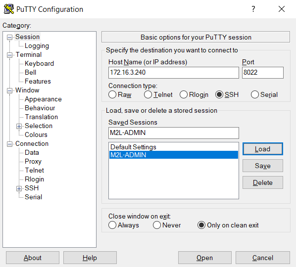
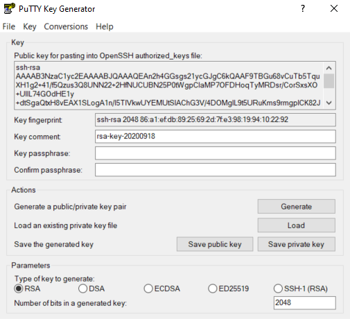
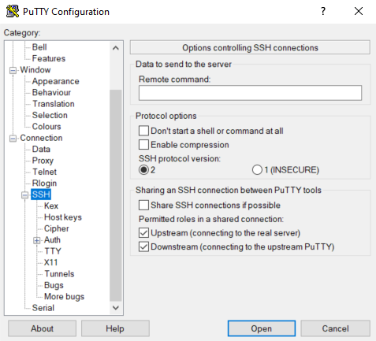
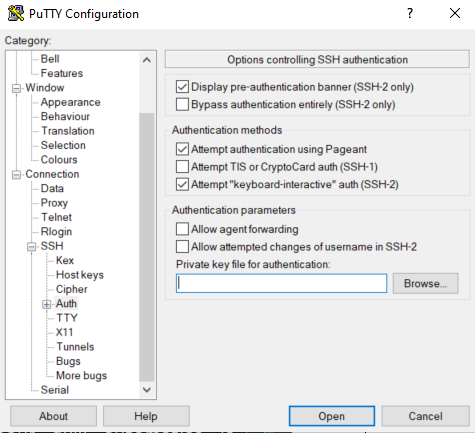
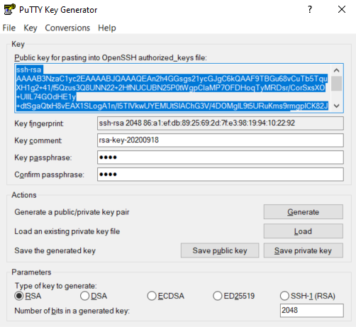

## Documentations et dépendances

Licence open source - [Documentation](https://www.openssh.com/manual.html)

Version du serveur SSH : OpenSSH_7.9p1

## Présentation

Cette procédure est réalisée dans le cadre de l'épreuve E4 du BTS Services Informatiques aux Organisations option SISR.

Il s'agit de mettre en place le protocole SSH pour l'accès de l'administrateur au serveur d'annuaire et de fichiers. L'administrateur devra se trouver dans le même réseau et donc sur le site de la maison des ligues. Le protocole SSH servira à communiquer entre le serveur et le client de manière sécurisée, l'authentification sera automatique dans un premier temps grâce à l'installation d'une clé publique du client sur le serveur, enfin on sécurisera l'ensemble avec une authentification à 2 facteurs.

**SSH** (**S**ecure **SH**ell) est un protocole de communication sécurisé de la couche 7 applicative du modèle OSI. Il permet d’effectuer des connexions sécurisées entre un client et un serveur en cryptant les données au moyen de clés de chiffrement avec une clé privée et une clé publique, cette technique est appelée chiffrement asymétrique. On obtient alors un shell distant sur un serveur. Il utilise le port 22 par défaut du protocole TCP (OSI 4). C'est la version 2 qui est actuellement utilisée de nos jours.

Le principe est le suivant, le serveur qui souhaite recevoir des données fabrique une clé publique et une clé privée. La clé publique est distribué à tous les clients qui souhaite communiquer avec le serveur, elle va servir à chiffrer les données qui ne seront lisibles qu'avec la clé privée stockées sur le serveur. Ce mécanisme garantit la confidentialité des données échangées. La clé public permet de chiffrer, alors que la clé privée permet de déchiffrer. La connaissance d'une clé ne permet pas d'en déduire l'autre. L'algorithme de chiffrement habituellement utilisé de nos jours est le RSA 4096 mais le EdDSA tend à le remplacer car plus rapide et sécurisé.

#### Topologie :

| Machine| OS | Distribution | Version | Rôle | Nom d'hôte | IP | Ports |
| ------ | -- | ------------ | ------- | ---- | ---------- | -- | ----- |
| Machine Virtuelle Virtual Box | GNU / Linux | Debian | 10.5 | Serveur ssh | ssh-server| 172.16.3.240 | 8022 |
| Dell Latitude 3500 | Windows | 10 Entreprise | 1903 | Client ssh | L019-163 | 172.16.x.x | 22 |

## Préalable - Création d'un utilisateur

Pour pouvoir se connecter au serveur, il va falloir créer cet utilisateur sur le serveur, ici dans notre exemple la debian. Il y 2 manières de créer un utilisateur.

<AP>su</AP>

La commande *su* permet de se mettre en Root, le compte administrateur de la machine. Voir l'utilisation du [groupe sudoers](/tutoriels/debian-ssh-m2l) pour une utilisation plus sécurisée des droits administrateurs.

### Script Perl adduser

**Premièrement**, par un script Perl qui pose toutes les bonnes questions :

<AP>adduser alex</AP>


```make
Ajout de l'utilisateur « alex » ...  
Ajout du nouveau groupe « alex » (1001) ...  
Ajout du nouvel utilisateur « alex » (1001) avec le groupe « alex » ...  
Création du répertoire personnel « /home/alex »...  
Copie des fichiers depuis « /etc/skel »...  
Entrez le nouveau mot de passe UNIX :  
Retapez le nouveau mot de passe UNIX :  
passwd : le mot de passe a été mis à jour avec succès  
Modification des informations relatives à l'utilisateur alex  
Entrez la nouvelle valeur ou « Entrée » pour conserver la valeur proposée  
Nom complet []: alex  
N° de bureau []: 1  
Téléphone professionnel []: +336 01 02 03 04  
Téléphone personnel []: +331 01 02 03 04  
Autre []:  
Cette information est-elle correcte ? [O/n]o
```

### useradd

**Deuxièmement**, en utilisant des commandes de plus bas niveaux avec des options pour le Home, le shell et enfin une commande pour le mot de passe :

<AP>useradd -m -s /usr/bin/bash alex</AP>

L'option *-m* permet de créer le dossier Home pour cet utilisateur et l'option *-s* permet de spécifier le shell à utiliser.

Création ou changement du mot de passe :

<AP>passwd alex</AP>

```make
Changing password for alex.  
Nouveau mot de passe :  
Retaper le nouveau mot de passe :  
Mot de passe changé.
```

Création du groupe alex :

<AP>groupadd alex</AP>

Ajout de l'utilisateur alex au groupe alex en tant que groupe principal avec l'option *-g* :

<AP>usermod -g alex alex</AP>

### Ajout au groupe sudo

On ajoute l'utilisateur alex au groupe sudo pour pouvoir effectuer des tâches d'administration avec les mêmes droits que root, en utilisant sudo devant les commandes nécéssitant une élévation.

<AP>adduser alex sudo</AP>

<div class="shadow-framed mt2">

<div class="framed">

Après s'être ajouté à un nouveau groupe, l'utilisateur doit se déconnecter et se reconnecter afin que le changement pour le nouveau groupe soit effectif. C'est une erreur assez répandue de s'ajouter à un groupe mais de ne pas ensuite se déconnecter et reconnecter, ce qui occasionne des problèmes car le groupe n'est pas encore assigné.

</div>

</div>

On vérifie que l'utilisateur créé appartient bien au groupe sudo, à partir de sa session :


<AP>su alex</AP>

<AP>groups</AP>


```make
alex cdrom floppy sudo audio dip video plugdev netdev bluetooth
```

### Vérification

Pour vérifier que ce compte a bien été créé, on peut vérifier le fichier qui comporte tous les utilisateurs et groupes nommé */etc/passwd* :

<AP>tail -1 /etc/passwd</AP>

*tail* permet d'afficher la fin d'un fichier dans la console en spécifiant le nombre de ligne, ici 1. Ce qui nous donne :

```shell
alex:x:1001:1001:Alex Dos Reis,1,+336 01 02 03 04, +331 01 02 03 04:/home/alex:/bin/bash
```

Pour info :

```make
[Nom de l'utilisateur]:[mot de passe cripté]:[userid]:[groupid]:[champ Gecos]:[home]:[shell]
```

## Installation et configuration

En principe, un serveur ssh est déjà installé sur une debian, pour vérifier cela, on peut saisir la commande suivante :

<AP>service --status-all | grep ssh</AP>

Cette commande affiche tous les services dans la console, mais grâce au charactère *|* le résultat passe au travers d'un filtre de recherche avec *grep* suivi du nom à rechercher, ce qui devrait afficher :

```
[ + ] ssh
```

Si le paquet n'est pas intallé, on procèdera au téléchargement et à l'installation du paquet :

<AP>apt install openssh-server</AP>

Le fichier du configuration de sshd se trouve ici : */etc/ssh/sshd_config*

Par défault, le serveur ssh est configuré pour une authentification par mot de passe, on va changer cela et mettre une authentification par clé publique avec un chemin à spécifier pour le dépôt de cette clé, si les 2 modes sont activés, l'authentification par clé publique prend le relais. On change le numéro de port 22 par défaut pour 8022 pour plus de sécurité.

<AP>nano /etc/ssh/sshd_config</AP>

Changer la ligne *# Port 22* en *Port 8022*.
Décommenter les lignes suivantes en supprimant le dièse :

- *PubkeyAuthentication yes*
- *AuthorizedKeysFile %h/.ssh/authorized_keys*

Si elles ne sont pas présentes, les saisir manuellement.

<div class="shadow-framed mt2">

<div class="framed">

On peut sauter cette étape si on ne veut pas qu'un client accède au serveur en Root.

Une fois l'installation terminée, on peut autoriser le client à se connecter directement en Root, pour cela il faut éditer le fichier de configuration SSHD avec l'éditeur de texte Nano mais cette pratique est déconseillée pour des raisons évidentes de sécurités :

Et changer la ligne suivante *#permitrootlogin prohibit-password* en *permitrootlogin yes*

</div>

</div>

Pour autoriser le système à lancer le service sshd à chaque démarre de la machine :

<AP>systemctl enable sshd</AP>

Puis il faut redémarrer le service SSH avec la commande :

<AP>systemctl restart sshd</AP>

On essai de se reconnecter au serveur pour vérifier que le changement de port à bien été pris en compte.

<AP>exit</AP>

<AP>ssh alex@172.16.3.240 -p 8022</AP>

## Gestion du service

Voici les commandes basiques pour gérer le service SSH :

<AP>systemctl status sshd</AP>

<AP>systemctl start sshd</AP>

<AP>systemctl stop sshd</AP>

<AP>systemctl restart sshd</AP>

<AP>systemctl reload sshd</AP>

A noter qu'il existe une difference entre *restart* et *reload*, le 1er coupe le service et redémarre alors que le 2ème rédemarre sans couper. On préférera la dernière solution pour des environnements de production.

Pour vérifier que le serveur SSH écoute bien avec le port 8022, il nous faut utiliser la commande suivante :

<AP>ss -lntp</AP>

Cette commande permet de visualiser l'état des ports et des connexions du serveur sous les systèmes Unix. L'option *-l* permet de ne lister que les ports en écoute, l'option *-n* permet d'afficher les ports de manière numérique, et non leur translation habituelle (exemple "telnet" à la place de "23") et l'option *-t* permet de ne lister que les ports TCP, l'option *-p* permet enfin de lister les processus derrière chaque ports.

```make
State Recv-Q Send-Q Local Address:Port Peer Address:Port  
LISTEN 0 128 0.0.0.0:8022 0.0.0.0:*  
LISTEN 0 128 [::]:8022 [::]:*
```

Le service *sshd* écoute sur le port 8022.

A ce stade là, l'authentification sur le serveur ne se fait qu'avec le mot de passe de l'utilisateur, ce qui assez faible en terme de sécurité. La création d'une paire de clé sur le client, puis l'envoi de cette clé publique vers le serveur dans le dossier *authorized_keys* permettrait de se passer de mot de passe, et d'utiliser la clé publique pour l'authentification. De cette manière, chacun des hôtes client et serveur auront la clé publique de l'un et de l'autre enregistrée sur leur machine.

## Connexion au serveur via un client SSH Windows

### Authentification par mot de passe

La connexion à un serveur SSH se fait via un programme de client SSH, par exemple **Putty** qui est multi-plateforme. Le client SSH a besoin du nom d’hôte ou de l’adresse IP du serveur à atteindre ainsi que le port d’écoute SSH du serveur.

[Télécharger Putty pour Windows](https://www.chiark.greenend.org.uk/~sgtatham/putty/latest.html)



Puis cliquer sur **Open** en bas.


Cette alerte est normale pour une 1ère connexion au serveur.

*Oui* mémorise la clé publique du serveur sur la machine client.  
*Non* autorise l'ouverture de session mais la question sera redemandée à la prochaine connexion.  
*Annuler* met fin à la tentative de connexion.  

Terminer sa connexion SSH proprement :

<AP>exit</AP>

### Authentification par clé publique

Sur le client Windows, ouvrir PuttyGen qui a été précédemment installé et cliqué sur *Generate*. Il faut alors bougé la souris pour générer de l'aléatoire. Une fois fini la clée est créée et il nous reste à spécifier l'algorythme de cryptage :



Le champ *Key comment* sert à donner un nom plus familier à notre clé mais n'est pas un champ important.  
Le champ *Key passphrase* sert à protéger la clé privée au moyen d'une phrase de passe, autant dire que ce n'est pas facultatif ! Il est conseillé de ne pas saisir de mots tirés du dictionnaire, de varier les charactères, majuscules, minuscules, chiffres, charactères spéciaux et au moins au nombre de 12 comme le conseille [l'ANSSI](https://www.ssi.gouv.fr/guide/mot-de-passe/).  
Enfin, en bas il faut choisir l'algorythme pour la clé publique, le *RSA* est encore beaucoup utilisé aujourd'hui car compatible sur toutes les machines, une taille de 4096 est la recommendation actuelle.  
Cependant l'algorythme *ED25519* semble avoir le vent en poupe. Il est très sécurisé et fondé sur des courbes elliptiques le rendant léger, et donc plus rapide à chiffrer, déchiffrer. Le seule bémol est qu'il n'est disponible que sur les distributions récentes, pas en dessous de Debian 8 et d'openssh 6.5 .  
Enfin il faut sauvegarder la clé privée et la clé publique avec *Save public key* et *Save private key*, il n'y a pas d'emplacement particulier pour le stockage des clés, il faut juste s'en souvenir.

Maintenant que nos clés sont prêtes, nous allons demandé à Putty de les inclure dans sa configuration pour l'authentification. Démarrer le programme Pageant, cet icône dans la barre des tâches devrait apparaitre :


Effectuer un clique-droit et selectionner *View Keys* puis *Add Key*. Renseigner le chemin de la clé privée *.ppk, la phrase de passe est demandée.


La clé privée est chargée.

Maintenant, nous allons paramétrer Putty pour qu'il automatise la connexion afin d'éviter de renseigner ses identifiants à chaque fois. Dans l'onglet *Connection* choisir l'onglet *Data* :


Dans le champ *Auto-login username*, remplir avec l'utilisateur créé sur le serveur au chapitre II.



Dans le menu *SSH*, vérifier que le protocole SSH est bien sur 2.



Dans le menu *SSH/Auth*, renseigner le chemin de la clé privée.


Dans le menu *Session*, renseigner l'adresse IP du serveur, donner un nom puis cliquer sur *Save*.

Il ne nous reste plus qu'à installer la clé publique sur le serveur, pour ce faire ouvrir Putty Key Generator ou Puttygen, choisir *Load*, renseigner la clé privée puis la phrase de passe.



Sélectionner et copier dans le presse papier, la clé qui se trouve dans le champ *Public key for pasting into OpenSSH authorized_keys file*.

Sur le serveur, créé un dossier caché dans le home de alex :

<AP>mkdir /home/alex/.ssh</AP>

Puis coller le contenu du presse papier dans un fichier nommé *authorized_keys* :

<AP>nano /home/alex/.ssh/authorized_keys</AP>

Modifier les droits sur le repertoire Home de manière à ce que l'utilisateur seulement ait les droits en lecture, écriture et exécution :

<AP>chmod 700 /home/alex</AP>

Modifier les droits sur le fichier *authorized_keys* et donner les droits de lecture, écriture uniquement par le propriétaire à l'exception de tout autre :

<AP>chmod 600 /home/alex/.ssh/authorized_keys</AP>

Tester que l'authenfication avec la clé publique fonctionne correctement.

Il ne nous reste plus qu'à désactiver l'authentification par mot de passe.

<AP>nano /etc/ssh/sshd_config</AP>

Changer la ligne suivante :  
*#PasswordAuthentication yes* en *PasswordAuthentication no*.

## Connexion au serveur via un client SSH OSX ou une distribution GNU/Linux

Que l'on soit sur une Debian ou sur la dernière version de MacOS, les commandes sont globalement les mêmes. Cela est dû au fait que Mac est basé sur le code source Unix et que GNU/Linux est inspiré d'Unix. [Plus d'infos.](https://astuces-informatique.com/quel-difference-entre-linux-et-unix/)

### Par mot de passe uniquement

La connexion à un serveur SSH peut se faire nativement avec l’invite de commande MacOs appelé <span class="text-bold">Terminal</span> qui est situé ici *Applications/Utilitaires/Terminal* ou directement ou ligne de commande :

<AP>ssh alex@172.16.3.240 -p 8022</AP>

```make
MacBookPro:~ alex$ ssh root@172.16.3.240  

The authenticity of host '172.16.3.240 (172.16.3.240)' can't be established.  
ECDSA key fingerprint is SHA256:84e/9qEypwtBtDBKZwoTjlU1BVoyil6HOOLahzOmuig.  
Are you sure you want to continue connecting (yes/no)? yes  

Warning: Permanently added '172.16.3.240' (ECDSA) to the list of known hosts.  
root@172.16.3.240's password:  

Linux debian-DNS 4.19.0-6-amd64 #1 SMP Debian 4.19.67-2+deb10u2 (2019-11-11) x86_64  

The programs included with the Debian GNU/Linux system are free software;  
the exact distribution terms for each program are described in the  
individual files in /usr/share/doc/*/copyright.  

Debian GNU/Linux comes with ABSOLUTELY NO WARRANTY, to the extent  
permitted by applicable law.  
Last login: Mon Mar 30 19:54:11 2020  
alex@ssh-server:~$
```

Si on veut se connecter avec une clé SSH au lieu d'un mot de passe :

<AP>ssh -i key.file username@ip</AP>

Terminer sa connexion SSH proprement :

<AP>exit</AP>

### Authentification par clé publique en ligne de commande

Nous allons générer la paire de clé rsa ou ed25519 :

<AP>ssh-keygen -t rsa -b 4096</AP>

<AP>ssh-keygen -t ed25519</AP>

```shell
Generating public/private ed25519 key pair.  
Enter file in which to save the key (/Users/alex/.ssh/id_ed25519):  
Enter passphrase (empty for no passphrase):  
Enter same passphrase again:  
Your identification has been saved in /Users/alex/.ssh/id_ed25519.  
Your public key has been saved in /Users/alex/.ssh/id_ed25519.pub.  
The key fingerprint is:  
SHA256:ar5c5hB01tLlstKQgz4NA7rjjac5ri+hMPGeYatw628 alex@MacBookPro  
The key's randomart image is:  
+--[ED25519 256]--+  
| . . |  
| . . . + o |  
| . = B + . |  
|. . o * = o |  
| oo + S o |  
|+.++ + . |  
|+=++o + o |  
|+.==E+ = |  
|oBB+. +.. |  
+----[SHA256]-----+
```

La paire de clés a bien été créé et déposée dans le dossier suivant : */Users/alex/.ssh*. Voici la clé publique *id_ed25519.pub* et la clé privée *id_ed25519*.

On copie maintenant la clé publique vers le home alex du serveur ssh :

<AP>cat id\_ed25519.pub | ssh alex@172.16.1.56 "mkdir -p ~/.ssh && chmod 700 ~/.ssh && cat >> ~/.ssh/authorized\_keys"</AP>

Cette commande affiche la clé publique puis l'encapsule dans la commande ssh et grâce au guillement permet de rentrer une commande: Création du dossier *.ssh*, changement des droits sur le dossier pour que seul l'utilisateur en ait l'accès, l'écriture et l'éxecution enfin affichage du *cat* dans la console mais transmis au fichier *authorized_keys*.

Essai de connection pour voir si la clé a bien été prise en compte :

<AP>ssh alex@172.16.1.56 -p 8022</AP>

```make
Enter passphrase for key '/Users/alex/.ssh/id_ed25519':  
Linux ssh-server 4.19.0-10-amd64 #1 SMP Debian 4.19.132-1 (2020-07-24) x86_64  

The programs included with the Debian GNU/Linux system are free software;  
the exact distribution terms for each program are described in the  
individual files in /usr/share/doc/*/copyright.  

Debian GNU/Linux comes with ABSOLUTELY NO WARRANTY, to the extent  
permitted by applicable law.  
alex@ssh-server:~$
```

La clé publique est bien acceptée par le serveur mais celui-ci nous demandera à chaque fois la phrase de passe, pour éviter cela il faut indiquer à l'agent ssh sur le client, de mémoriser la phrase à notre place en lui renseignant la clé privée :

<AP>ssh-add ~/.ssh/id_ed25519</AP>

```make
Enter passphrase for /Users/alex/.ssh/id_ed25519:  
Identity added: /Users/alex/.ssh/id_ed25519 (alex@MacBookPro)
```

Si la commande retourne cette phrase :

```make
Could not open a connection to your authentication agent.
```

Les commandes *ssh-add* et *ssh* requièrent une varible d'environnement pour savoir comment communiquer avec l'agent ssh. On fera donc :

<AP>eval `ssh-agent -s`</AP>

Puis on essayera à nouveau d'entrer la clé avec *ssh-add*.

Puis on retente :

<AP>ssh alex@172.16.1.56 -p 8022</AP>

```make
Linux ssh-server 4.19.0-10-amd64 #1 SMP Debian 4.19.132-1 (2020-07-24) x86_64  

The programs included with the Debian GNU/Linux system are free software;  
the exact distribution terms for each program are described in the  
individual files in /usr/share/doc/*/copyright.  

Debian GNU/Linux comes with ABSOLUTELY NO WARRANTY, to the extent  
permitted by applicable law.  
Last login: Sat Sep 19 15:18:58 2020 from 172.16.1.60  
alex@ssh-server:~$  

```

La connexion s'est effectuée sans phrase de passe !

## Authentification à 2 facteurs

Il s'agit de s'authentifier au serveur via 2 méthodes complémentaires, le mot de passe du compte utilisateur du serveur, plus un code aléatoire généré automatiquement par une application mobile et renouveller au bout d'un certain temps, ici google-authenticator. De ce fait, si le mot de passe utilisateur est compromis, il faudra aussi dérober le code déténu sur le téléphone pour accéder au serveur.

### Installation de google authenticator sur téléphone

Il y a plusieurs applications qui permettent de générer des codes, ici on choisit google authenticator. L'app devrait être disponible sur l'app store pour iPhone et Android Market pour Android. Il faudra scanner le QR code plus tard lorsqu'il sera généré sur le serveur.

### Installation de google authenticator sur le serveur

<AP>apt install libpam-google-authenticator</AP>

Le paramètrage de l'application se fait avec la commande suivante :

<AP>google-authenticator</AP>

Do you want authentication tokens to be time-based (y/n)

Il est demandé si on veut effectuer nos envois de jetons pendant une temps donné. Il faut evidemment répondre par l'affirmative, cela augmente drastiquement la sécurité puisque le code à entrer changera dans un laps de temps très court.

```make
Warning: pasting the following URL into your browser exposes the OTP secret to Google:  

https://www.google.com/chart?chs=200x200&chld=M|0&cht=qr&chl=otpauth://totp/  
alex@ssh-server%3Fsecret%3D35E4J24PAVIEN6PJJ7B6J2JBSM%26issuer%3Dssh-server
```


Ceci est l'adresse qu'a généré l'application pour accéder au QR code au cas où on ne puisse pas l'afficher correctement dans la console.


C'est le fameux QR code qu'il faut scanner avec l'app sur le téléphone.

```make
Your new secret key is: 35E4J24PAVIEN6PJJ7B6J2JBSM  

Your verification code is 245548  

Your emergency scratch codes are:  
78137403  
14779331  
41695326  
24001596  
90535367
```

Les 2 premiers codes servent à installer l'authentification sur le téléphone si on ne peut lire le QR code. Quant aux codes d'urgences, ils serviront si jamais le téléphone est perdu ou volé.

```make
Do you want me to update your "/home/alex/.google_authenticator" file? (y/n)
```

Enfin, on nous demande si on veut mettre à jour la configuration, on répond par l'affirmative.


```make
Do you want to disallow multiple uses of the same authentication  
token? This restricts you to one login about every 30s, but it increases  
your chances to notice or even prevent man-in-the-middle attacks (y/n)
```


On nous demande si le jeton d'authentification peut être utilisé plusieurs fois, on répondra non pour éviter les attaque de type man-in-the-middle.

```make
By default, a new token is generated every 30 seconds by the mobile app.  
In order to compensate for possible time-skew between the client and the server,  
we allow an extra token before and after the current time. This allows for a  
time skew of up to 30 seconds between authentication server and client. If you  
experience problems with poor time synchronization, you can increase the window  
from its default size of 3 permitted codes (one previous code, the current  
code, the next code) to 17 permitted codes (the 8 previous codes, the current  
code, and the 8 next codes). This will permit for a time skew of up to 4 minutes  
between client and server.  
Do you want to do so? (y/n)
```

Cela concerne la durée de vie des codes générées par l'application sur téléphone, par défaut les codes sont acceptés jusqu'à 1m30 après que celui-ci soit passé. Cela permet de palier à un retard dû au réseau. On nous demande si on veut ajuster ce temps à 4min, on répondra par la négative.

```make
If the computer that you are logging into isn't hardened against brute-force  
login attempts, you can enable rate-limiting for the authentication module.  
By default, this limits attackers to no more than 3 login attempts every 30s.  
Do you want to enable rate-limiting? (y/n)
```

Permet de limiter les tentatives de connexion à 3 essais toutes les 30 secondes. Permet d'éviter les attaques de type brute-force. On répondra évidemment par l'affirmative.

Enfin, il faut configurer SSH pour qu'il accepte cette nouvelle authentification. On éditera ce fichier :

<AP>nano /etc/pam.d/sshd</AP>

On ajoutera la ligne suivante : *auth required pam_google_authenticator.so*

Puis on éditera le fichier de configuration principale situé ici :

<AP>nano /etc/ssh/sshd_config</AP>

Changer *#ChallengeResponseAuthentication No* en *ChallengeResponseAuthentication Yes*, et annuler l'authentification par clé publique si elle est activée, donc :  
*PubkeyAuthentication yes* en *PubkeyAuthentication no*, enfin on redémarre le service sshd avec :

<AP>systemctl restart sshd</AP>

On effectue le test :

```make
PS C:\Users\alexandre.dosreis> ssh alex@172.16.3.240 -p 8022  
Password: Mot de passe de l'utilisateur alex
Verification code: Code délivré par le téléphone
Linux ssh-server 4.19.0-10-amd64 #1 SMP Debian 4.19.132-1 (2020-07-24) x86_64  
The programs included with the Debian GNU/Linux system are free software;  
the exact distribution terms for each program are described in the  
individual files in /usr/share/doc/*/copyright.  

Debian GNU/Linux comes with ABSOLUTELY NO WARRANTY, to the extent  
permitted by applicable law.  
Last login: Mon Dec 7 20:04:57 2020 from 172.16.1.65  
alex@ssh-server ~ 20:09 >
```

La double authentification a bien abouti !