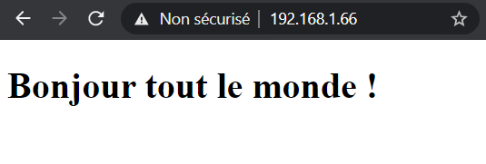
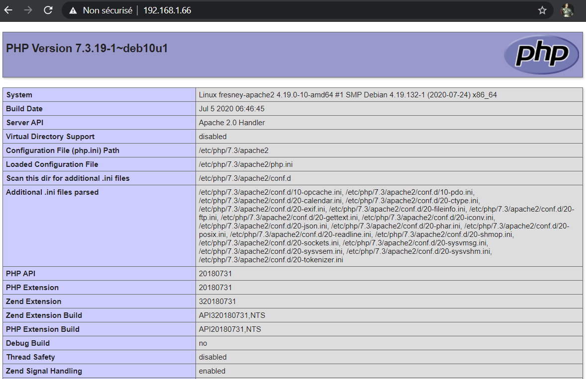
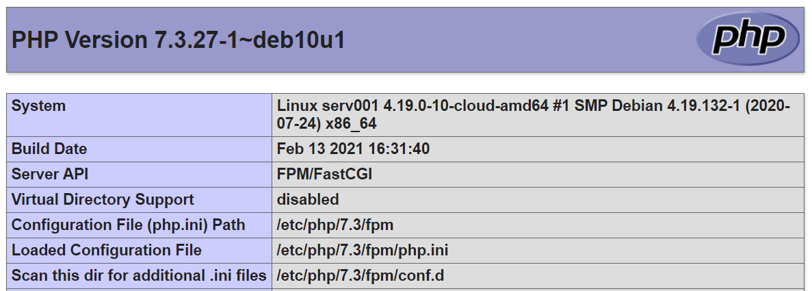

## Documentations

Licence open source - [Documentation](https://www.php.net/manual/fr/) - php 7.3

## Présentation

**Qu'est ce que PHP ?**

PHP (officiellement, ce sigle est un acronyme récursif pour PHP Hypertext Preprocessor) est un langage de scripts généraliste et Open Source, spécialement conçu pour le développement d'applications web. Il peut être intégré facilement au HTML. Bien... mais qu'est ce que cela veut dire ?

Un exemple :

```php
<!DOCTYPE html>
<html>
  <head>
    <title>Exemple</title>
  </head>
  <body>

    <?php echo "Bonjour, je suis un script PHP !"; ?>

  </body>
</html>
```

Au lieu d'utiliser des tonnes de commandes afin d'afficher du HTML (comme en C ou en Perl), les pages PHP contiennent des fragments HTML dont du code qui fait "quelque chose" (dans ce cas, il va afficher "Bonjour, je suis un script PHP !"). Le code PHP est inclus entre une balise de début _&lt;?php_ et une balise de fin _?&gt;_ qui permettent au serveur web de passer en mode PHP.

Php est exécuté coté serveur, générant ainsi le HTML, qui sera ensuite envoyé au client. Le client ne reçoit que le résultat du script, sans aucun moyen d'avoir accès au code qui a produit ce résultat. Vous pouvez configurer votre serveur web afin qu'il analyse tous vos fichiers HTML comme des fichiers PHP. Ainsi, il n'y a aucun moyen de distinguer les pages qui sont produites dynamiquement des pages statiques.

Source : [php.net](https://www.php.net/manual/fr/intro-whatis.php)

#### Topologie :

| Machine                       | OS          | Distribution  | Version | Rôle        | Nom d'hôte | IP           |
| ----------------------------- | ----------- | ------------- | ------- | ----------- | ---------- | ------------ |
| Machine Virtuelle Virtual Box | GNU / Linux | Debian        | 10.5    | Serveur Web | apache2    | 192.168.1.66 |
| Dell Latitude 3500            | Windows     | 10 Entreprise | 1903    | Client Web  | L019-163   | 192.168.1.29 |

## Installation de PHP

### Via le dépôt officiel

Pour pouvoir commencer à utiliser du code PHP dans nos pages HTML, il faut installer php, avec la commande suivante :

<AP>apt install php7.3</AP>

On peux tester que l'installation s'est bien faite en consultant la version de php installée :

<AP>php -v</AP>

```make
PHP 7.3.19-1~deb10u1 (cli) (built: Jul 5 2020 06:46:45) ( NTS )
Copyright (c) 1997-2018 The PHP Group
Zend Engine v3.3.19, Copyright (c) 1998-2018 Zend Technologies
with Zend OPcache v7.3.19-1~deb10u1, Copyright (c) 1999-2018, by Zend Technologies
```

Normalement, l'installation de PHP active le module PHP pour Apache2. On peut vérifier cela en tapant la commande :

<AP>a2query -m</AP>

```make
authz_core (enabled by maintainer script)
authn_file (enabled by maintainer script)
php7.3 (enabled by maintainer script)
status (enabled by maintainer script)
access_compat (enabled by maintainer script)
env (enabled by maintainer script)
authz_host (enabled by maintainer script)
setenvif (enabled by maintainer script)
dir (enabled by maintainer script)
auth_basic (enabled by maintainer script)
filter (enabled by maintainer script)
mime (enabled by maintainer script)
deflate (enabled by maintainer script)
negotiation (enabled by maintainer script)
mpm_prefork (enabled by maintainer script)
reqtimeout (enabled by maintainer script)
alias (enabled by maintainer script)
autoindex (enabled by maintainer script)
authn_core (enabled by maintainer script)
authz_user (enabled by maintainer script)
```

Sinon on peut redémarrer Apache2 :

<AP>systemctl restart apache2</AP>

Si on continue avec [notre exemple de l'installation d'Apache2](/blog/services-web/serveur-httpd-apache2-sous-debian-10-buster), il suffit de renommer le fichier _index.html_ contenu dans le dossier _/var/www/html/monsite1.fr/_ en _index.php_, le HTML sera rendu comme avant et notre code PHP sera interprété. Pour cela, on utilise la commande _mv_ qui sert à déplacer des fichiers et/ou à les renommer.

<AP>mv index.html index.php</AP>

Faisons un 1er exemple simple, on met notre code php dans une balise h1 :

```php
<!DOCTYPE html>
<html lang="fr">
  <head>
    <meta charset="UTF-8">
    <title>monsite1.fr</title>
  </head>
  <body>
    <h1>
    <?php
        $var = "Bonjour tout le monde !";
        echo $var;
    ?>
    </h1>
</body>
</html>

```

Notre code est bien interprété :



Faisons un 2ème exemple, plus utile avec la fonction _phpinfo()_ :

```php
<!DOCTYPE html>
<html lang="fr">
  <head>
    <meta charset="UTF-8">
    <title>monsite1.fr</title>
  </head>
  <body>

    <?php phpinfo() ?>

  </body>
</html>
```

Ce qui nous donne des informations sur la version de php, sa configuration de PHP :



Evidemment, on ne laissera pas ce fichier en production car il fournit des failles à quelqu'un de malveillant.

### Via le PPA de Ondrej Sury

Le souci avec les dépôts officiel c'est qu'ils tardent à se mettre à jour avec les dernières versions d'application car elles sont testées activement pour qu'aucun bug, ni faille de sécurité adviennent. Au moment où est rédigé cette article, php7.4 n'est pas disponible depuis le dépôt officiel, on va donc installer un PPA pour personal package archive, il faut donc faire confiance à ce dépôt avant de l'utiliser. Voir [cet article](https://vitux.com/how-to-add-ppa-repositories-in-debian/#:~:text=However%2C%20if%20the%20program%20is,their%20source%20package%20on%20it.) pour plus d'info.

[LaunchPad](https://launchpad.net) est une plateforme de collaboration pour partager des PPA, ce qui permet de se fier aux paquets que l'on télécharge.

Il y a des dépôts connus comme celui d'Ondrej Sury qui dispose de toutes les versions de php. On ajoute son dépôt à nos sources et on télécharge PHP7.4

<AP>sudo add-apt-repository ppa:ondrej/php</AP>

<AP>sudo apt-get update</AP>

<AP>sudo apt install php-7.4</AP>

### Choisir la bonne version pour la production

Les version de php officiellement supportées le sont durant une période de 2 ans. Par exemple la version 7.3 de php sera supportée jusqu'au 6 décembre 2021. Passer ce délai, il faudra passer sur la version 7.4 au plus.

[Version supportées sur le site officiel php.net](https://www.php.net/supported-versions.php)

## Configuration de PHP selon l'environnement

Pour configurer php, il faut trouver le fichier _php.ini_. D'après les informations contenus dans la fonction _phpinfo()_, le fichier de configuration principal de php se trouve dans le dossier _/etc/php/7.3/apache2/php.ini_. Ce fichier est d'une taille considérable, on n'abordera ici que les principales caractèristiques.

Ce fichier se décompose (dans sa version par défaut) en 2 grandes sections : La première décrit la configuration du "moteur" PHP alors que la seconde (désignée par le commentaire "Module settings") permet de configurer l'ensemble des extensions (optionnelles) proposées pour PHP (comme les fonctions de gestion de base de données).

Une partie de ce fichier doit particulièrement attirer votre attention. Il s'agit de la section relative au traitement des erreurs. En effet, bien qu'il puisse être pratique dans un environnement de développement ou de test, de disposer immédiatement des messages d'erreur, dans un environnement de production, il est préférable de ne pas les afficher (à la place on priviligiera l'écriture des messages d'erreur dans un fichier). En conséquence, dans un environnement de production il est recommandé d'avoir :

_display_errors = Off_, afin de ne pas afficher les erreurs (en cours d'exécution du script).  
_display_startup_errors = Off_, afin de ne pas afficher les erreurs (au lancement du script).  
_log_errors = On_, afin de stocker les erreurs dans un fichier.

Le chemin du fichier d'erreur peut être spécifié via le paramètre _error_log_. De même l'équipe PHP recommande d'avoir :  
_track_errors = Off_

## Installation de PHP FastCGI Process Manager pour Apache2

FastCGI est une technique permettant la communication entre un serveur HTTP et un logiciel indépendant. Pour notre cas, cela va déléguer le traitement du code à PHP sans utilisé le module php d'apache2 qui lui est inclus dans chaque requête ce qui ralentis les performances.

C'est ce système que l'on retrouve le plus souvent en production.

### Installation des paquets

On installe le module Fast CGI pour apache avec la commande suivante :

<AP>sudo apt install libapache2-mod-fcgid -y</AP>

Il ne reste plus qu'à installer le paquet fpm lié à PHP avec la bonne version, **ce paquet existe pour d'autre type de langage.**

<AP>sudo apt install php7.3-fpm -y</AP>

Les fichiers d'installation de FPM ont été installés dans _/etc/php/7.3/fpm_, ce dossier contient le fichier _php.ini_ qui est le fichier de configuration principale de php.

Faire une description du dossier _/etc/php/7.3/fpm_.

php7.3-fpm est un service donc il peut être géré avec toute les commandes _systemctl_.

### Configuration

Il va nous falloir dire à Apache2 de traiter les requêtes php vers php-fpm. Pour cela, on va se rendre dans la configuration d'Apache2 : _/etc/apache2/mods-available_.

On actives les modules d'apache2 suivants avec :

<AP>sudo a2enmod proxy_fcgi setenvif</AP>

On activera fpm pour un site en particulier, ici le site par défaut dans : _/etc/apache2/sites-available/000-default.conf_. On y ajoute les lignes suivantes :

```
<VirtualHost *:80>

        ServerAdmin webmaster@localhost
        DocumentRoot /var/www/html

        ErrorLog ${APACHE_LOG_DIR}/error.log
        CustomLog ${APACHE_LOG_DIR}/access.log combined

        <FilesMatch "\.php$">
                SetHandler  "proxy:unix:/var/run/php/php7.3-fpm.sock|fcgi://localhost/"
        </FilesMatch>

</VirtualHost>
```

On filtre toutes les requêtes qui appelle un fichier _.php_ et on les redirige vers le socket _php7.4-fpm.sock_.

On recharge la configuration d'apache2 avec :

<AP>sudo systemctl reload apache2</AP>

On peut tester si notre site utilise bien la nouvelle configuration avec la fonction _phpinfo()_ :



## Ressources

- [PHP-FPM : vitesse et sécurité réunies !](https://www.disko.fr/reflexions/technique/php-fpm-vitesse-securite-reunies)
- [How to Configure PHP (and PHP-FPM) for Apache on Ubuntu](https://www.youtube.com/watch?v=Z1nFb4kvuJk)
- [Module Apache mod_proxy_fcgi](https://httpd.apache.org/docs/2.4/fr/mod/mod_proxy_fcgi.html)
