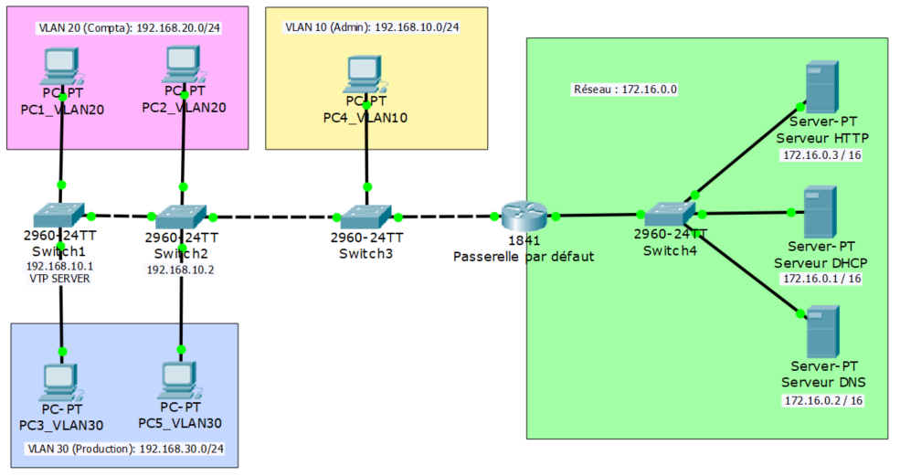

##### Cisco IOS Software, Version 15.0(2)SE4

##### [Documentation en français](https://www.cisco.com/c/fr_ca/td/docs/routers/access/1800/1841/software/configuration/guide/sw/1800over.html)

## Présentation

Un routeur travaille au niveau de la couche 3 du modèle OSI, il sert principalement à interconnecter plusieurs réseaux différents. Il utilise pour cela le protocole IP, qui détermine le parcours des données et l’adressage logique. Il est souvent utilisé comme passerelle par défaut, c’est-à-dire comme interface pour sortir du réseau et se connecter sur le réseau public (Internet). Un routeur possède au moins 2 interfaces réseaux et au moins 2 adresses IP.

## Topologie

Voici la topologie vue dans l'article précédent :



Le routeur Cisco 1841 n’ayant que 2 cartes réseaux et donc ne pouvant interconnecter que 2 réseaux différents, il va nous falloir trouver un moyen de relier les différents réseaux que constitue notre schéma de départ à savoir :

- Le réseau Admin avec pour adresse 192.168.10.0 /24
- Le réseau Compta avec pour adresse 192.168.20.0 /24
- Le réseau Production avec pour adresse 192.168.30.0 /24
- Et en dernier, le réseau de services web avec pour adresse 172.16.0.0 /16.

## Sous-interfaces de réseaux

Pour remédier au problème de limite physique, on ca créer des interfaces logiques. Cela représente donc 4 réseaux différents pour 2 cartes réseaux sur le routeur, ici dans cet exemple, nous aurons 3 sous-interfaces logiques sur 1 interface physique.
Par défaut les cartes physiques sont désactivées. Voici comment les activer :

```
Router#enable
Router#conf t
Enter configuration commands, one per line. End with CNTL/Z.
Router(config)#interface fastEthernet 0/0
Router(config-if)#no shutdown
Router(config-if)#
%LINK-5-CHANGED: Interface FastEthernet0/0, changed state to up
%LINEPROTO-5-UPDOWN: Line protocol on Interface FastEthernet0/0, changed state to up
```

### Création

On va créer 1 sous-interface sur l’interface FastEthernet 0/0, il est important que cette interface n’ait pas en elle-m$eme d’adresse IP pour que les sous-interfaces fonctionnent correctement.

```
Router#conf t
Router(config)#interface fastEthernet 0/0.10
Router(config-subif)#description VLAN 10 ADMIN
Router(config-subif)#encapsulation dot1Q 10
Router(config-subif)#ip address 192.168.10.254 255.255.255.0
Router(config-subif)#exit
```

On répètera cette opération 2 fois pour créer les 2 autres sous interfaces de réseaux Compta et Production. Une fois cela fait, on peut voir notre configuration dans « sh run » :

```
interface FastEthernet0/0
no ip address
duplex auto
speed auto
!
interface FastEthernet0/0.10
description VLAN 10 ADMIN
encapsulation dot1Q 10
ip address 192.168.10.254 255.255.255.0
!
interface FastEthernet0/0.20
description VLAN 20 COMPTA
encapsulation dot1Q 20
ip address 192.168.20.254 255.255.255.0
!
interface FastEthernet0/0.30
description VLAN 30 PRODUCTION
encapsulation dot1Q 30
ip address 192.168.30.254 255.255.255.0
```

### Test

On devrait pouvoir effectuer un ping entre pc1 et pc3 mais il faut indiquer à pc1 l’adresse IP de sa passerelle par défaut ( Gateway ) pour que pc1 puisse sortir de son réseau. La sous interface du routeur fait office de passerelle par défaut :

```
PC1>ping 192.168.30.1

Pinging 192.168.30.1 with 32 bytes of data:

Reply from 192.168.30.1: bytes=32 time=0ms TTL=127
Reply from 192.168.30.1: bytes=32 time=0ms TTL=127
Reply from 192.168.30.1: bytes=32 time=0ms TTL=127
Reply from 192.168.30.1: bytes=32 time=0ms TTL=127

Ping statistics for 192.168.30.1:
Packets: Sent = 4, Received = 4, Lost = 0 (0% loss),
Approximate round trip times in milli-seconds:
Minimum = 0ms, Maximum = 0ms, Average = 0ms
```

Enfin, on affectera le réseau de service web à la 2ème interface réseau puis on effectuera un ping entre pc1 et le serveur DHCP.

```
PC1>ping 172.16.0.1

Pinging 172.16.0.1 with 32 bytes of data:

Reply from 172.16.0.1: bytes=32 time=0ms TTL=127
Reply from 172.16.0.1: bytes=32 time=0ms TTL=127
Reply from 172.16.0.1: bytes=32 time=0ms TTL=127
Reply from 172.16.0.1: bytes=32 time=0ms TTL=127

Ping statistics for 172.16.0.1:
Packets: Sent = 4, Received = 4, Lost = 0 (0% loss),
Approximate round trip times in milli-seconds:
Minimum = 0ms, Maximum = 0ms, Average = 0ms
```

### Permettre le passage des trames DHCP

Maintenant que les réseaux différents peuvent communiquer. Il nous reste une dernière chose à configurer sur le routeur, nous devons permettre au trame DHCP de passer par le routeur pour aller délivrer des baux lorsque le serveur DHCP sera actif, en indiquant l’adresse IP du serveur DHCP pour chaque sous-interface :

```
Router#conf t
Enter configuration commands, one per line. End with CNTL/Z.
Router(config)#int fa 0/0.10
Router(config-subif)#ip helper-address 172.16.0.1
Router(config-subif)#int fa 0/0.20
Router(config-subif)#ip helper-address 172.16.0.1
Router(config-subif)#int fa 0/0.30
Router(config-subif)#ip helper-address 172.16.0.1
```

Dans « sh run », la configuration a changé :

```
interface FastEthernet0/0.10
description VLAN 10 ADMIN
encapsulation dot1Q 10
ip address 192.168.10.254 255.255.255.0
ip helper-address 172.16.0.1
!
interface FastEthernet0/0.20
description VLAN 20 COMPTA
encapsulation dot1Q 20
ip address 192.168.20.254 255.255.255.0
ip helper-address 172.16.0.1
!
interface FastEthernet0/0.30
description VLAN 30 PRODUCTION
encapsulation dot1Q 30
ip address 192.168.30.254 255.255.255.0
ip helper-address 172.16.0.1
```

## Access Control List

La notion d'ACL est assez généraliste et désigne une liste de contrôle d'accès sur des fichiers, des adresses IP ou des ports. Dans l'univers Cisco, ces listes peuvent filtrer les paquets entrant ou sortant des interfaces d’un routeur selon plusieurs critères :

- L'adresse source pour les _access-lists standard_
- L'adresse source, l’adresse de destination, le protocole ou le numéro de port pour les _access-lists étendues_.

On déclare l'access-list de la façon suivante :

```
[access-list] [numéro_access_list] [permit/deny] [conditions]
```

On crée d'abord l'ACL puis on l'affecte à une interface. Il est possible de résumer le fonctionnement des ACL de la façon suivante :

- Le paquet est vérifié par rapport au 1er critère défini.
- S’il vérifie le critère, l’action définie est appliquée.
- Sinon le paquet est comparé successivement par rapport aux règles suivantes.
- S’il ne satisfait aucun critère, l’action deny est appliquée raison pour laquelle on terminera systèmaqtiquement nos règles par un _permit_ pour tout le monde.

Les critères sont définit sur les informations contenues dans les en-têtes IP, TCP ou UDP.

Des masques inversés (wildcard mask) ont été défini pour pouvoir identifier une ou plusieurs adresses IP en une seule définition. Ce masque défini la portion de l’adresse IP qui doit être examinée

Exemple :

- _0.0.255.255_ signifie que seuls les 2 premiers octets doivent être examinés
- _deny 10.1.3.0_ avec _0.0.0.255_ : refus de toutes les IP commençant par _10.1.3_

Quelques conseils et règles :

- Créer les ACL à l’aide d’un éditeur de texte et de faire un copier/coller dans la configuration du routeur.
- Placer la règle la plus spécifique en premier.
- Avant de faire le moindre changement sur une ACL, désactivez celle-ci sur l’interface concerné avec _no ip access-group_.

## ACL standards

L'ACL standard affecte uniquement la couche 3 du modèle OSI et ne regarde que l'IP source, il faut donc placer les **ACL standards au plus près de la destination** sinon on risque de détruire un paquet trop tôt.

le choix du numéro d'un ACL standard se fait de **1** à **99** avec pour les routeurs plus récents une plage étendue entre **1300** et **1999**.

### Interdire un réseau

Dans cet exemple, on veut interdire aux machines de la comptabilité présentes dans le réseau 192.168.20.0 d'accéder aux machines de la production présentes dans le réseau 192.168.30.0

On va définir la règle puis la placer au plus près de la destination c'est à dire l'interface _FastEthernet0/0.30_ :

```
Router(config)#access-list 10 remark **** Empecher la Compta d'acceder à la Prod ****
Router(config)#access-list 10 deny 192.168.20.0 0.0.0.255
Router(config)#access-list 10 permit 0.0.0.0 255.255.255.255
Router(config)#interface FastEthernet0/0.30
Router(config-subif)#ip access-group 10 out
```

- La 1ère ligne avec _remark_ permet de spécifier un commentaire, très utile pour s'y retrouver, les accents ne sont pas rendus.
- La 2ème ligne permet d'interdire l'accès avec le mot _deny_. On utilise aussi un masque inversé (mask wildcard) pour spécifier le nombre de bits significatif, ici les 3 premiers bits sont significatifs avec _0_.
- Si un paquet a réussi à franchir la règle, on autorise alors tous les paquets à traverser l'interface avec le mot clé _permit_. On autorise toutes les IPs avec _0.0.0.0_ avec un masque inversé de _255.255.255.255_, donc aucun bit n'est significatif. On peut remplacer cette ligne par _access-list 10 permit any_
- Ensuite on se place sur _l'interface 0/0.30_, donc la plus proche de la destination que l'on veut interdire et on applique avec la règle de l'ACL par son numéro _10_ sur la sortie avec _out_.

**Attention, même si on tente un ping du réseau .30 vers le réseau .20, le retour du ping ne passera pas puisque nous avons interdit l'accès du réseau .20 vers le réseau 30.**

### Interdire une machine

Lorsqu'il s'agit d'interdire une machine avec un ACL standard, évidemment il faut que cette machine ait une adresse IP statique.

Si on reprend l'exemple, on souhaite interdire le serveur HTTP à communiquer avec le réseau Compta. Voilà la commande :

```
access-list 20 remark **** Empêcher le serveur WEB d'accéder à la COMPTA ****
access-list 20 deny host 172.16.0.3
access-list 20 permit any
interface FastEthernet0/0.20
ip access-group 20 out
```

De par cette règle, toutes les machines de la compta dans le réseau **.20**, ne pourront plus accéder au serveur HTTP car les requêtes ne pourront plus revenir du serveur vers le réseau **.20**.

## ACL étendues

L'ACL étendue affecte les couches 3 et 4 du modèle OSI, il faut donc placer les **ACL étendues au plus près possible de la source** du paquet pour le détruire le plus vite possible. Les ACL étendues permettent donc un contrôle plus précis des ACL.

Le choix du numéro d'un ACL standard se fait de **100** à **199** avec pour les routeurs plus récents une plage étendue entre **2600** et **2699**.

### Interdire un réseau

Voici la commande pour interdire la compta de communiquer avec la prod comme dans l'exemple précédent :

```
Router(config)#access-list 110 remark **** Empecher la Compta d'acceder a la Prod ****
Router(config)#access-list 110 deny ip 192.168.20.0 0.0.0.255 192.168.30.0 0.0.0.255
Router(config)#access-list 110 permit ip any any
Router(config)#interface FastEthernet0/0.20
Router(config-subif)#ip access-group 110 in
```

### Interdire une machine par son IP à joindre un réseau

On interdit au serveur web _172.16.0.3_ de communiquer avec toute la compta _192.168.20.0_

```
Router(config)#access-list 120 remark **** Empêcher le serveur WEB d'accéder à la COMPTA ****
Router(config)#access-list 120 deny ip host 172.16.0.3 192.168.20.0 0.0.0.255
Router(config)#access-list 120 permit any
Router(config)#interface FastEthernet0/1
Router(config-subif)#ip access-group 120 in
```

### Interdire le ping ICMP

On veut interdire les pings de la compta depuis la prod, cependant l'inverse sera possible :

```
Router(config)#access-list 130 remark **** Empecher la Compta de ping la Prod ****
Router(config)#access-list 130 deny icmp 192.168.20.0 0.0.0.255 192.168.30.0 0.0.0.255 echo
Router(config)#access-list 130 permit any
Router(config)#interface FastEthernet0/0.20
Router(config-subif)#ip access-group 130 in
```

### Interdire un port TCP ou UDP

On veut interdire au réseau de la compta d'effectuer des requêtes SSH (port 22) sur le serveur Web :

```
Router(config)#access-list 130 remark **** Interdire le port SSH entre la Compta et le serveur web ****
access-list 140 deny tcp 192.168.20.0 0.0.0.255 eq 22 host 172.16.0.3 eq 22 established
Router(config)#access-list 140 permit any
Router(config)#interface FastEthernet0/0.20
Router(config-subif)#ip access-group 140 in
```

A noter que grâce au mot clé _established_, l'inverse sera possible.

### Autoriser un réseau

Voici la commande pour autoriser la compta de communiquer avec la prod :

```
Router(config)#access-list 150 remark **** Autoriser la Compta d'acceder a la Prod ****
Router(config)#access-list 150 permit ip 192.168.20.0 0.0.0.255 192.168.30.0 0.0.0.255
Router(config)#interface FastEthernet0/0.20
Router(config-subif)#ip access-group 150 in
```

**Attention, c'est implicite mais l'ACL ajoute un _deny any_ à la fin de la liste. Il vaut mieux l'ajouter pour ne pas oublier ! Ce qui veut dire tout autre traffic sera interdit.**

### Autoriser une machine par son IP à joindre un réseau

On autorise au serveur web _172.16.0.3_ de communiquer avec toute la compta _192.168.20.0_

```
Router(config)#access-list 160 remark **** Autoriser le serveur WEB d'accéder à la COMPTA ****
Router(config)#access-list 160 permit ip host 172.16.0.3 192.168.20.0 0.0.0.255
Router(config)#access-list 160 deny ip any any
Router(config)#interface FastEthernet0/1
Router(config-subif)#ip access-group 160 in
```

### Autoriser un réseau à effectuer des requetes HTTP et HTTPS

On autorise la compta à effectuer des requêtes HTTP et HTTPS avec le serveur WEB.

```
Router(config)#access-list 170 remark **** Autoriser les requêtes HTTP et HTTPS depuis la Compta vers le serveur WEB ****
Router(config)#access-list 170 permit tcp 192.168.20.0 0.0.0.255 eq 80 host 172.16.0.3 eq 80 established
Router(config)#access-list 170 permit tcp 192.168.20.0 0.0.0.255 eq 443 host 172.16.0.3 eq 443 established
Router(config)#access-list 170 deny ip any any
Router(config)#interface FastEthernet0/0.20
Router(config-subif)#ip access-group 170 in
```

## Afficher les règles

La commande _show access-lists_ permet d'afficher les règles en cours et le nombre de correspondances :

```
Router#show access-lists
Standard IP access list 10
    10 deny 192.168.20.0 0.0.0.255 (12 match(es))
    20 permit any
```

Les règles apparaissent aussi dans _show run_ :

```
outer#sh run
Building configuration...
(...)
!
interface FastEthernet0/0.20
 description ***COMPTA***
 encapsulation dot1Q 20
 ip address 192.168.20.254 255.255.255.0
 ip helper-address 172.16.0.1
!
interface FastEthernet0/0.30
 description ***PROD***
 encapsulation dot1Q 30
 ip address 192.168.30.254 255.255.255.0
 ip helper-address 172.16.0.1
 ip access-group 10 out
(...)
!
access-list 10 remark **** Empecher la Compta d'acceder a la Prod ****
access-list 10 deny 192.168.20.0 0.0.0.255
access-list 10 permit any
!
(...)
end

```

## Supprimer une règle

On supprime une règle de cette manière :

```
outer#conf t
Enter configuration commands, one per line.  End with CNTL/Z.
Router(config)#no access-list 20
```

Ou si on veut désactiver une règle sur un interface sans la supprimer :

```
Router(config)#interface FastEthernet0/0.30
Router(config-subif)#no ip access-group 10 out
```
