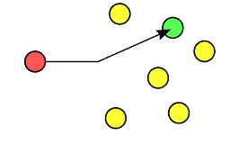
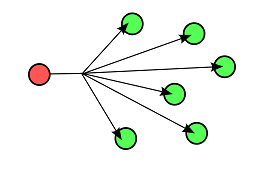
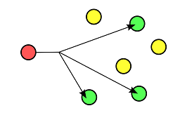
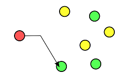
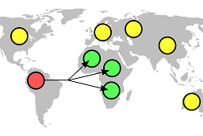
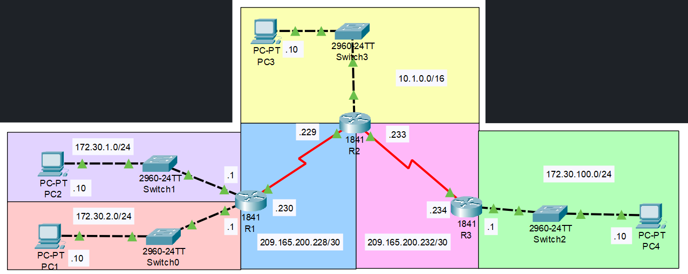
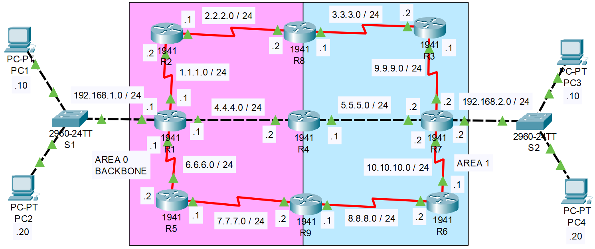

## Version

Cisco IOS Software, Version 15.0(2)SE4

## Présentation

### Définition

Le routage est le processus de sélection d'un chemin pour le trafic dans un réseau ou entre ou à travers plusieurs réseaux. D'une manière générale, le routage est effectué dans de nombreux types de réseaux, y compris les réseaux à commutation de circuits, tels que le réseau téléphonique public commuté (PSTN), et les réseaux informatiques, tels qu'Internet.

Dans les réseaux à commutation de paquets, le routage est la prise de décision de niveau supérieur qui dirige les paquets réseau de leur source vers leur destination via des nœuds de réseau intermédiaires par des mécanismes de transfert de paquets spécifiques. Le transfert de paquets est le transit de paquets réseau d'une interface réseau à une autre. Les nœuds intermédiaires sont généralement des périphériques matériels de réseau tels que des routeurs, des passerelles, des pare-feu ou des commutateurs. Les ordinateurs à usage général transfèrent également les paquets et effectuent le routage, bien qu'ils ne disposent pas de matériel spécialement optimisé pour la tâche.

### Tables de routage

Le processus de routage dirige généralement le transfert sur la base de tables de routage. Les tables de routage conservent un enregistrement des routes vers diverses destinations du réseau. Les tables de routage peuvent être spécifiées par un administrateur, apprises en observant le trafic réseau ou construites à l'aide de protocoles de routage.

Le routage, dans un sens plus étroit du terme, fait souvent référence au routage IP et s'oppose au pontage. Le routage IP suppose que les adresses réseau sont structurées et que des adresses similaires impliquent une proximité au sein du réseau. Les adresses structurées permettent à une seule entrée de table de routage de représenter la route vers un groupe de périphériques. Dans les grands réseaux, l'adressage structuré (routage, au sens étroit) surpasse l'adressage non structuré (bridging). Le routage est devenu la forme dominante d'adressage sur Internet. Le pontage est encore largement utilisé dans les réseaux locaux.

## Schémas de livraison

### Unicast



Unicast délivre un message à un seul nœud spécifique en utilisant une association un-à-un entre un expéditeur et une destination : chaque adresse de destination identifie de manière unique un seul point de terminaison récepteur.

### Broadcast



Broadcast transmet un message à tous les nœuds du réseau à l'aide d'une association un-à-tous ; un datagramme unique d'un expéditeur est acheminé vers tous les points d'extrémité éventuellement multiples associés à l'adresse de diffusion. Le réseau réplique automatiquement les datagrammes selon les besoins pour atteindre tous les destinataires dans le cadre de la diffusion, qui est généralement un sous-réseau entier.

### Multicast



Multicast délivre un message à un groupe de nœuds qui ont exprimé leur intérêt à recevoir le message en utilisant une association un-à-plusieurs-de-plusieurs ou plusieurs-à-plusieurs-de-plusieurs ; les datagrammes sont routés simultanément en une seule transmission à plusieurs destinataires. La multidiffusion diffère de la diffusion en ce que l'adresse de destination désigne un sous-ensemble, pas nécessairement la totalité, des nœuds accessibles.

### Anycast



Anycast délivre un message à n'importe quel nœud d'un groupe de nœuds, généralement le plus proche de la source en utilisant une association un-à-un-plusieurs où les datagrammes sont acheminés vers n'importe quel membre d'un groupe de récepteurs potentiels qui sont tous identifié par la même adresse de destination. L'algorithme de routage sélectionne le récepteur unique dans le groupe en fonction de celui qui est le plus proche en fonction d'une mesure de distance.

### Geocast



Geocast délivre un message à un groupe de nœuds d'un réseau en fonction de leur emplacement géographique. Il s'agit d'une forme spécialisée d'adressage multidiffusion utilisée par certains protocoles de routage pour les réseaux mobiles ad hoc.

## Protocole RIP

Le protocole d'information de routage (RIP) est l'un des plus anciens protocoles de routage à vecteur de distance qui utilise le nombre de sauts comme métrique de routage. RIP empêche les boucles de routage en implémentant une limite sur le nombre de sauts autorisés dans un chemin de la source à la destination. Le plus grand nombre de sauts autorisés pour RIP est de 15, ce qui limite la taille des réseaux que RIP peut prendre en charge.

RIP met en œuvre les mécanismes d'horizon partagé, d'empoisonnement de route et de maintien pour empêcher la propagation d'informations de routage incorrectes.

Dans les routeurs RIPv1, les mises à jour sont diffusées avec leur table de routage toutes les 30 secondes. Dans les premiers déploiements, les tables de routage étaient suffisamment petites pour que le trafic ne soit pas important. Cependant, à mesure que la taille des réseaux augmentait, il est devenu évident qu'il pouvait y avoir une rafale de trafic massive toutes les 30 secondes, même si les routeurs avaient été initialisés à des moments aléatoires.

Dans la plupart des environnements réseau, RIP n'est pas le choix préféré pour le routage car son temps de convergence et son évolutivité sont médiocres par rapport à EIGRP, OSPF ou IS-IS. Cependant, il est facile à configurer, car RIP ne nécessite aucun paramètre, contrairement à d'autres protocoles.

RIP utilise le protocole UDP (User Datagram Protocol) comme protocole de transport et se voit attribuer le numéro de port réservé 520.

### Algorythme

Basés sur l'algorithme Bellman-Ford et l'algorithme Ford-Fulkerson, les protocoles de routage à vecteur de distance ont commencé à être mis en œuvre à partir de 1969 dans les réseaux de données tels que ARPANET et CYCLADES. Le prédécesseur de RIP était le Gateway Information Protocol (GWINFO) qui a été développé par Xerox au milieu des années 1970 pour acheminer son réseau expérimental. Dans le cadre de la suite de protocoles Xerox Network Systems (XNS), GWINFO s'est transformé en XNS Routing Information Protocol. Ce RIP XNS est à son tour devenu la base des premiers protocoles de routage, tels que le RIP IPX de Novell, le protocole de maintenance de la table de routage (RTMP) d'AppleTalk et le RIP IP. La distribution de logiciels Berkley 1982 du système d'exploitation UNIX a implémenté RIP dans le démon routé. La version 4.2BSD s'est avérée populaire et est devenue la base des versions UNIX suivantes, qui ont implémenté RIP dans le démon routé ou gated. En fin de compte, RIP avait été largement déployé avant que la norme écrite par Charles Hedrick ne soit adoptée en tant que RIPv1 en 1988.

### RIP V1

La spécification originale de RIP, définie dans la RFC 1058, a été publiée en 1988. Au démarrage, et toutes les 30 secondes par la suite, un routeur avec implémentation RIPv1 diffuse à 255.255.255.255 un message de demande via chaque interface RIPv1. Les routeurs voisins recevant le message de requête répondent avec un segment RIPv1, contenant leur table de routage. Le routeur demandeur met à jour sa propre table de routage, avec l'adresse réseau IP accessible, le nombre de sauts et le prochain saut, c'est-à-dire l'adresse IP de l'interface du routeur à partir de laquelle la réponse RIPv1 a été envoyée. Comme le routeur demandeur reçoit des mises à jour de différents routeurs voisins, il ne mettra à jour que les réseaux accessibles dans sa table de routage, s'il reçoit des informations sur un réseau accessible qu'il n'a pas encore dans sa table de routage ou des informations qu'un réseau qu'il a dans sa table de routage est accessible avec un nombre de sauts inférieur. Par conséquent, un routeur RIPv1 n'aura dans la plupart des cas qu'une seule entrée pour un réseau accessible, celle avec le nombre de sauts le plus bas. Si un routeur reçoit des informations de deux routeurs voisins différents indiquant que le même réseau est accessible avec le même nombre de sauts mais via deux routes différentes, le réseau sera entré deux fois dans la table de routage avec différents routeurs de saut suivant. Le routeur compatible RIPv1 effectuera alors ce que l'on appelle l'équilibrage de charge à coût égal pour les paquets IP.

Les routeurs compatibles RIPv1 demandent non seulement les tables de routage des autres routeurs toutes les 30 secondes, mais ils écoutent également les demandes entrantes des routeurs voisins et envoient leur propre table de routage à leur tour. Les tables de routage RIPv1 sont donc mises à jour toutes les 25 à 35 secondes. Le protocole RIPv1 ajoute une petite variable de temps aléatoire au temps de mise à jour, pour éviter la synchronisation des tables de routage sur un réseau local. On pensait qu'en raison d'une initialisation aléatoire, les mises à jour de routage s'étaleraient dans le temps, mais ce n'était pas vrai en pratique. Sally Floyd et Van Jacobson ont montré en 1994 que, sans légère randomisation de la minuterie de mise à jour, les minuteries se synchronisaient dans le temps.

RIPv1 peut être configuré en mode silencieux, de sorte qu'un routeur demande et traite les tables de routage voisines, et garde à jour sa table de routage et son nombre de sauts pour les réseaux accessibles, mais n'envoie pas inutilement sa propre table de routage dans le réseau. Le mode silencieux est couramment mis en œuvre pour les hôtes.

RIPv1 utilise le routage par classe. Les mises à jour de routage périodiques ne transportent pas d'informations de sous-réseau et ne prennent pas en charge les masques de sous-réseau de longueur variable (VLSM). Cette limitation rend impossible d'avoir des sous-réseaux de tailles différentes à l'intérieur de la même classe de réseau. En d'autres termes, tous les sous-réseaux d'une classe de réseau doivent avoir la même taille. Il n'y a pas non plus de support pour l'authentification du routeur, ce qui rend RIP vulnérable à diverses attaques.

### RIP V2

En raison des lacunes de la spécification RIP d'origine, la version 2 de RIP (RIPv2) a été développée en 1993[4], publiée sous le nom de RFC 1723 en 1994 et déclarée Internet Standard 56 en 1998. Il comprenait la possibilité de transporter des informations de sous-réseau, prenant ainsi en charge le routage interdomaine sans classe (CIDR). Pour maintenir la compatibilité descendante, la limite de nombre de sauts de 15 est restée. RIPv2 dispose de fonctionnalités pour interagir pleinement avec la spécification précédente si tous les champs de protocole Doit être zéro dans les messages RIPv1 sont correctement spécifiés. De plus, une fonction de commutateur de compatibilité permet des ajustements d'interopérabilité précis.

Afin d'éviter une charge inutile sur les hôtes qui ne participent pas au routage, RIPv2 multidiffuse l'intégralité de la table de routage vers tous les routeurs adjacents à l'adresse 224.0.0.9, contrairement à RIPv1 qui utilise la diffusion. L'adressage Unicast est toujours autorisé pour des applications spéciales.

l'authentification pour RIP a été introduite en 1997. (MD5)

Des balises de route ont également été ajoutées dans RIP version 2. Cette fonctionnalité permet de faire la distinction entre les routes apprises du protocole RIP et les routes apprises d'autres protocoles.

## Mise en pratique

### Topologie

Voici la topologie pour l'implémentation de RIP :



Il y a 6 réseaux :

- 10.1.0.0 / 16
- 172.30.1.0 / 24
- 172.30.2.0 / 24
- 172.30.100.0 / 24
- 209.165.200.288 / 30
- 209.165.200.232 / 30

### Configuration des routeurs pour RIP V1

Configuration pour R1 :

```
interface FastEthernet0/0
 ip address 172.30.1.1 255.255.255.0
 duplex auto
 speed auto
!
interface FastEthernet0/1
 ip address 172.30.2.1 255.255.255.0
 duplex auto
 speed auto
!
interface Serial0/1/0
 ip address 209.165.200.230 255.255.255.252
 clock rate 64000
!
```

Implémentation de RIP V1 pour R1 :

```
R1#conf t
R1(config)#router rip
R1(config-router)#passive-interface FastEthernet0/0
R1(config-router)#passive-interface FastEthernet0/1
R1(config-router)#network 172.30.0.0
R1(config-router)#network 209.165.200.0
```

Configuration pour R2 :

```
interface FastEthernet0/0
 ip address 10.1.0.1 255.255.0.0
 duplex auto
 speed auto
!
interface Serial0/1/0
 ip address 209.165.200.233 255.255.255.252
 clock rate 64000
!
interface Serial0/1/1
 ip address 209.165.200.229 255.255.255.252
!
```

Implémentation de RIP V1 pour R2 :

```
R2#conf t
R2(config)#router rip
R2(config-router)#passive-interface FastEthernet0/0
R2(config-router)#network 10.0.0.0
R2(config-router)#network 209.165.200.0
```

Configuration pour R3 :

```
interface Serial0/1/0
 no ip address
 clock rate 2000000
 shutdown
!
interface Serial0/1/1
 ip address 209.165.200.234 255.255.255.252
!55.252
!
```

Implémentation de RIP V1 pour R3 :

```
R3#conf t
R3(config)#router rip
R3(config-router)#passive-interface FastEthernet0/0
R3(config-router)#network 172.30.0.0
R3(config-router)#network 209.165.200.0
```

Il est possible de définir des interfaces passives qui ne redistribueront pas les tables de routage RIP, typiquement cela est utile lorsque des interfaces se trouvent en bout de réseaux. La déclaration des interfaces passives s'effectue comme ceci : _passive-interface NomDeL'interface_.

Sur un routeur, il faut alors déclarer à RIP tous les réseaux IP qui sont reliés à ce routeur, mais en respectant les masques par défaut car RIP V1 est un protocole de routage Classful et ne prend pas en charge le masquage de sous-réseau de longueur variable.

Exemple :

- Le réseau _10.1.0.0 / 16_ donne en RIP V1 _10.0.0.0_ car c'est une adresse de type classe A avec un masque à 8 bits.
- Le réseau _172.30.1.0 / 24_ donne en RIP V1 _172.30.0.0_ car c'est une adresse de type classe B avec un masque à 16 bits.
- Le réseau _209.165.200.232 / 30_ donne en RIP V1 _209.165.200.0_ car c'est une adresse de type classe C avec un masque à 24 bits.

### Test de ping avec RIP V1

Si on effectue un ping depuis la machine qui a pour adresse IP _10.1.0.10_ vers la machine _172.30.1.10_, voici ce que l'on obtient :

```
Pinging 172.30.1.10 with 32 bytes of data:

Reply from 172.30.1.10: bytes=32 time=1ms TTL=126
Reply from 209.165.200.234: Destination host unreachable.
Reply from 172.30.1.10: bytes=32 time=1ms TTL=126
Reply from 209.165.200.234: Destination host unreachable.

Ping statistics for 172.30.1.10:
    Packets: Sent = 4, Received = 2, Lost = 2 (50% loss),
Approximate round trip times in milli-seconds:
    Minimum = 1ms, Maximum = 35ms, Average = 26ms
```

Il y aura systèmatiquement 50% de pertes au moins des paquets car le protocole RIP V1 considère que les réseaux _209.165.200.228 / 30_ et _209.165.200.232 / 30_ sont en fait un seul et unique réseau le _209.165.200.0_, le routeur R2 envoie donc ses paquets alternativement à R1 et à R3 raison pour laquelle R3 nous répond avec l'adresse _209.165.200.232_.

RIP V1 considère qu'il y a ici 4 réseaux :

- 10.0.0.0 / 8
- 172.30.0.0 / 16
- 172.30.0.0 / 16
- 209.165.200.0 / 24

Pour éviter la perte de paquets, il faudrait rédéfinir les réseaux en respectant les masques par défaut.

### Configuration des routeurs pour RIP V2

Configuration pour R1 :

```
interface FastEthernet0/0
 ip address 172.30.1.1 255.255.255.0
 duplex auto
 speed auto
!
interface FastEthernet0/1
 ip address 172.30.2.1 255.255.255.0
 duplex auto
 speed auto
!
interface Serial0/1/0
 ip address 209.165.200.230 255.255.255.252
 clock rate 64000
!
```

Implémentation de RIP V1 pour R1 :

```
R1#conf t
R1(config)#router rip
R1(config-router)#version 2
R1(config-router)#passive-interface FastEthernet0/0
R1(config-router)#passive-interface FastEthernet0/1
R1(config-router)#network 172.30.0.0
R1(config-router)#network 209.165.200.0
R1(config-router)#no auto-summary
```

Configuration pour R2 :

```
interface FastEthernet0/0
 ip address 10.1.0.1 255.255.0.0
 duplex auto
 speed auto
!
interface Serial0/1/0
 ip address 209.165.200.233 255.255.255.252
 clock rate 64000
!
interface Serial0/1/1
 ip address 209.165.200.229 255.255.255.252
!
```

Implémentation de RIP V1 pour R2 :

```
R2#conf t
R2(config)#router rip
R2(config-router)#version 2
R2(config-router)#passive-interface FastEthernet0/0
R2(config-router)#network 10.0.0.0
R2(config-router)#network 209.165.200.0
R2(config-router)#no auto-summary
```

Configuration pour R3 :

```
interface Serial0/1/0
 no ip address
 clock rate 2000000
 shutdown
!
interface Serial0/1/1
 ip address 209.165.200.234 255.255.255.252
!55.252
!
```

Implémentation de RIP V1 pour R3 :

```
R3#conf t
R3(config)#router rip
R3(config-router)#version 2
R3(config-router)#passive-interface FastEthernet0/0
R3(config-router)#network 172.30.0.0
R3(config-router)#network 209.165.200.0
R3(config-router)#no auto-summary
```

Il est possible de définir des interfaces passives qui ne redistribueront pas les tables de routage RIP, typiquement cela est utile lorsque des interfaces se trouvent en bout de réseaux. La déclaration des interfaces passives s'effectue comme ceci : _passive-interface NomDeL'interface_.

On déclare l'utilisation du protocole RIP V2 avec la commande _version 2_

Sur un routeur, il faut alors déclarer à RIP tous les réseaux IP qui sont reliés à ce routeur, mais en respectant les masques par défaut.

Exemple :

- Le réseau _10.1.0.0 / 16_ donne en RIP V1 _10.0.0.0_ car c'est une adresse de type classe A avec un masque à 8 bits.
- Le réseau _172.30.1.0 / 24_ donne en RIP V1 _172.30.0.0_ car c'est une adresse de type classe B avec un masque à 16 bits.
- Le réseau _209.165.200.232 / 30_ donne en RIP V1 _209.165.200.0_ car c'est une adresse de type classe C avec un masque à 24 bits.

### Test de ping avec RIP V2

Si on effectue un ping depuis la machine qui a pour adresse IP _10.1.0.10_ vers la machine _172.30.1.10_, voici ce que l'on obtient :

```
Pinging 172.30.1.10 with 32 bytes of data:

Reply from 172.30.1.10: bytes=32 time=1ms TTL=126
Reply from 172.30.1.10: bytes=32 time=8ms TTL=126
Reply from 172.30.1.10: bytes=32 time=10ms TTL=126
Reply from 172.30.1.10: bytes=32 time=1ms TTL=126

Ping statistics for 172.30.1.10:
    Packets: Sent = 4, Received = 4, Lost = 0 (0% loss),
Approximate round trip times in milli-seconds:
    Minimum = 1ms, Maximum = 10ms, Average = 5ms
```

Il n'y aucune perte de paquets car le protocole RIP V2 est un protocole de routage hybride et à la possibilité d'envoyer un masque de réseau dans la mise à jour pour permettre un routage classless. RIP V2 prendre donc en charge contrairement à RIP V1 le masquage de sous-réseau de longueur de variable (VLSM).

### Conclusion des tests RIP

La principale différence entre RIPv1 et RIPv2 est que RIPv2 incorpore l’ajout du masque de réseau dans les mises à jour pour autoriser les annonces de routage classless. Ceci est extrêmement important pour la flexibilité nécessaire à un adressage IP de plus en plus réduit.

## Protocole OSPF

### Introduction

Open Shortest Path First (OSPF) est un protocole de routage pour les réseaux IP (Internet Protocol). Il utilise un algorithme de routage à état de liaison (LSR) et appartient au groupe des protocoles de passerelle intérieure (IGP), fonctionnant au sein d'un seul système autonome (AS). Il est défini comme OSPF Version 2 dans RFC 2328 (1998) pour IPv4. Les mises à jour pour IPv6 sont spécifiées comme OSPF Version 3 dans RFC 5340 (2008). OSPF prend en charge le modèle d'adressage CIDR (Classless Inter-Domain Routing).

OSPF est un IGP largement utilisé dans les réseaux de grandes entreprises. IS-IS, un autre protocole basé sur LSR, est plus courant dans les grands réseaux de fournisseurs de services.

### Historique

OSPF a été conçu comme un protocole de passerelle intérieure (IGP), pour une utilisation dans un système autonome tel qu'un réseau local (LAN). Il implémente l'algorithme de Dijkstra, également connu sous le nom d'algorithme SPF (shortest path first). En tant que protocole de routage à état de liens, il était basé sur l'algorithme à état de liens développé pour ARPANET en 1980 et le protocole de routage IS-IS. OSPF a été normalisé pour la première fois en 1989 sous le nom de RFC 1131, qui est maintenant connu sous le nom d'OSPF version 1. Le travail de développement d'OSPF avant sa codification en tant que norme ouverte a été entrepris en grande partie par Digital Equipment Corporation, qui a développé ses propres protocoles propriétaires DECnet.

### Différence avec RIP

Les protocoles de routage comme OSPF calculent le chemin le plus court vers une destination via le réseau en fonction d'un algorithme. Le premier protocole de routage largement implémenté, le Routing Information Protocol (RIP), calculait la route la plus courte en fonction des sauts, c'est-à-dire le nombre de routeurs qu'un paquet IP devait traverser pour atteindre l'hôte de destination. RIP a implémenté avec succès le routage dynamique, où les tables de routage changent si la topologie du réseau change. Mais RIP n'a pas adapté son routage en fonction de l'évolution des conditions du réseau, telles que le taux de transfert de données. La demande a augmenté pour un protocole de routage dynamique capable de calculer l'itinéraire le plus rapide vers une destination. OSPF a été développé pour que le chemin le plus court à travers un réseau soit calculé en fonction du coût de la route, en tenant compte de la bande passante, du délai et de la charge. Par conséquent, OSPF entreprend le calcul du coût de la route sur la base de paramètres de coût de liaison, qui peuvent être pondérés par l'administrateur. OSPF a été rapidement adopté car il est devenu connu pour le calcul fiable des routes à travers des réseaux locaux vastes et complexes.

### Fonctionnement

En tant que protocole de routage à état de liens, OSPF maintient des bases de données d'états de liens, qui sont en réalité des cartes de topologie de réseau, sur chaque routeur sur lequel il est implémenté. L'état d'une route donnée dans le réseau est le coût, et l'algorithme OSPF permet à chaque routeur de calculer le coût des routes vers n'importe quelle destination accessible.A moins que l'administrateur n'ait fait une configuration, le coût de liaison d'un chemin connecté à un routeur est déterminé par le débit (1 Gbit/s, 10 Gbit/s, etc.) de l'interface. Une interface de routeur avec OSPF annoncera ensuite son coût de liaison aux routeurs voisins via la multidiffusion, connue sous le nom de procédure hello. Tous les routeurs avec implémentation OSPF continuent d'envoyer des paquets Hello, et ainsi les changements dans le coût de leurs liens sont connus des routeurs voisins.Les informations sur le coût d'un lien, c'est-à-dire la vitesse d'une connexion point à point entre deux routeurs, sont ensuite diffusées en cascade sur le réseau car les routeurs OSPF annoncent les informations qu'ils reçoivent d'un routeur voisin à tous les autres routeurs voisins. Ce processus d'inondation des informations sur l'état des liens à travers le réseau est appelé synchronisation. Sur la base de ces informations, tous les routeurs avec implémentation OSPF mettent continuellement à jour leurs bases de données d'état des liens avec des informations sur la topologie du réseau et ajustent leurs tables de routage.[9]

### Structure et zone

Un réseau OSPF peut être structuré ou subdivisé en zones de routage pour simplifier l'administration et optimiser le trafic et l'utilisation des ressources. Les zones sont identifiées par des nombres de 32 bits, exprimés soit simplement en décimal, soit souvent dans la même notation point-décimale utilisée pour les adresses IPv4. Par convention, la zone 0 (zéro), ou 0.0.0.0, représente la zone centrale ou dorsale d'un réseau OSPF. Alors que les identifications d'autres zones peuvent être choisies à volonté; les administrateurs sélectionnent souvent l'adresse IP d'un routeur principal dans une zone comme identifiant de zone. Chaque zone supplémentaire doit avoir une connexion à la zone principale OSPF. De telles connexions sont maintenues par un routeur d'interconnexion, connu sous le nom de routeur frontière de zone (ABR). Un ABR maintient des bases de données d'état de liaison distinctes pour chaque zone qu'il dessert et maintient des routes résumées pour toutes les zones du réseau.

OSPF détecte les changements dans la topologie, tels que les défaillances de liaison, et converge vers une nouvelle structure de routage sans boucle en quelques secondes.

### Utilisation

OSPF est devenu un protocole de routage dynamique populaire. D'autres protocoles de routage dynamique couramment utilisés sont le RIPv2 et le Border Gateway Protocol (BGP).Aujourd'hui, les routeurs prennent en charge au moins un protocole de passerelle intérieure pour annoncer leurs tables de routage au sein d'un réseau local. Outre OSPF, les protocoles de passerelle intérieure fréquemment mis en œuvre sont RIPv2, IS-IS et EIGRP (Enhanced Interior Gateway Routing Protocol).

## Mise en pratique

Le but ici est de démontrer que le protocole OSPF ne cherche pas le chemin le plus court pour trouver sa route mais plutôt le coût le plus bas.

### Topologie OSPF

Voici le schéma de départ :



Il y 12 réseaux pour 9 routeurs allant de R1 à R10 :

- 192.168.1.0 / 24
- 192.168.2.0 / 24
- 1.1.1.0 / 24
- 2.2.2.0 / 24
- 3.3.3.0 / 24
- 4.4.4.0 / 24
- 5.5.5.0 / 24
- 6.6.6.0 / 24
- 7.7.7.0 / 24
- 8.8.8.0 / 24
- 9.9.9.0 / 24
- 10.10.10.0 / 24

OSPF utilise des aires appelé _AREA_ permettant de découper les réseaux en plusieurs petits groupes de travails, un AREA ne peut pas contenir plus de 15 routeurs. Le découpage en aire permet de réduire la charge CPU des routeurs.

Les routeurs appartenant à une même aire et au même réseau s'envoit des paquers de type _hello_ pour se présenter, ils construisent ainsi leur voisinage et s'assure de la disponibilité de leurs voisins. C'est dans la LSDB (Link State DataBase)que le routeur va stocker toutes les informations de ses voisins appelé LSA (Link State Advertisment). La commande _show ip ospf database_ permet d'afficher le contenu de cette base de donnée.

Ici le routeur R4 connecte 2 aires, il se fait donc appelé ABR pour Area Border Router.

Si on avait un routeur qui implémenterait un autre protocole de routage comme RIP, il serait appelé ASBR pour Autonomous System Border Routers.

Sur les liaisons plus rapides comme le gigabit ou le 10 gigabit, il est nécessaire indispensable de déclarer la bande passante de référence avec la commande _auto-cost reference bandwidth 1000_.

### Configuration

Voici la configuration OSPF des 9 routeurs :

Pour R1

```
router ospf 1
 router-id 1.1.1.1
 log-adjacency-changes
 passive-interface GigabitEthernet0/0
 network 192.168.1.0 0.0.0.255 area 0
 network 1.1.1.0 0.0.0.255 area 0
 network 4.4.4.0 0.0.0.255 area 0
 network 6.6.6.0 0.0.0.255 area
```

Pour R2 :

```
router ospf 2
 router-id 2.2.2.2
 log-adjacency-changes
 network 1.1.1.0 0.0.0.255 area 0
 network 2.2.2.0 0.0.0.255 area 0
```

Pour R3 :

```
router ospf 3
 router-id 3.3.3.3
 log-adjacency-changes
 network 3.3.3.0 0.0.0.255 area 1
 network 9.9.9.0 0.0.0.255 area 1
```

Pour R4 :

```
router ospf 4
 router-id 4.4.4.4
 log-adjacency-changes
 network 4.4.4.0 0.0.0.255 area 0
 network 5.5.5.0 0.0.0.255 area 1
```

Pour R5

```
router ospf 5
 router-id 5.5.5.5
 log-adjacency-changes
 network 6.6.6.0 0.0.0.255 area 0
 network 7.7.7.0 0.0.0.255 area 0
```

Pour R6

```
router ospf 6
 router-id 6.6.6.6
 log-adjacency-changes
 network 8.8.8.0 0.0.0.255 area 1
 network 10.10.10.0 0.0.0.255 area 1
```

Pour R7 :

```
router ospf 7
 router-id 7.7.7.7
 log-adjacency-changes
 passive-interface GigabitEthernet0/0
 auto-cost reference-bandwidth 10
 network 9.9.9.0 0.0.0.255 area 1
 network 5.5.5.0 0.0.0.255 area 1
 network 10.10.10.0 0.0.0.255 area 1
 network 192.168.2.0 0.0.0.255 area 1
```

Pour R8 :

```
router ospf 8
 router-id 8.8.8.8
 log-adjacency-changes
 network 2.2.2.0 0.0.0.255 area 0
 network 3.3.3.0 0.0.0.255 area 1
```

Pour R9 :

```
router ospf 9
 router-id 9.9.9.9
 log-adjacency-changes
 network 7.7.7.0 0.0.0.255 area 0
 network 8.8.8.0 0.0.0.255 area 1
```

La commande _show ip ospf neighbor_ permet d'afficher les routeurs présent dans une même aire, pour R1 cela donne :

```
Neighbor ID     Pri   State           Dead Time   Address         Interface
4.4.4.4           1   FULL/DR         00:00:39    4.4.4.2         GigabitEthernet0/1
2.2.2.2           0   FULL/  -        00:00:39    1.1.1.2         Serial0/1/0
5.5.5.5           0   FULL/  -        00:00:39    6.6.6.2         Serial0/1/1
```

### 1er test

On effectue un test avec la commande _tracert_ de PC1 à PC3. Cette commande va nous retourner la route que va prendre un ping en spécifiant les routeurs empruntés sur sa route :

```make
C:\>tracert 192.168.2.10

Tracing route to 192.168.2.10 over a maximum of 30 hops:

  1   0 ms      0 ms      0 ms      192.168.1.1
  2   0 ms      0 ms      0 ms      4.4.4.2
  3   0 ms      0 ms      1 ms      5.5.5.2
  4   0 ms      0 ms      7 ms      192.168.2.10

Trace complete.
```

Le ping passe bien par le routeur R1, puis R4 puis R7 pour aller jusqu'à PC3 car OSPF juge que c'est la route qui a le moins de coût. Cela semble logique car c'est la route qui contient le moins de routeur.

### 2ème test avec cout

On va modifier R4 et lui rajouter un côut sur l'interface Gigabit 0/0, voici la commande :

```
R4#conf t
Enter configuration commands, one per line.  End with CNTL/Z.
R4(config)#interface gigabitEthernet 0/0
R4(config-if)#ip ospf cost 60000
```

On refait le même test que précédemment, on utilise la commande _tracert_ pour suivre le chemin que prend un ping, voici le résultat :

```
tracert 192.168.2.10

Tracing route to 192.168.1.10 over a maximum of 30 hops:

  1   1 ms      0 ms      0 ms      192.168.1.1
  2   5 ms      7 ms      16 ms     1.1.1.2
  3   1 ms      26 ms     19 ms     2.2.2.2
  4   6 ms      22 ms     1 ms      3.3.3.2
  5   1 ms      5 ms      2 ms      9.9.9.2
  6   1 ms      8 ms      7 ms      192.168.2.10

Trace complete.
```

Si on continue à faire la commande, OSPF se mettra à faire du load balacing car le chemin du haut et le chemin du bas ont le même coût.

```
tracert 192.168.2.10

Tracing route to 192.168.1.10 over a maximum of 30 hops:

  1   1 ms      0 ms      0 ms      192.168.1.1
  2   5 ms      7 ms      16 ms     6.6.6.2
  3   1 ms      26 ms     19 ms     7.7.7.2
  4   6 ms      22 ms     1 ms      8.8.8.2
  5   1 ms      5 ms      2 ms      10.10.10.2
  6   1 ms      8 ms      7 ms      192.168.2.10

Trace complete.
```

### Conclusion des tests :

OSPF est un protocole qui s'adapte à la topologie et l'état du réseau, contrairement à RIP qui ne se soucie pas de l'état du réseau mais du nombre du saut.
