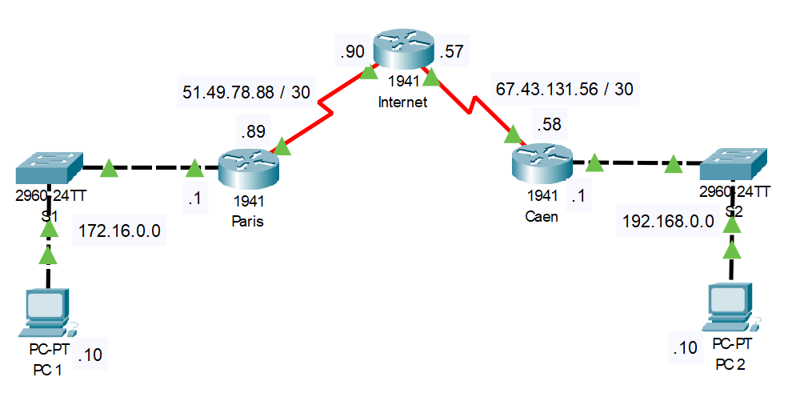

## Version

Cisco IOS Software, Version 15.0(2)SE4

## Présentation

Un réseau privé virtuel (VPN) étend un réseau privé sur un réseau public et permet aux utilisateurs d'envoyer et de recevoir des données sur des réseaux partagés ou publics comme si leurs appareils informatiques étaient directement connectés au réseau privé. Les applications s'exécutant sur un VPN peuvent donc bénéficier des fonctionnalités, de la sécurité et de la gestion du réseau privé. Il donne accès à des ressources qui peuvent être inaccessibles sur le réseau public et est généralement utilisé en télétravail. Le cryptage est une partie courante, bien que non inhérente, d'une connexion VPN.

Un VPN est créé en établissant une connexion virtuelle point à point via l'utilisation de circuits dédiés ou avec des protocoles de tunneling sur des réseaux existants. Un VPN disponible sur l'Internet public peut offrir certains des avantages d'un réseau étendu. Du point de vue de l'utilisateur, les ressources disponibles au sein du réseau privé sont accessibles à distance.

## Topologie

Voici le schéma qui sera utilisé pour effectuer les tests:



Ce schéma tente de reproduire un vpn site à site entre 2 entreprises situés à Paris et à Caen.

- Paris dispose d'une adresse IP publique de 51.49.78.89
- Caen dispose d'une adresse IP publique de 67.43.131.58

## Prérequis

### Route 0

On configure la route 0 pour rediriger tous les paquets vers **l'internet** au cas où le routeur ne s'est pas où envoyer un paquet en particulier.

Pour le routeur de Paris:

```
Paris(config)#ip route 0.0.0.0 0.0.0.0 51.49.78.90
```

Pour le routeur de Caen:

```
Caen(config)#ip route 0.0.0.0 0.0.0.0 67.43.131.57
```

### Protocole de routage

C'est le protocole RIP V2 qui est utilisé pour une question de rapidité de mise en place.

Pour le routeur de Paris:

```
Paris(config)#router rip
Paris(config-router)#version 2
Paris(config-router)#network 172.16.0.0
Paris(config-router)#network 51.49.78.88
Paris(config-router)#passive-interface gigabitEthernet 0/0
Paris(config-router)#no auto-summary
```

Pour le routeur de Caen:

```
Caen(config)#router rip
Caen(config-router)#version 2
Caen(config-router)#network 192.168.0.0
Caen(config-router)#network 67.43.131.56
Caen(config-router)#passive-interface gigabitEthernet 0/0
Caen(config-router)#no auto-summary
```

## Mise en place du VPN site à site

### Activation du paquet Security Technology

il faut dans un 1er temps activer le module de sécurité `secirutyk9`. Sur les 2 routeurs, effectuer ces commandes:

```
Paris#conf t
Enter configuration commands, one per line.  End with CNTL/Z.
Paris(config)#license boot module c1900 technology-package securityk9
(...)
ACCEPT? [yes/no]: yes
(...)
Paris(config)#exit
(...)
Proceed with reload? [confirm]
```

Pour voir si c'est actif:

```
Paris>sh version
(...)
Technology Package License Information for Module:'c1900'

----------------------------------------------------------------
Technology    Technology-package          Technology-package
              Current       Type          Next reboot
-----------------------------------------------------------------
ipbase        ipbasek9      Permanent     ipbasek9
security      securityk9    Evaluation    securityk9
data          disable       None          None

Configuration register is 0x2102
```

### Configuration de la politique ISAKMP

On va ensuite nous occuper des stratégies de chiffrement avec ISAKMP (Internet Security Association and Key Management Protocol). Ce protocole fournis la sécurisation des paquets qui seront acheminés d’un bout à l’autre.

```
Paris(config)#crypto isakmp policy 10
Paris(config-isakmp)#encryption aes
Paris(config-isakmp)#hash sha
Paris(config-isakmp)#authentication pre-share
Paris(config-isakmp)#lifetime 120
Paris(config-isakmp)#exit
```

67.43.131.58 est le routeur de Caen.

Le cryptage AES est le chiffrement choisi pour l’échange. Les algorithmes DES et 3DES n’étant plus considérés comme sûres, il est recommandé d’utiliser AES.

Cet algorithme nécessite une clé pré-partagée pour le chiffrement et le déchiffrement. C’est pourquoi nous choisissons l’authentification pre-share.

### Clé d'échange

Nous précisons ensuite la clé d’échange qui sera appelée PHASE1 ainsi que la destination de l’hôte distant.

```
Paris(config)#crypto isakmp key PHASE1 address 67.43.131.58
```

### Définition de l'IPSEC transform-set

Ensuite nous sélectionnons la méthode de cryptage que l’on appelle IPVPN

```
Paris(config)#crypto ipsec transform-set IPVPN esp-aes esp-sha-hmac
```

ESP-AES est l’algorythme de cryptage et esp-sha-hmac est la méthode d’authentification

### Création de l'Access List

```
Paris(config)#access-list 100 permit ip 172.16.0.0 0.0.255.255 192.168.0.0 0.0.0.255
```

### Création de la crypto-map pour IPSEC

A présent on rassemble les différents éléments créés ci-dessus pour en faire une cryptomap que l’on positionnera sur l’interface de sortie du routeur de Paris.

```
Paris(config)#crypto map MAP1 1 ipsec-isakmp
Paris(config-crypto-map)#match address 100
Paris(config-crypto-map)#set peer 67.43.131.58
Paris(config-crypto-map)#set transform-set IPVPN
Paris(config-crypto-map)#set security-association lifetime seconds 120
```

67.43.131.58 est le routeur de destination.

### Application sur l'interface

On applique la crypto map sur l'interface de sortie du routeur:

```
Paris(config)#int S0/0/0
Paris(config-if)#crypto map MAP1
*Jan  3 07:16:26.785: %CRYPTO-6-ISAKMP_ON_OFF: ISAKMP is ON
```

Il reste à faire les mêmes opérations pour le routeur de Caen, en mettant en destination le routeur de Paris et en inversant les adresses de l'access-list.

### Résultats des configurations

Pour le routeur Paris, on a:

```
license udi pid CISCO1941/K9 sn FTX1524FD55-
license boot module c1900 technology-package securityk9
!
crypto isakmp policy 10
 encr aes
 authentication pre-share
 lifetime 120
!
crypto isakmp key PHASE1 address 67.43.131.58
!
crypto ipsec transform-set IPVPN esp-aes esp-sha-hmac
!
crypto map MAP1 1 ipsec-isakmp
 set peer 67.43.131.58
 set security-association lifetime seconds 120
 set transform-set IPVPN
 match address 100
!
spanning-tree mode pvst
!
interface GigabitEthernet0/0
 ip address 172.16.0.1 255.255.0.0
 duplex auto
 speed auto
!
interface GigabitEthernet0/1
 no ip address
 duplex auto
 speed auto
 shutdown
!
interface Serial0/0/0
 ip address 51.49.78.89 255.255.255.252
 clock rate 2000000
 crypto map MAP1
!
interface Serial0/0/1
 no ip address
 clock rate 2000000
 shutdown
!
interface Vlan1
 no ip address
 shutdown
!
router rip
 version 2
 passive-interface GigabitEthernet0/0
 network 51.0.0.0
 network 172.16.0.0
 no auto-summary
!
ip classless
ip route 0.0.0.0 0.0.0.0 51.49.78.90
!
ip flow-export version 9
!
access-list 100 permit ip 172.16.0.0 0.0.255.255 192.168.0.0 0.0.0.255
```

Pour le router de Caen, on a:

```
license udi pid CISCO1941/K9 sn FTX15241N39-
license boot module c1900 technology-package securityk9
!
crypto isakmp policy 10
 encr aes
 authentication pre-share
 lifetime 120
!
crypto isakmp key PHASE1 address 51.49.78.89
!
crypto ipsec transform-set IPVPN esp-aes esp-sha-hmac
!
crypto map MAP1 1 ipsec-isakmp
 set peer 51.49.78.89
 set security-association lifetime seconds 120
 set transform-set IPVPN
 match address 100
!
spanning-tree mode pvst
!
interface GigabitEthernet0/0
 ip address 192.168.0.1 255.255.255.0
 duplex auto
 speed auto
!
interface GigabitEthernet0/1
 no ip address
 duplex auto
 speed auto
 shutdown
!
interface Serial0/0/0
 no ip address
 clock rate 2000000
 shutdown
!
interface Serial0/0/1
 ip address 67.43.131.58 255.255.255.252
 crypto map MAP1
!
interface Vlan1
 no ip address
 shutdown
!
router rip
 version 2
 passive-interface GigabitEthernet0/0
 network 67.0.0.0
 network 192.168.0.0
 no auto-summary
!
ip classless
ip route 0.0.0.0 0.0.0.0 67.43.131.57
!
ip flow-export version 9
!
access-list 100 permit ip 192.168.0.0 0.0.0.255 172.16.0.0 0.0.255.255
```

## Test

### Ping

Après avoir configuré les 2 routeurs, les 2 machines aux extrémités du réseau devraient pouvoir se pinger entre elles et communiquer de manière cryptée. Si tel n'est pas le cas, on peut effectuer un _sh run_ afin de vérifier s'il n'y a pas un message du style: _configuration incomplete_.

### sh crypto map

On peut débugger avec la commande _sh crypto map_ qui doit nous renvoyer ces résultats de la configuration courante:

Pour Paris:

```
Crypto Map MAP1 1 ipsec-isakmp
        Peer = 67.43.131.58
        Extended IP access list 100
            access-list 100 permit ip 172.16.0.0 0.0.255.255 192.168.0.0 0.0.0.255
        Current peer: 67.43.131.58
        Security association lifetime: 4608000 kilobytes/120 seconds
        PFS (Y/N): N
        Transform sets={
                IPVPN,
        }
        Interfaces using crypto map MAP1:
                Serial0/0/0
```

Pour Caen:

```
Crypto Map MAP1 1 ipsec-isakmp
        Peer = 51.49.78.89
        Extended IP access list 100
            access-list 100 permit ip 192.168.0.0 0.0.0.255 172.16.0.0 0.0.255.255
        Current peer: 51.49.78.89
        Security association lifetime: 4608000 kilobytes/120 seconds
        PFS (Y/N): N
        Transform sets={
                IPVPN,
        }
        Interfaces using crypto map MAP1:
                Serial0/0/1
```

### show crypto ipsec sa

Cette commande permet de renvoyer combien de paquets ont été encrypté et décrypté, voici un exemple pour Caen:

```
interface: Serial0/0/1
    Crypto map tag: MAP1, local addr 67.43.131.58

   protected vrf: (none)
   local  ident (addr/mask/prot/port): (192.168.0.0/255.255.255.0/0/0)
   remote  ident (addr/mask/prot/port): (172.16.0.0/255.255.0.0/0/0)
   current_peer 51.49.78.89 port 500
    PERMIT, flags={origin_is_acl,}
   #pkts encaps: 10, #pkts encrypt: 10, #pkts digest: 0
   #pkts decaps: 11, #pkts decrypt: 11, #pkts verify: 0
   #pkts compressed: 0, #pkts decompressed: 0
   #pkts not compressed: 0, #pkts compr. failed: 0
   #pkts not decompressed: 0, #pkts decompress failed: 0
   #send errors 0, #recv errors 0

     local crypto endpt.: 67.43.131.58, remote crypto endpt.:51.49.78.89
     path mtu 1500, ip mtu 1500, ip mtu idb Serial0/0/1
     current outbound spi: 0x0(0)
```

### show crypto isakmp

Les commandes _show crypto isakmp policy_ et _show crypto isakmp sa_ permettent d'afficher les informations par rapport au protocole ISAKMP avec SA pour _Security Association_.

Voilà ces commandes pour Caen:

```
Caen#sh crypto isakmp policy

Global IKE policy
Protection suite of priority 10
        encryption algorithm:   AES - Advanced Encryption Standard (128 bit keys).
        hash algorithm:         Secure Hash Standard
        authentication method:  Pre-Shared Key
        Diffie-Hellman group:   #1 (768 bit)
        lifetime:               120 seconds, no volume limit
Caen#sh crypto isakmp sa
IPv4 Crypto ISAKMP SA
dst             src             state          conn-id slot status

IPv6 Crypto ISAKMP SA
```

```
Caen#sh crypto isakmp sa
IPv4 Crypto ISAKMP SA
dst             src             state          conn-id slot status

IPv6 Crypto ISAKMP SA


Caen#sh crypto isakmp sa
IPv4 Crypto ISAKMP SA
dst             src             state          conn-id slot status

IPv6 Crypto ISAKMP SA
```

Si tous les test sont concluants, les 2 sites sont fin prêt pour communiquer ensemble de façon sécurisée !
