## Documentations

GIT version 2.23.0 - Licence GNU - [Docs](https://git-scm.com/doc)

## Présentation

*Git* est un logiciel de versioning créé en 2005 par Linus Torvalds, le créateur de Linux.

Un logiciel de versioning, ou logiciel de gestion de version est un logiciel qui permet de conserver un historique des modifications effectuées sur un projet afin de pouvoir rapidement identifier les changements effectuées et de revenir à une ancienne version en cas de problème.
Les logiciels de gestion de versions sont quasiment incontournables aujourd’hui car ils facilitent grandement la gestion de projets et car ils permettent de travailler en équipe de manière beaucoup plus efficace. Parmi les logiciels de gestion de versions, Git est le leader incontesté et il est donc indispensable pour tout développeur de savoir utiliser Git.

## Installation de Git

### Windows

Rendez-vous à cette adresse : [https://git-scm.com/download/win](https://git-scm.com/download/win) et choisissez l'installation qui correspond à votre architecture.

La GNU Licence :
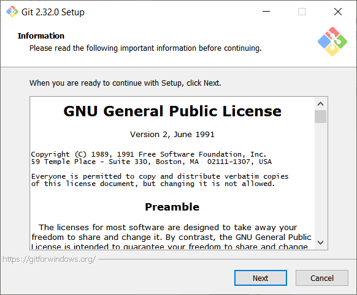

On laisse par défaut pour avoir les options git dans l'explorateur Windows en effectuant un clic droit dans un dossier.
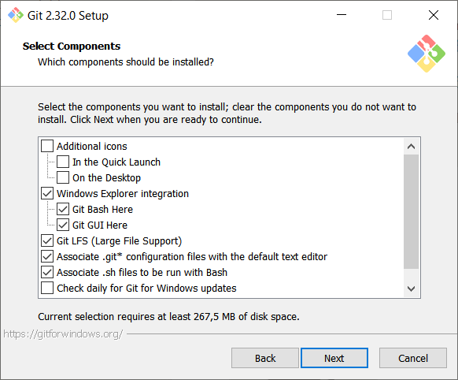

On indique son IDE, le mien est [Visual Studio Code](https://code.visualstudio.com/).
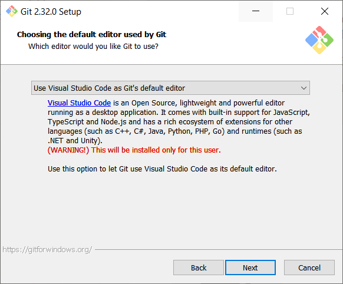

On choisit le nom par défaut de la branche lors d'une initialisation de projet *git init* 
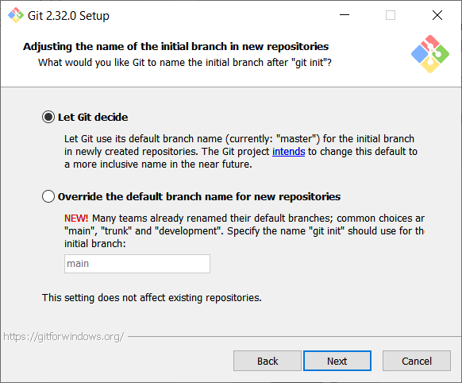

On accepte que le PATH windows soit modifié pour utiliser les commandes GIT dans les terminaux Powershell, CMD et Git Bash.
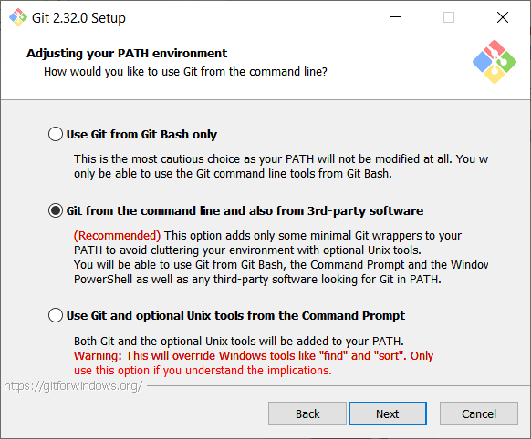

On choisit le client SSH que l'on souhaite utiliser, ici on reste sur OpenSSH car il est supporté sur toutes les plateformes, depuis peu notamment sur Windows 10. 
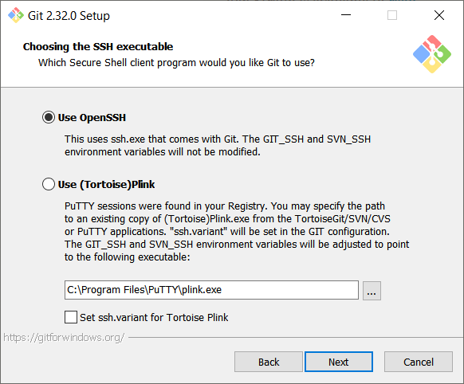

Le choix de la librairie SSL, on choisit OpenSSL qui est répandu sur toutes les platerformes.
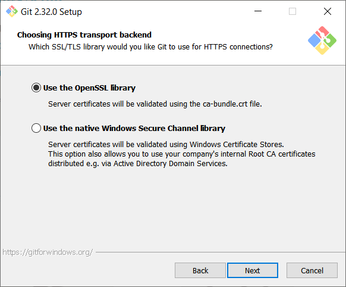

Comment Git va traiter les fins de lignes dans les fichiers, on choisit la 1ère option qui va transformera tout en style Unix pour une plus grande compatibilité.
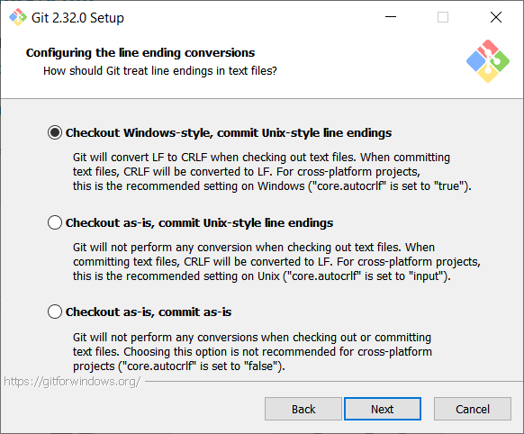

L'émulateur qui sera utilisé pour le terminal Git Bash, (je l'utilise très peu). On laisse par défaut MinTTY.


Que doit faire la command *git pull* par défaut ? On laisse par défaut.
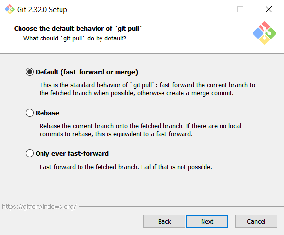

On choisit un credential helper pour ne pas à avoir à rentrer nos logins et mot de passe tout le temps. On laisse le choix par défaut, plus d'info [ici](https://github.com/microsoft/Git-Credential-Manager-Core/blob/main/docs/faq.md#about-the-project).
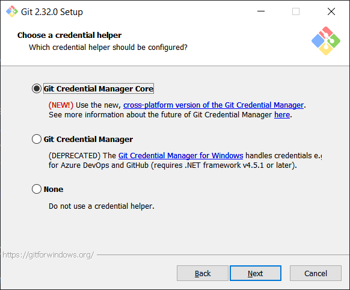

Options additionnels, on laisse par défaut.
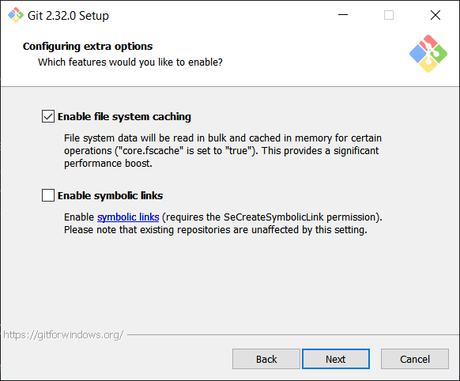

Options expérimentales, on ne coche pas.
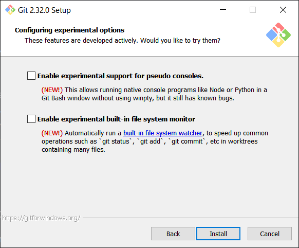

L'installation devrait démarrer.
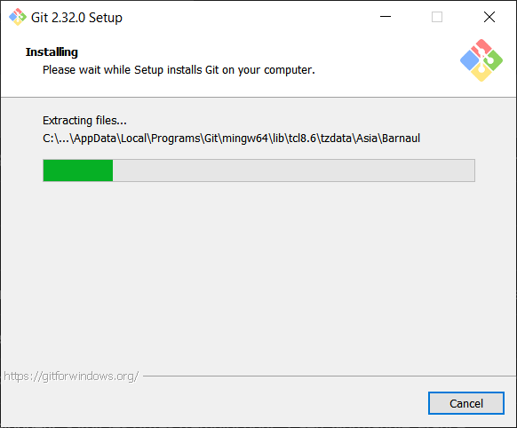

L'installation s'est terminée sans erreur.
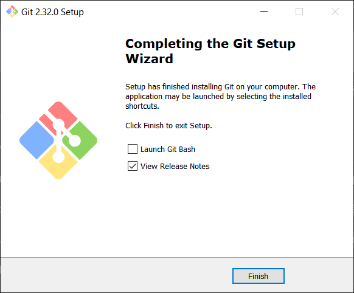

### Mac OS

Sur Mavericks (10.9) ou postérieur, vous pouvez simplement essayer de lancer git dans le terminal la première fois.

<AP>git --version</AP>

Si git n'est pas installé, vous pouvez installer une version à jour via Homebrew, le gestionnaire de paquet pour Mac OS. il s'installe avec cette commande :

<AP>/bin/bash -c "$(curl -fsSL https://raw.githubusercontent.com/Homebrew/install/HEAD/install.sh)"</AP>

Juste après :

<AP>brew install git</AP>

### Linux

Sur Fedora (ou toute distribution parente basée sur RPM, telle que RHEL ou CentOS), vous pouvez utiliser *dnf* :

<AP>sudo dnf install git-all</AP>

Sur Debian et Ubuntu, essayer *apt*.

<AP>sudo apt install git-all</AP>

Sinon pour une installation détaillée par distribution, [ce lien](https://git-scm.com/download/linux) est utile.

### Test d'installation

Vous pouvez tester que Git est bien installé en ouvrant un terminal et affichant sa version avec la commande :

<AP>git --version</AP>

```shell
git version 2.32.0.windows.1
```

## Création d'un projet Git

### Création d'un dossier de travail.

La force de Git réside dans le fait que c'est un outil en CLI pour Command Line Interface, c'est à dire que tout se fait en ligne de commande dans un terminal, ce qui le rend extrèmement rapide d'éxecution au prix d'un apprentissage des commandes.

On va initialiser un projet GIT en ouvrant un terminal et en créant un dossier. (Sur Windows, on utilisera Powershell en guise de terminal).

- Se placer dans un dossier de travail en utilisant les commandes suivantes :
  - On consulte le contenur du répertoire avec *ls* (Sur Windows, il faut utiliser un terminal avec Powershell pour que cette commande fonctionne).
  - On change de répertoire avec *cd* plus le nom du répertoire.

<AP>ls</AP>
<AP>cd ./NomDuRéptoire</AP>

- Créer le dossier suivant avec la commande : 
  
<AP>mkdir git-project-tuto</AP>

- On se place dans le dossier créé avec : 

<AP>cd git-project-tuto</AP>

### Git init

On initialise un projet Git avec la commande suivante, le dossier courant n'a pas besoin d'être vide, on pourrait tout aussi bien initialiser un projet Git dans un dossier qui possède des fichiers.

<AP>git init</AP>

```bash
Initialized empty Git repository in C:/Users/alexandre/dev/git-project-tuto/.git/
```

Git va suivre tous les changements qui auront lieu dans ce dossier. Tous les ajouts de fichiers et de dossiers ainsi que leurs modifications seront observés.

Un dossier caché a été créé à la racine du projet, il s'appelle *.git*. Il contient la configuration Git du projet, vous n'avez même pas besoin de savoir ce qu'il contient.

Sur *Unix ou Linux*, on affiche les fichiers cachés en liste avec la commande :

<AP>ls -la</AP>

```bash
drwxr-xr-x  7 alex alex 4096 Jun 15 11:56 .git
```

Sur *Windows* avec un terminal Powershell :

<AP>ls -Hidden</AP>

```powershell
Mode                 LastWriteTime         Length Name
----                 -------------         ------ ----
da-h--        15/06/2021     11:49                .git
```

Par défaut, le nom de la branche qui a été choisie est celle que vous avez défini lors de l'installation de git, pour vérifier le nom de la branche actuelle, on effectue la commande suivante :

<AP>git status</AP>

```bash
On branch master

No commits yet

nothing to commit (create/copy files and use "git add" to track)
```

Le nom de la branche ici est *master*. Cette commande indique que le dossier est vide et nous invite à créer ou à copier des fichiers.

## Suivi de fichiers avec git add

### Ajout d'un fichier

Toujours dans notre terminal précédent, j'ouvre mon IDE préféré, ici Visual Studio Code mais vous pouvez utiliser ce que vous voulez.

<AP>code .</AP>

Créez donc un fichier nommé *test.md* avec le contenu suivant :

```markdown
Tuto Git

Ceci est un test
```

On refait la commande *git status*.

```bash
On branch master

No commits yet

Untracked files:
  (use "git add <file>..." to include in what will be committed)
        test.md

nothing added to commit but untracked files present (use "git add" to track)
```

Git a bien détecté ce nouveau fichier, et nous demande d'effectuer la commande *git add nomDuFichier* pour que Git effectue le suivi.

<AP>git add test.md</AP>

Si la commande ne retourne rien, c'est que tout s'est bien passé. On observe les changements sur la branche toujours avec la commande *git status*.

```bash
On branch master

No commits yet

Changes to be committed:
  (use "git rm --cached <file>..." to unstage)
        new file:   test.md
```

le fichier *test.md* a bien été pris en compte par Git, on pourrait l'enlever du suivi avec la commande *git rm --cached test.md* mais on ne le fera pas ici. On verra par la suite comment empêcher Git de suivre des fichiers automatiquement avec le fichier *.gitignore*.

### Modification de fichier

Si on effectue des changements sur notre fichier, par exemple :

```markdown
Tuto Git

Ceci est un test de git add
```

Et que l'on effectue un *git status* derrière :

```bash
On branch master

No commits yet

Changes to be committed:
  (use "git rm --cached <file>..." to unstage)
        new file:   test.md

Changes not staged for commit:
  (use "git add <file>..." to update what will be committed)
  (use "git restore <file>..." to discard changes in working directory)
        modified:   test.md
```

Des changements ont été observés par Git mais ces nouveaux changements ont besoin d'être ajouté au suivi pour effectuer une capture de notre projet.

On effectue à nouveau la commande *git add test.md*.

## Capture de l'état d'un projet avec git commit

Voilà, vous avez fini de travailler sur votre projet (ici notre fichier test.md), vous voudriez effectuer une sauvegarde de l'état de votre projet.

C'est la que *git commit* intervient, elle va enregistrer toutes les modifications du projet dans un commit. Par défaut cette commande ouvre l'éditeur car un commit nécessite de détailler les modifications qui ont été faites (et oui pour du suivi c'est mieux !), mais on peut utiliser l'option *-m* pour spécifier un message dans la ligne de commande.

<AP>git commit -m "1er commit"</AP>

```bash
[master (root-commit) e2b81d2] 1er commit
 1 file changed, 3 insertions(+)
 create mode 100644 test.md
```
On peut faire un *git status*.

```bash
On branch master
nothing to commit, working tree clean
```

Il n'y a plus rien à *capturer* car le commit a déjà été effectué.

On pourrait continuer comme ça à ajouter des modifications (git add) puis à les capturer (git commit) mais dans un vrai environnement de travail seul ou en équipe, on va vouloir créer des branches et utiliser un dépôt distant pour mieux organiser notre travail.

## Dépôt distant

Imaginons que nous travaillons en équipe sur un projet, vous ne voulez pas garder les fichiers de suivis du projet sur votre machine en local mais tout mutualisé sur un serveur distant. On va se retrouver donc dans un schéma de client / serveur classique.

### Configurer un dépôt distant

L'intérêt de disposer d'un dépôt distant est de pouvoir pousser notre projet vers ce qu'on appelle un remote, pour le sauvegarder en dehors de notre machine mais aussi simplifier le travail en équipe. En cas de problème, il sera toujours possible de récupérer les fichiers du dépôt distant rapidement.

Il existe plusieurs services gratuits de dépôts distants comme Github, Gitlab ou bitbucket. Vous pouvez héberger vous même un serveur gitlab comme je l'explique [ici](/articles/m2l-serveur-gitlab-&-https). Allez donc créer un compte sur un de ces 3 services, ici pour l'exemple j'ai choisi github.

Une fois sur votre compte dont l'adresse devrait de ce type : *https://github.com/nomDeVotreCompte*, en haut à droite on crée un nouveau dépôt.

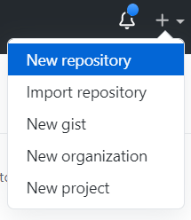

Remplissez les champs :

- *Repository Name* : Le nom du dépôt
- *Public / private* : Choisir de rendre le dépôt public ou privé, cela dépendra de la nature de votre projet.
- Tout le reste est optionnel.

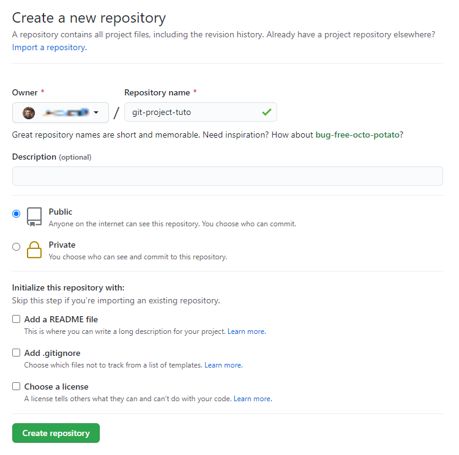

Vous devriez avoir un écran comme celui-ci :

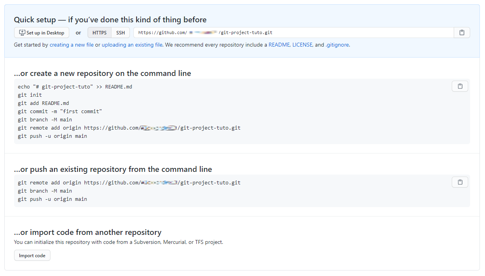

### Ajout du dépôt distant en local

Pour résumer ce que l'on doit retenir c'est que notre dépôt dispose d'une url qui s'appelle : *https://github.com/nomDeVotreCompte/git-project-tuto.git*. C'est cette url que l'on utilisera pour indiquer à Git où se trouve notre dépôt distant. Puisque notre projet est déjà créé en local, on choisira *...or push an existing repository from the command line*.

Dans notre terminal, on tape ces commandes en situant à la racine de notre projet :

<AP>git remote add origin https://github.com/nomDeVotreCompte/git-project-tuto.git</AP>

Cette commande va créer un référence locale appelée *origin*. Ce mot est un standard utilisé pour nommer la branche du dépôt distant mais on aurait très bien l'appeler **toto**. Cela nous sert surtout à pas entrer l'url du dépôt à chaque fois que l'on veut l'utiliser comme on le verra juste après.

### On pousse notre projet vers le dépôt distant

Github nous propose le nom de la branche principale *main* mais rappelez-vous que la notre s'appelle *master*. Ensuite, on effectue l'envoi :

<AP>git push -u origin master</AP>

L'option *-u* est un alias pour l'option *--set-upstream-to*, elle permet de définir automatiquement l'association en amont pour toutes les futures tentatives push/pull. Donc on vient d'associer une branche en local à une branche du dépôt distant. On obtient donc :

```bash
Counting objects: 100% (3/3), done.
Writing objects: 100% (3/3), 259 bytes | 259.00 KiB/s, done.
Total 3 (delta 0), reused 0 (delta 0), pack-reused 0
To https://github.com/nomDeVotreCompte/git-project-tuto.git
 * [new branch]      master -> master
Branch 'master' set up to track remote branch 'master' from 'origin'.
```

La prochaine fois que l'on effectuera une modification de notre projet avec *git add* et *git commit*, il ne restera plus qu'à faire la commande *git push* pour envoyer notre projet sur le dépôt distant car toute la configuration est faite.

### Récupération des modifications depuis le dépôt distant

Si des modifications ont été effectués et pousser vers le dépôt distant par un de vos collègues , cela signife que votre projet en local n'est plus à jour, on va donc demander à Git d'aller chercher les modifications sur le dépôt distant et de mettre à jour notre projet avec :

<AP>git pull</AP>

### Cloner un projet

L'intérêt d'avoir des depôts distants publics est que n'importe qui peut cloner un projet sur sa machine et commencer à travailler dessus ou à utiliser le code. Exemple :

<AP>git clone https://github.com/nomDuCompte/nomDuDépôt.git</AP>

## Les branches

A quoi servent les branches ? Les branches sont utiles pour plusieurs raisons.

- On va pouvoir les utiliser pour développer de nouvelles fonctionnalités pour notre projet sans venir polluer la branche principale.
- Elles sont utiles pour décrire l'état de notre projet : branche prod, branche dev, branche test, etc...

On pourra par la suite fusioner les branches entre elles, lorsqu'il ne sera plus nécessaire de maintenir des versions différentes du projet.

A noter que l'utilisation des branches n'est pas seulement destinée aux cas que je viens de citer, chacun pourra développer sons utilisation personelle selon le projet, ses envies, etc...

### Création d'une branche

A la racine du projet, on crée une nouvelle branche auquel on donne le nom que l'on souhaite et qui va décrire ce que l'on veut faire.

<AP>git branch nouvelle-feature</AP>

Cette commande ne renvoit rien. La branche a bien été créée mais on ne travaille pas encore dessus. Pour cela on fait :

<AP>git switch nouvelle-feature</AP>

```bash
Switched to branch 'nouvelle-feature'
```

On peut voir toute les branches du projets en faisant :

<AP>git branch -a</AP>

```bash
master
* nouvelle-feature
  remotes/origin/master
```

L'astérisque indique sur quelle branche le projet se trouve !

### Modification sur la nouvelle branche

Effectuons une modification de notre projet, on modifie le fichier *test.md* :

```markdown
Tuto Git

Ceci est un test de la nouvelle branche
```

On effectue les commandes vues précédemment pour enregistrer notre travail avec *git add* et *git commit*. On devrait avoir quelques chose comma ça :

```bash
[nouvelle-feature 7bcc633] 1er commit branche nouvelle-feature
 1 file changed, 1 insertion(+), 1 deletion(-)
 ```

### Fusion de branches

Admettons que nous sommes content de notre projet, on veut fusionner la branche *master* et la branche *nouvelle-feature*.

On se place sur la branche que l'on souhaite garder ici la branche *master*.

<AP>git switch master</AP>

```bash
Switched to branch 'master'
Your branch is up to date with 'origin/master'.
```

On fusionne la branche *nouvelle-feature* avec la branche actuelle :

<AP>git merge nouvelle-feature</AP>

```bash
Updating e2b81d2..7bcc633
Fast-forward
 test.md | 2 +-
 1 file changed, 1 insertion(+), 1 deletion(-)
 ```

Cependant, si on effectue un *git status*, on obtient :

```bash
On branch master
Your branch is ahead of 'origin/master' by 1 commit.
  (use "git push" to publish your local commits)    

nothing to commit, working tree clean
```

Git nous prévient que notre branche actuelle est en avance par rapport à la branche *origin/master* de 1 commit alors que nous n'avons pas effectuer la commande *git commit*. En fait, c'est qu'en faisant la commande *git merge*, qu'un commit est effectué automatiquement, il faut donc pousser nos changements.

<AP>git push</AP>

```bash
Enumerating objects: 5, done.
Counting objects: 100% (5/5), done.
Delta compression using up to 8 threads
Compressing objects: 100% (2/2), done.
Writing objects: 100% (3/3), 322 bytes | 322.00 KiB/s, done.
Total 3 (delta 0), reused 0 (delta 0), pack-reused 0        
To https://github.com/votreNomDeCompte/git-project-tuto.git
   e2b81d2..7bcc633  master -> master
```

### Suppression de branches

La branche *nouvelle-feature* existe toujours, on peux la supprimer comme ça :

<AP>git branch -d nouvelle-feature</AP>

```bash
Deleted branch nouvelle-feature (was 7bcc633).
```