## Documentations
Debian Buster 10.9 - Licence Debian Free Software Guidelines - [Manuel de l'administrateur](https://www.debian.org/doc/manuals/debian-handbook/)

## Présentation

Debian également connue sous le nom de Debian GNU/Linux, est une distribution Linux composée de logiciels libres et open source, développée par le projet Debian soutenu par la communauté, qui a été établi par Ian Murdock le 16 août 1993. La première version de Debian (0.01) a été publiée le 15 septembre 1993 et sa première version stable a été publiée le 17 juin 1996. La branche Debian Stable est l'édition la plus populaire pour les ordinateurs personnels et les serveurs. Debian est également la base de nombreuses autres distributions, notamment Ubuntu.

Debian est l'un des plus anciens systèmes d'exploitation basés sur le noyau Linux. Le projet est coordonné sur Internet par une équipe de bénévoles guidés par le chef de projet Debian et trois documents fondamentaux: le contrat social Debian, la constitution Debian et les directives du logiciel libre Debian. Les nouvelles distributions sont mises à jour en permanence et la prochaine candidate est publiée après un gel temporel.

Depuis sa fondation, Debian a été développée ouvertement et distribuée librement selon les principes du projet GNU. Pour cette raison, la Free Software Foundation a parrainé le projet de novembre 1994 à novembre 1995. Lorsque le parrainage a pris fin, le projet Debian a formé l'organisation à but non lucratif Software in the Public Interest pour continuer à soutenir financièrement le développement.

## Prérequis

Actuellement la version Stable de Debian est la version 10 nommée **Buster**, le plus simple est de se rendre sur le [site officiel](https://www.debian.org/distrib/netinst.fr.html#netboot) et de télécharger la version correspondant à l'architecture du processeur adéquat.

Ensuite cela va dépendre de notre utilisation, soit on veut installer Debian sur une machine virtuelle pour effectuer des tests par exemple ou on peut l'installer en dual boot avec une version de Windows.

Ici on se concentrera sur une installation virtualisé sur Virtual Box.

### Via Virtual Box

Sur Virtual Box, on commence par cliquer sur `Machine` puis `Nouvelle`. On renseigne les informations sur le nom et le système d'exploitation:

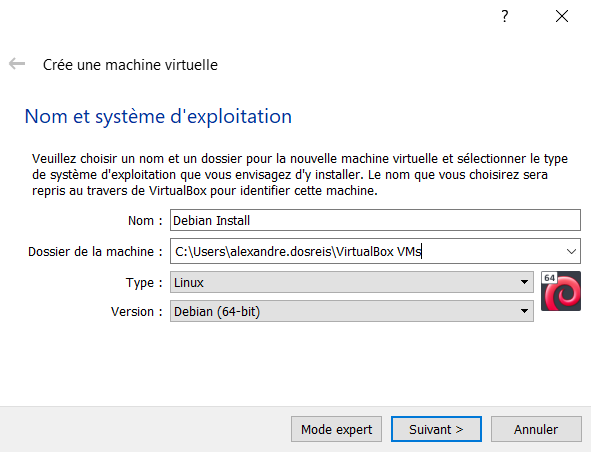

Ensuite vient le choix de la taille de la mémoire, cela va dépendre de l'utilisation de la Debian. Dans tous les cas, consulter la documentation des applications que l'on souhaitera installer plus tard. Ici on laisse la valeur par défaut de 1024 Mo.

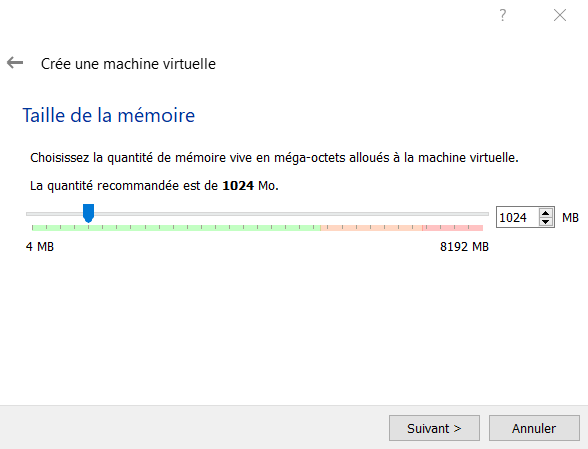

Concernant le disque dur, on laisse le choix par défaut qui est `Creér un disque dur virtuel maintenant`, cela va laisser Virtual Box gérer les choses à notre place.

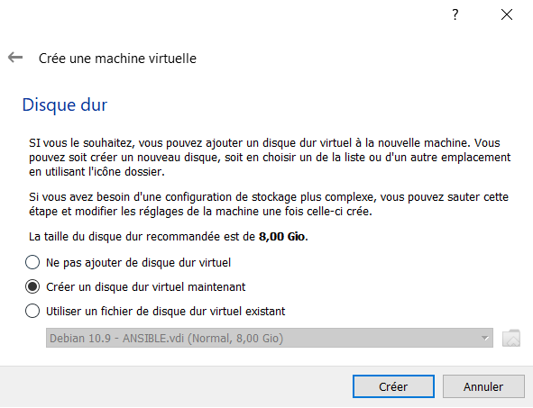

On laisse le type à `VDI (VirtualBox Disk Image)` et dynamiquement alloué.

Un fichier de disque dur alloué dynamiquement n'utilisera d'espace sur le disque dur physique qu'au fur et à mesure qu'il se remplira jusqu'à une taille fixe maximale, cependant il ne se réduira pas automatiquement lorsque de l'espace sur celui-ci sera libéré.

Pour la taille, on choisit 8 Go mais il ne faut pas hesiter à changer cette taille selon le besoin.

Dans le menu principal, la machine virtuelle à bien été créée:


On double clique pour la démarrer, puis il est demander de choisir l'ISO d'un Debian. Il faut indiquer le chemin de l'ISO que l'on a prélablement télécharger depuis le site officiel de Debian. Puis cliquer sur `Démarrer`.

Avant de démarrer la Debian, on vérifie bien que la machine est en accès par pont au niveau du réseau sinon on ne pourra sortir du réseau. Sur l'onglet `Configuration`, `Réseau`, choisir `Accès par pont` et le nom de la carte réseau de l'hôte.

Pour plus de confort on peut installer les additions invités pour Debian

https://linuxtricks.fr/wiki/installer-les-additions-invite-virtualbox-dans-debian

## Installation

Le début de l'installation de la Debian débute avec cet écran:

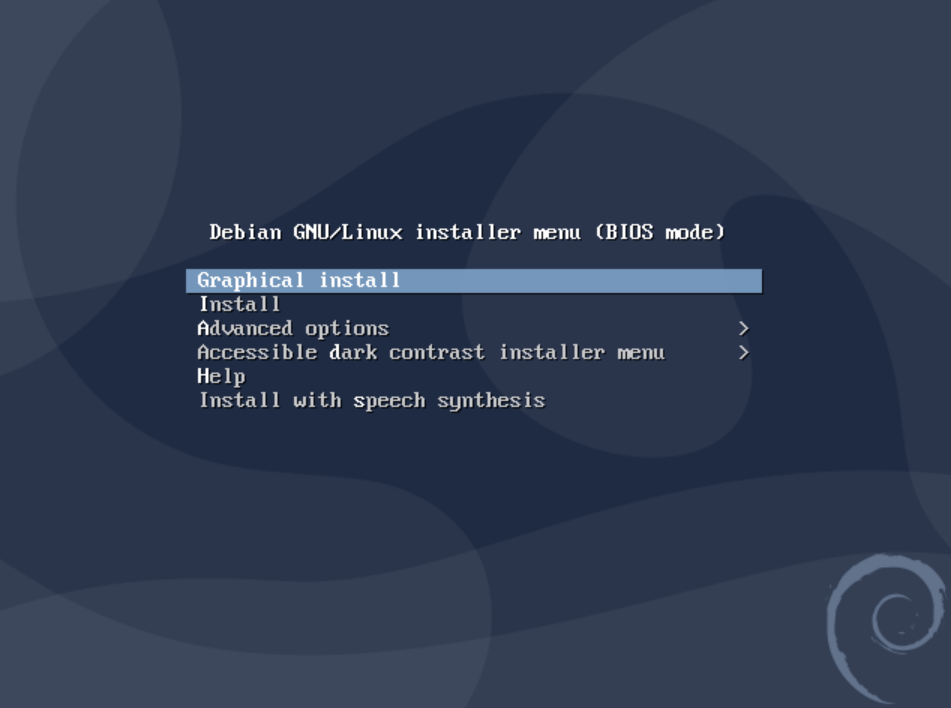

Il y 2 méthodes d'intallation possible, une avec interface graphique et l'autre sans, on choisit simplement `Install`.

### Langue, locale et clavier

On choisit de mettre la machine, le système, la locale et le clavier en français.

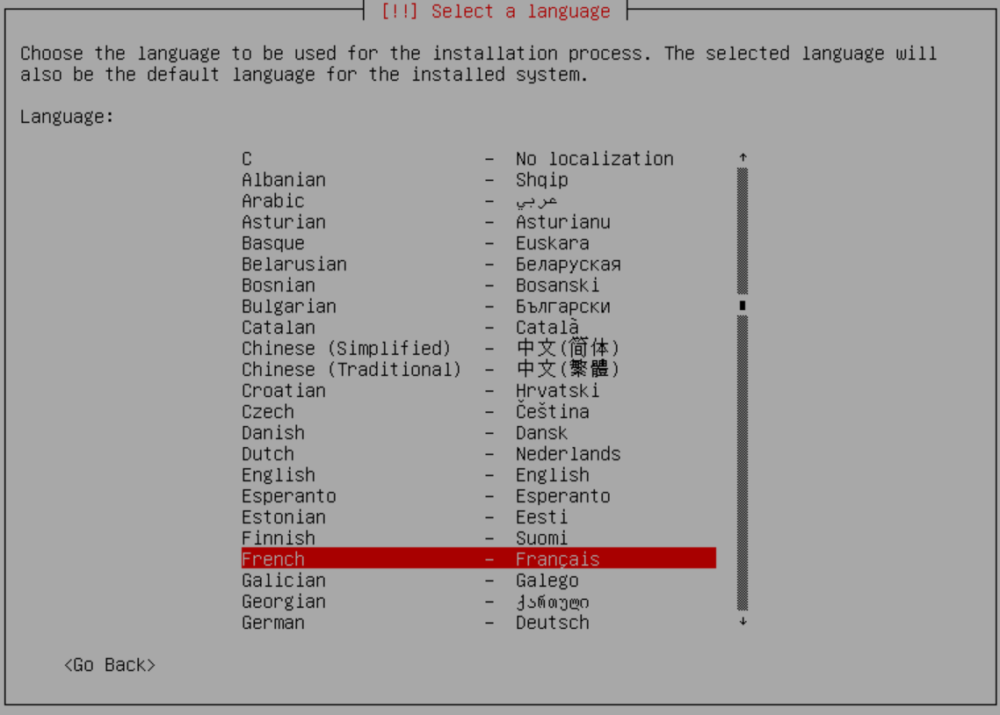

### Nom et Domaine

Ce nom est important puisqu'il va correspondre au hostname de la machine, mais on pourra toujours le modifier plus tard dans le fichier `/etc/hostname`. Ici on laisse Debian par défaut.

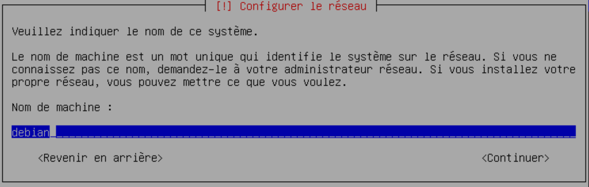

Le nom de domaine est important si cette machine est installer dans une entreprise avec un serveur DNS, on pourra mettre en exemple: `mondomaine.local`. Si c'est pour une installation de test, on laisse ce champs vide.

Le nom FQDN de la machine sera alors: `debian.mondomaine.local`

### Root

Root est le superutilisateur de la machine, en d'autre termes c'est l'administrateur qui aura tous les droits sur la machine. En production, le mot de passe de `Root` ne doit pas être facile à deviner car une fois découvert, un utilisateur malveillant pourrait commettre des désastres sur la machine.

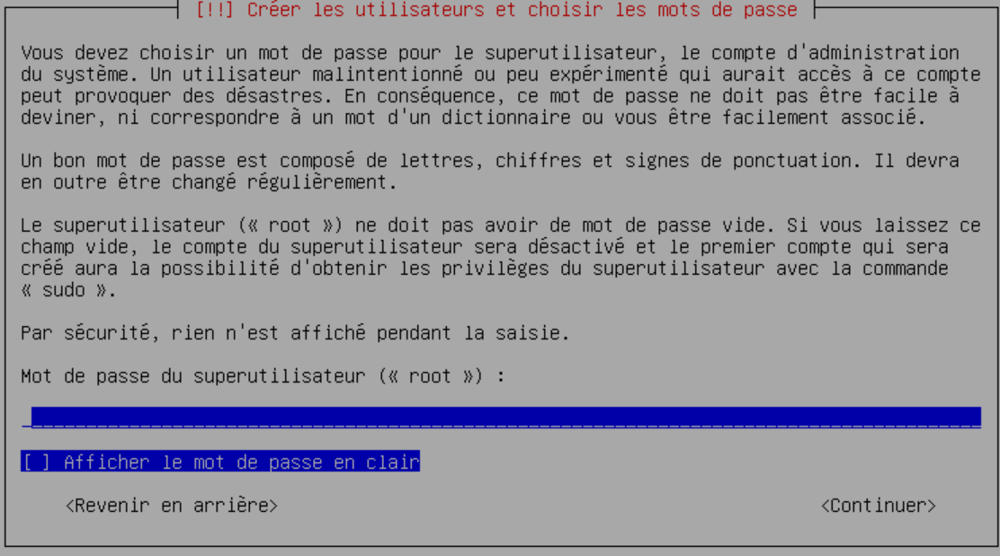

### Création d'un utilisateur

Même si on a créer un utilisateur administrateur qu aura tous les droits sur la machine, dans un contexte réelle de production. On utilisera toujours des compte utilisateurs personnalisés qui auront des droits restreints sur la machine.

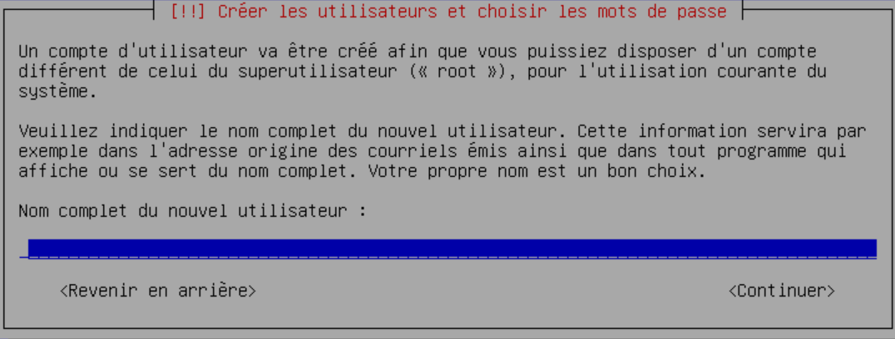

### Partition des disques

Concernant le partionnement, voici ce que dit [wiki.debian-fr.xyz](https://wiki.debian-fr.xyz/Le_partitionnement):

> Pourquoi partitionner ?

> Vous pourriez envisager de n'avoir qu'une seule partition contenant tout votre système... La plupart d'entre nous choisissent de créer plus de partitions que le minimum dont Debian a besoin pour fonctionner. Pourquoi ?

> Principalement pour des raison de sécurité:
> Si une partition est corrompue, le reste du système peut être encore accessible. Il peut suffire simplement de restaurer une sauvegarde de la partition corrompue pour régler le problème. Mais aussi pour séparer les partitions qui risqueraient d'être submergées de fichiers (Par exemple /var pour un serveur de mail qui serait attaqué par un envoi massif...),le reste du système serait alors toujours opérationnel.

> Séparer les autres partitions de la racine "/" permet, en cas de corruption d'une autre partition, de toujours pouvoir amorcer Linux pour réparer le système...
> Vous voulez en effet pouvoir être en mesure de démarrer en "Single user mode" pour restaurer votre station ou serveur... Ce qui exige une racine «intacte».

> La seconde difficulté (après le choix du nombre de partitions) sera de définir la taille de ces partitions...
> Une taille trop petite rendra rapidement votre système inutilisable. Une taille trop grande gâche de l'espace disque (qui même s'il n'est pas cher peut être utile ailleurs...)

> Les remarques qui suivent sont des préconisations Debian:

> Pour les nouveaux utilisateurs, les machines Debian personnelles ou familiales, et autres systèmes mono-utilisateur, une simple partition / (plus celle d'échange swap ) est sans doute la solution la plus simple à mettre en œuvre. L'inconvénient serait que les données personnelles ne sont pas séparées du système. Il est donc donc généralement conseillé, en plus de la partition d'échange (swap) de créer une partition racine "/" ET une partition "/home".
> Pour les systèmes utilisés par plusieurs personnes (donc avec autant de comptes personnels), ou les systèmes disposants de beaucoup d'espace disque, il vaut mieux placer les répertoires "/usr", "/var", "/tmp", et "/home" chacun sur une partition distincte du ou des disques. /.
> Si vous projetez d'utiliser votre machine comme serveur de mail, prévoyez une partition "/var" en conséquence (à moins que vous ne stockiez les courriers dans un autre répertoire - vous pourriez par exemple avoir besoin de mettre "/var/mail" sur une partition distincte.
> Si vous mettez sur pied un serveur avec beaucoup d'utilisateurs ou si vous avez plusieurs systèmes Linux, il est généralement intéressant d'avoir une grande partition distincte pour "/home".

> Pour un serveur, avec 2 Gb de mémoire vive et sur laquelle le DD interne a une capacité de 100 GB par exemple un serveur de mail, un serveur MariaDB, Serveur Web Apache2, un home limité pour quelques utilsateurs:

| Nom de la partition | Taille |
| ------------------- | ------ |
| /                   | 350 MB |
| /boot               | 50 MB  |
| /usr                | 10 GB  |
| /var                | 70 GB  |
| /tmp                | 10 GB  |
| /home               | 5,6 GB |
| SWAP                | 4 GB   |

Il est recommander de séparer les dossiers des utilisateurs `/home`, les dossiers `/var` et `/tmp` d'avec celui du système, pour cela on choisit `partitionnement assisté`, puis `Assisté - utiliser un disque entier`, on sélectionne le disque à partitionner puis on choisit `Partitions /home, /var et /tmp séparées`.

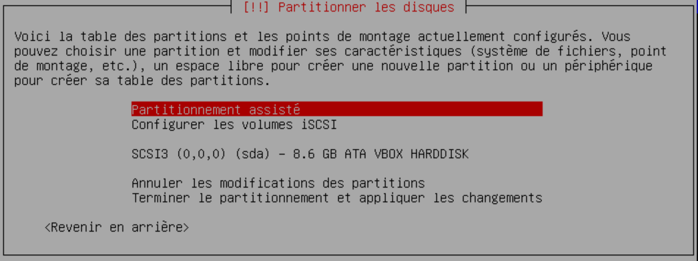

Puis `Terminer le partitionnement et appliquer les changements`, puis `oui`.

Le disque ISO est analysé, la version doit être affichée, on répond `non`.

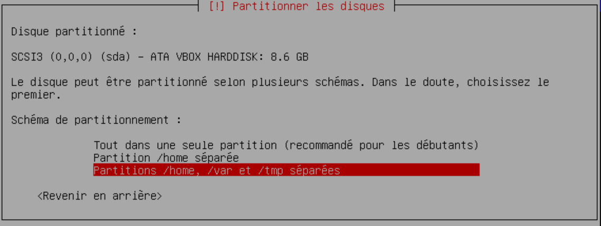

### Choix du mirroir

Comme on a choisit une installation en `net install`, il est de demander choisir le mirroir qui servira à l'installation de la Debian mais aussi pour l'obtention des futurs paquets, le but étant de choisir le mirroir le plus proche de la machine. Ici on choisit `ftp.fr.debian.org`.

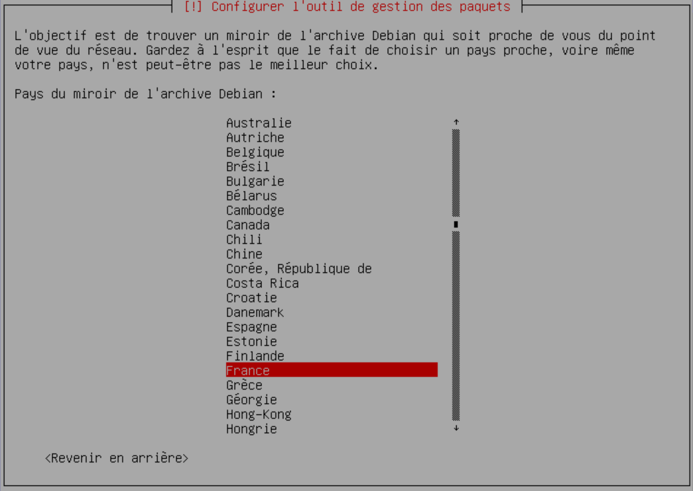

On n'utilise pas de proxy donc on laisse vide le champs.

### Sélection des logiciels

Ici est un choix crucial pourpour le système, on peut décider de mettre une interface graphique à notre Debian ce que l'on ne fera pas pour une serveur web par exemple. On choisit au minimum un serveur SSH et les utilitaires usuels du système, ce qui va grandement accélerer le téléchargement des paquets.

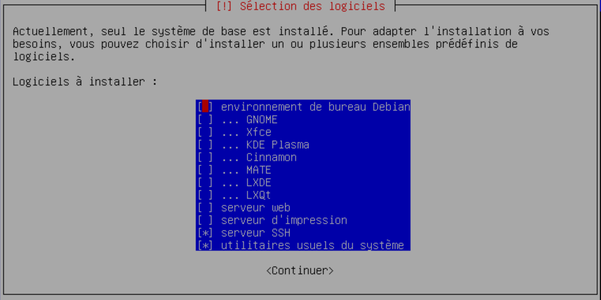

### GRUB

GNU GRUB (acronyme signifiant en anglais « GRand Unified Bootloader ») est un programme d'amorçage de micro-ordinateur. Il s'exécute à la mise sous tension de l'ordinateur, après les séquences de contrôle interne et avant le système d'exploitation proprement dit, puisque son rôle est justement d'en organiser le chargement. Lorsque l'ordinateur héberge plusieurs systèmes (on parle alors de multi-amorçage), il permet à l'utilisateur de choisir quel système démarrer.

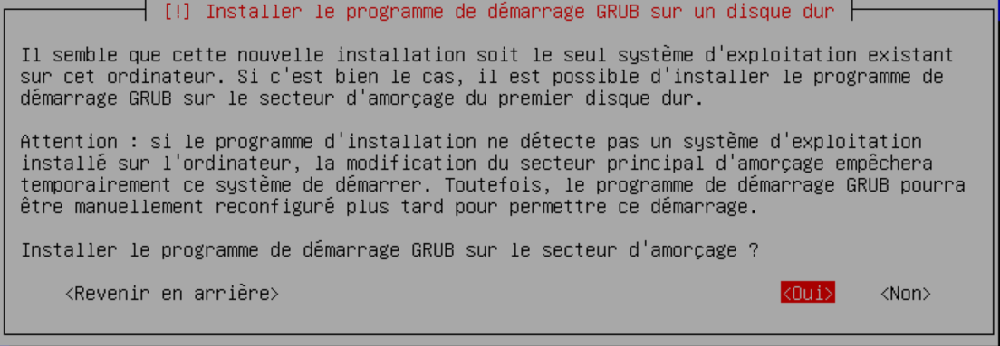

Ici on choisit `Oui`. Grub peut être installé sur un disque dur externe, une clé USB ou sur la partition principale. Ici, on choisit la partition principale

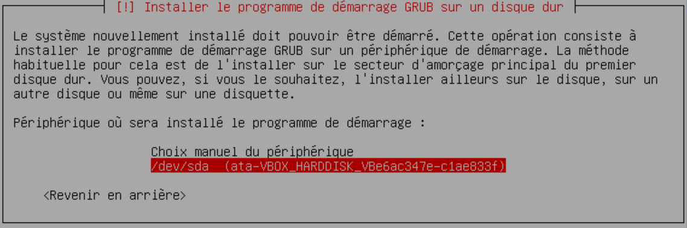

Grub est utile lorsque l'on a plus plusieurs OS intallés sur la même machine.

## Configuration de base

Pour les installations de base, on change d'utilisateur pour se mettre en root:

<AP>su</AP>

Et on rentre le mot de passe que l'on a défini pour root plus tôt dans l'installation.

### Renouveler son bail DHCP

Pour connaitre ses cartes réseaux et son adresse IP, on fait:

<AP>ip a</AP>

```
1: lo: <LOOPBACK,UP,LOWER_UP> mtu 65536 qdisc noqueue state UNKNOWN group default qlen 1000
    link/loopback 00:00:00:00:00:00 brd 00:00:00:00:00:00
    inet 127.0.0.1/8 scope host lo
       valid_lft forever preferred_lft forever
    inet6 ::1/128 scope host
       valid_lft forever preferred_lft forever
2: enp0s3: <BROADCAST,MULTICAST,UP,LOWER_UP> mtu 1500 qdisc pfifo_fast state UP group default qlen 1000
    link/ether 08:00:27:ef:0e:27 brd ff:ff:ff:ff:ff:ff
    inet 172.16.0.68/16 brd 172.16.255.255 scope global dynamic enp0s3
       valid_lft 86171sec preferred_lft 86171sec
    inet6 fe80::a00:27ff:feef:e27/64 scope link
       valid_lft forever preferred_lft forever
```

Si pour une raison ou une autre, on souhaite renouveller son bail dhcp, on peut faire:

<AP>/sbin/dhclient -r enp0s3</AP>

`enp0s3` étant le nom de la carte réseau par laquelle on souhaite un renouvellement du bail DHCP.

### Variables d'environnement

Par défaut, certaine installation de variables d'environnement qui vont permettre de ne taper tout le chemin du commande. On va donc indiquer au système les chemins par défaut à regarder lorsque l'on tape une commande. Ainsi on n'aura plus besoin de tapper `/sbin/dhclient -r enp0s3` mais `dhclient -r enp0s3`.

Pour ce faire, éditer le fichier suivant: `/etc/environment`

<AP>nano /etc/environment</AP>

On ajoute la ligne suivante:

```
export PATH="/usr/local/sbin:/user/local/bin:/sbin:/bin:/usr/sbin:/usr/bin:/root/bin"
```

On change de session pour que le système le prenne en compte avec `su`

### Mise à jour du système

On peut afficher les informations liés au système avec:

<AP>uname -a</AP>

```
Linux debian 4.19.0-16-amd64 #1 SMP Debian 4.19.181-1 (2021-03-19) x86_64 GNU/Linux
```

Avant d'installer quoi que se soit, on utilise la commande suivante pour mettre à jour les dépôts.

<AP>apt update</AP>

```
Atteint :1 http://security.debian.org/debian-security buster/updates InRelease
Atteint :2 http://ftp.fr.debian.org/debian buster InRelease
Atteint :3 http://ftp.fr.debian.org/debian buster-updates InRelease
Lecture des listes de paquets... Fait
Construction de l'arbre des dépendances
Lecture des informations d'état... Fait
Tous les paquets sont à jour.
```

Puis on met à jour le système avec:

<AP>apt dist-upgrade</AP>

```
Lecture des listes de paquets... Fait
Construction de l'arbre des dépendances
Lecture des informations d'état... Fait
Calcul de la mise à jour... Fait
0 mis à jour, 0 nouvellement installés, 0 à enlever et 0 non mis à jour.
```