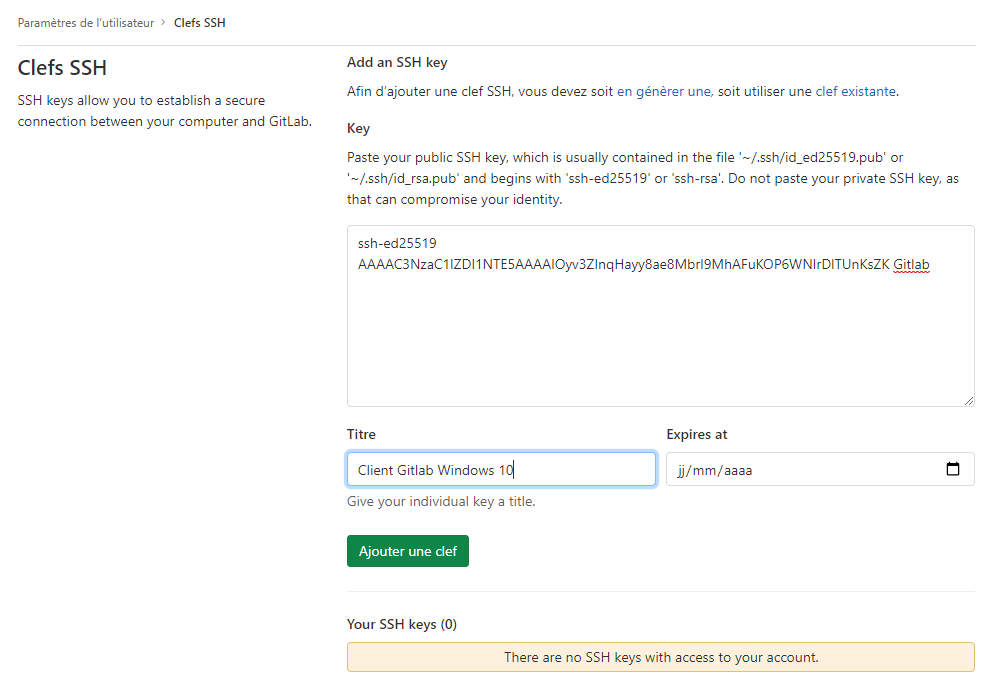
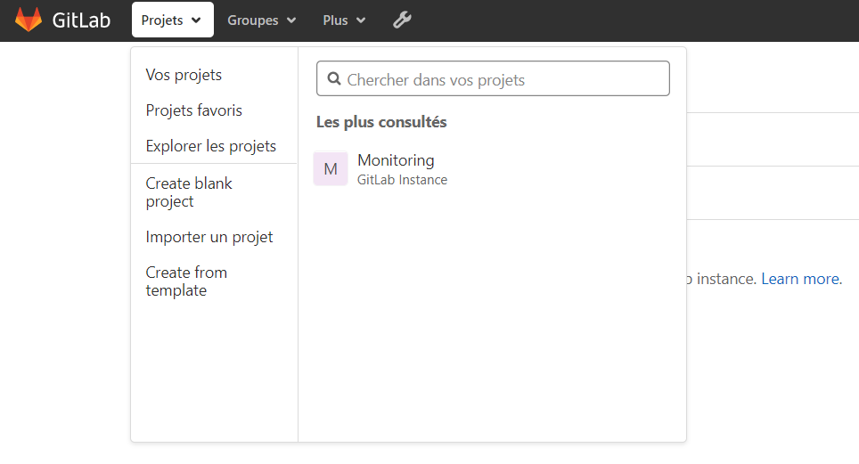
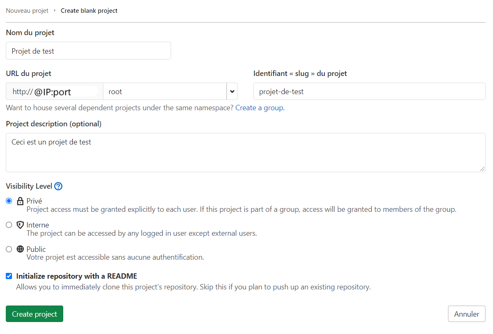
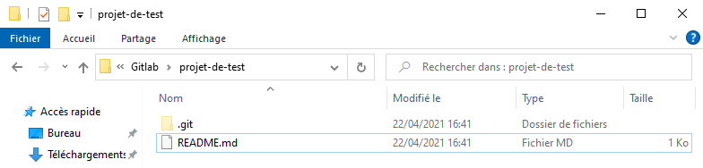

## Présentation

Git est un logiciel de versioning créé en 2005 par Linus Torvalds, le créateur de Linux.

Un logiciel de versioning, ou logiciel de gestion de version est un logiciel qui permet de conserver un historique des modifications effectuées sur un projet afin de pouvoir rapidement identifier les changements effectuées et de revenir à une ancienne version en cas de problème.

Les logiciels de gestion de versions sont quasiment incontournables aujourd’hui car ils facilitent grandement la gestion de projets et car ils permettent de travailler en équipe de manière beaucoup plus efficace.

Parmi les logiciels de gestion de versions, Git est le leader incontesté et il est donc indispensable pour tout développeur de savoir utiliser Git.

| Machine             | OS          | Distribution | Version | Rôle           | Nom d'hôte | IP            |
| ------------------- | ----------- | ------------ | ------- | -------------- | ---------- | ------------- |
| VM Gitlab           | GNU / Linux | Debian       | 10.8    | Serveur Gitlab | gitlab     | 192.168.1.1   |
| VM Windows 10       | Windows     | 10 Éducation | 20H2    | Client Gitlab  | PC-Test-AD| 192.168.1.79 |

## Installation

Mise en place d'un serveur GitLab et du protocole https dans le cadre de la situation professionnelle M2L.

### Prérequis

Il est recommandé d'utiliser 2 cœurs pour le processeur et 4 GB de mémoire ram pour une configuration de base.

Gitlab peut être installé sur plusieurs OS : Ubuntu, Debian, CentOS, Red Hat Enterprise Linux, Scientific Linux, Oracle Linux. Ici on partira sur une distribution Debian.

Gitlab propose 2 installations, une nommée Entreprise Edition et l'autre nommée Community Edition. Ces installations sont similaires, l'Entreprise Edition permet d'ajouter des modules payants à tout moment alors La version Community Edition ne contient pas de code source propriétaire.

### Mise en oeuvre

Pour l'installation, on choisit la version *Community Edition* accessible depuis ce lien : [Installation de Gitlab CE](https://about.gitlab.com/install/?version=ce#debian)

<AP>sudo apt-get install -y curl openssh-server ca-certificates perl</AP>

<AP>curl -sS https://packages.gitlab.com/install/repositories/gitlab/gitlab-ce/script.deb.sh | sudo bash</AP>

## Configuration

Editer le fichier de configuration : */etc/gitlab/gitlab.rb*

On va définir un nom de domaine pour servir notre application, la ligne à changer est la suivante : 

```make
external_url 'http://domain.com'
```

Ici on sous entend que l'application sera servie sur le le port 80, on l'indique tout de même pour une plus grande clarté.

```make
external_url 'http://gitlab.m2a.local:80'
```

A chaque modification du fichier de configuration, il faudra relancer le build de notre application avec la commande suivante :

<AP>sudo gitlab-ctl reconfigure</AP>

La reconfiguration devrait durer 5 min. Une fois effectuée, le message *GitLab Reconfigured!* devrait apparaître.

## Accessibilité depuis l'extérieur

Puis que nous sommes derrière un serveur Proxmox, il faut transmettre les requêtes depuis l'adresse IP publique vers le serveur Gitlab pour le rendre accessible depuis l'extérieur. Pour cela, on effectue un NAT où l'on va dire à Proxmox que l'on veut autoriser les requêtes entrantes sur le port 4001 (Port choisi au hasard) à communiquer avec le port 80 du serveur Gitlab et inversement.

Sur le serveur Proxmox, on utilise la commande *iptables* pour effectue le nat :

<AP>iptables -t nat -A PREROUTING -j DNAT -i vmbr0 -p tcp --dport 4001 --to-destination 192.168.1.1:80</AP>

On effectue un test avec l'adresse IP publique suivie du numéro de port dans le navigateur comme ceci : *http://@IpPublique:4001*


L'identifiant par défaut est *root* et il est demandé de changer le mot de passe dés la 1ère connexion.

## Sécuriser Gitlab en HTTPS avec un certificat auto-signé

Par défaut, Gitlab intégère un module TLS/SSL qui permet de sécuriser les connexions au site et de passer en HTTPS mais elle nécessite d'avoir un vrai nom de domaine valide avec un enregistrement A pointant vers le serveur Gitlab.

Ici on va plutôt utilisé un certificat auto-signé avec OpenSSL. Normalement, il est déjà installé par défaut sur le serveur, on le vérifie avec :

<AP>dpkg -s openssl</AP>

Sinon on fait :

<AP>apt install openssl</AP>

La génération du certificat s'effectue avec la commande suivante :

<AP>sudo openssl req -x509 -nodes -days 365 -newkey rsa:2048 -keyout /etc/gitlab/ssl/selfsigned.key -out /etc/gitlab/ssl/selfsigned.crt</AP>

Expliquer cette commande avec [ce lien](https://www.digitalocean.com/community/tutorials/how-to-create-a-self-signed-ssl-certificate-for-nginx-on-debian-10)

On nous demande de répondre à des informations liés à la localisation du serveur :

```make
You are about to be asked to enter information that will be incorporated
into your certificate request.
What you are about to enter is what is called a Distinguished Name or a DN.
There are quite a few fields but you can leave some blank
For some fields there will be a default value,
If you enter '.', the field will be left blank.
-----
Country Name (2 letter code) [AU]:FR
State or Province Name (full name) [Some-State]:Calvados
Locality Name (eg, city) []:Caen
Organization Name (eg, company) [Internet Widgits Pty Ltd]:M2L
Organizational Unit Name (eg, section) []:IT
Common Name (e.g. server FQDN or YOUR name) []:gitlab
Email Address []:
```

On édite à nouveau le fichier de configuration principal */etc/gitlab/gitlab.rb*

On va changer ces lignes :

```make
external_url 'https://gitlab.m2l.local'
(...)
nginx['enable'] = true
nginx['client_max_body_size'] = '250m'
nginx['redirect_http_to_https'] = true
nginx['redirect_http_to_https_port'] = 80
(...)
nginx['ssl_certificate'] = "/etc/gitlab/ssl/selfsigned.crt"
nginx['ssl_certificate_key'] = "/etc/gitlab/ssl/selfsigned.key"
nginx['ssl_protocols'] = "TLSv1.2 TLSv1.3"
```

On peut voir ici que le serveur web de Gitlab n'est autre que Nginx. Une fois les modifications effectuées, on lance la reconfiguration de l'application avec :

<AP>sudo gitlab-ctl reconfigure</AP>

Puis pour vérifier notre installation :

<AP>sudo gitlab-rake gitlab:check</AP>

## Utilisation d'un dépôt distant

Pour qu'un dévéloppeur puisse commencer à travailler avec un dépot distant qui sera créé sur notre serveur Gitlab, il va falloir créé une paire de clef SSH sur la machine cliente dont la clef publique sera déposée sur notre serveur Gitlab. Le but de cette manœuvre est d'éviter de rentrer les identifiants du compte git à chaque *push*.

### Création d'une paire de clé SSH sur la machine cliente

Sur la machine cliente présente dans le domaine m2l, on crée une clé SSH avec la commande suivante, cette commande fonctionne sur toutes les plateformes tant que OpenSSH est utilisé.

<AP>ssh-keygen -t ed25519</AP>

```make
Generating public/private ed25519 key pair.
Enter file in which to save the key (C:\Users\toto/.ssh/id_ed25519):
Created directory 'C:\Users\toto/.ssh'.
Enter passphrase (empty for no passphrase):
Enter same passphrase again:
Your identification has been saved in C:\Users\toto/.ssh/id_ed25519.
Your public key has been saved in C:\Users\toto/.ssh/id_ed25519.pub.
The key fingerprint is:
SHA256:RyUWJrQkN/JHfKc5a1EhpAanPWmMbv5Fw41B9t7GkIc Gitlab
The key's randomart image is:
+--[ED25519 256]--+
|      o.B.Bo*.. |
|       * #.B.ooo |
|        = @..=E .|
{|       . = o== = |
|        S . =+o +|
|       o . .o. . |
|        .  ..    |
|         . .     |
|          .      |
+----[SHA256]-----+
```

Une fois la création terminée, copier l'intégralité du fichier *id_ed25519.pub* sur le serveur Gitlab.

### Import de la clé SSH sur l'application Gitlab

Cliquer sur l'image en haut à droite et sélectionner *Edit profile*. Puis dans le menu à gauche *Clefs SSH*. Configurer comme ceci :



### Création d'un nouveau projet

Se rendre sur *Projet* puis *Create blank project* :



Configurer le projet de test comme ceci :



Le projet de test étant privé, l'utilisation d'un clé SSH est nécessaire pour cloner le projet sur une machine cliente.

### Clone du projet sur la machine cliente et ajout au dépôt distant

On va effectuer des commandes liés à Git pour cloner le dépôt distant en dépôt local, il faut pour cela installer Git pour Windows [disponible ici](https://git-scm.com/download/win). Il faut que la commande *Git* soit accessible depuis n'importe où, pour cela il faut l'ajouter à la variable d'environnement PATH.

Une fois Git installé sur la machine cliente, on crée un dossier nommé *Gitlab* dans les documents et on se place dedans avec le terminal.

Pour cela, ouvrir le menu démarrer et taper *cmd*, puis touche entrer. On tape la commande suivante :

<AP>cd C:\Users\toto\Documents\Gitlab</AP>

Puis pour importer le projet :

<AP>git clone git@gitlab:root/projet-de-test.git</AP>

Normalement, on devrait obtenir ceci :

```make
PS C:\Users\toto\Documents\Gitlab> git clone git@192.168.1.1:root/projet-de-test.git
Cloning into 'projet-de-test'...
remote: Enumerating objects: 3, done.
remote: Total 3 (delta 0), reused 0 (delta 0), pack-reused 3
Receiving objects: 100% (3/3), done.
```

On peut voir que le projet a bien été cloné :



On va modifié le fichier *README.MD* et lui ajouter quelques lignes pour simuler un changement dans un notre dépôt. Puis on effectuera les commandes suivantes dans le dossier *projet-de-test* :

Cette commande permet d'ajouter tous les fichiers vers la proposition de changement.

<AP>git add .</AP>

Cette commande valide les propositions, les fichiers concernés sont ajouté au HEAD, mais pas encore au dépôt distant.

<AP>git commit -m 'test 1er commit'</AP>

La commande git push est utilisée pour charger le contenu d'un dépôt local vers un dépôt distant. Cela transfère les "commits" du dépôt local vers le dépôt distant.

<AP>git push</AP>

Si cette erreur survient, c'est que le dépôt distant n'est pas configuré :

```make
fatal: No configured push destination.
Either specify the URL from the command-line or configure a remote repository using

    git remote add <name> <url>

and then push using the remote name

    git push <name>
```

On fera alors :

<AP>git remote add origin git@192.168.1.1:root/projet-de-test.git</AP>

Puis cette commande pour associer notre branche local à la branche distante :

<AP>git push --set-upstream origin master</AP>

On peut désormais continuer à travailler sur cette branche et envoyer nos propositions sans authentification grâce à la clé SSH.
