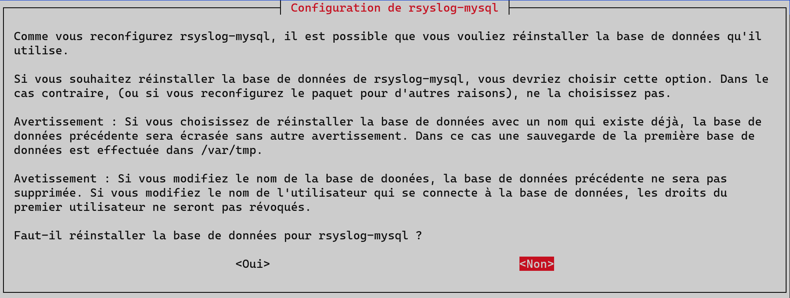
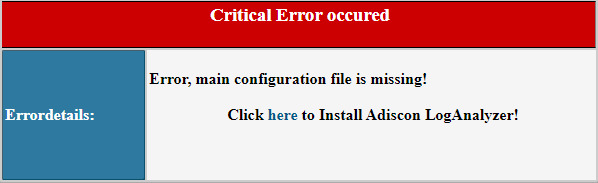
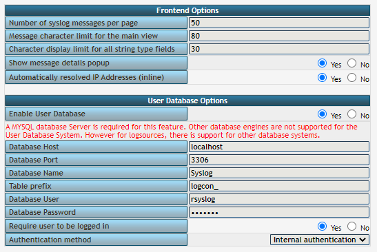
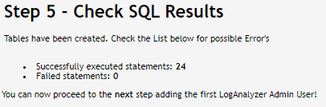
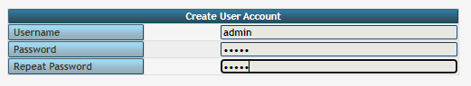
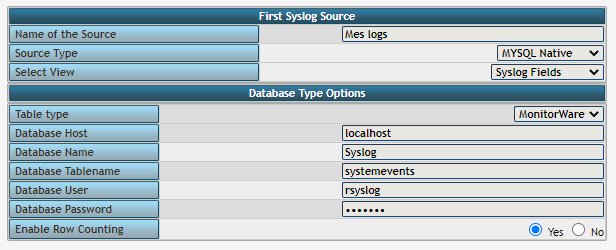
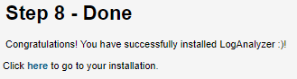
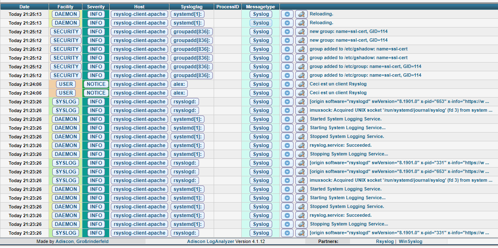

## Documentations et dépendences

RSyslog 8.1901.0 - Licence GNU GPL v3 - [Docs](https://www.rsyslog.com/doc/v8-stable/)

Loganalyzer 4.1.12 - [Docs](https://loganalyzer.adiscon.com/doc/)

## Présentation

Rsyslog est un logiciel libre utilisé sur des systèmes d'exploitation de type Unix et Linux transférant les messages des journaux d'événements sur un réseau IP. Rsyslog implémente le protocole basique syslog - qui centralise les journaux d'événements, permettant de repérer plus rapidement et efficacement les défaillances d'ordinateurs présents sur un réseau. Il présente la particularité d'en étendre les fonctionnalités en permettant, notamment, de filtrer sur des champs, de filtrer à l'aide d'expressions régulières et l'utilisation du protocole TCP de la couche transport.

Les fonctionnalités les plus notables sont :

- Il remplace facilement syslog (les règles de syslog peuvent être simplement copiées dans /etc/rsyslog).
- Il peut écrire les événements dans une base de données (MySQL ou postgreSQL).
- Il gère la rotation automatique des fichiers.
- Il peut mettre en tampon (sous forme de fichiers) des événements.
- Il gère GSS-API et TLS 2.
- Il peut être utilisé comme un relais et peut être configuré pour enregistrer les points de passage.
- Il peut utiliser son propre protocole réseau : RELP (Reliable Event Logging Protocol) qui offre une meilleure garantie de réception des événements par le serveur.
- Il peut utiliser un format de date complet(incluant l'année, contrairement au syslog de base qui n'inclut jamais l'année) et pouvant être précis jusqu'au millième de seconde (contrairement à syslog qui n'est précis qu'à la seconde).

Le protocole "syslog" par réseau qui n'est qu'un standard de fait mal défini, fonctionne au-dessus d'UDP. Le protocole "syslog" de base n'offre aucune garantie que le serveur était bien en train d'écouter au moment où le message est envoyé. RELP utilise des acquittements pour garantir que le serveur a bien pris en compte l'événement envoyé. Avec RELP, la perte de message devient peu probable. Par contre, ils peuvent être reçus en double.

## Topologie

Pour notre exemple nous aurons ici 2 machines, le serveur de logs et un serveur Web sur lequel on récupérera les logs.

| Machine        | OS          | Distribution | Version | Rôle            | Nom d'hôte | IP          |
| -------------- | ----------- | ------------ | ------- | --------------- | ---------- | ----------- |
| VM Virtual Box | GNU / Linux | Debian       | 10.5    | Serveur Rsyslog | rsyslog    | 172.16.0.10 |
| VM Virtual Box | GNU / Linux | Debian       | 10.9    | Serveur Web     | web1       | 172.16.0.20 |

## Installation de Rsyslog

Rsyslog est installé par défaut sur les distributions Debian, on peut vérifier avec :

<AP>systemctl status rsyslog</AP>

Si tel n'est pas le cas on l'installe avec la commande :

<AP>apt install rsyslog</AP>

On affiche la version installée avec :

<AP>rsyslogd -v</AP>

```
rsyslogd  8.1901.0 (aka 2019.01) compiled with:
        PLATFORM:                               x86_64-pc-linux-gnu
        PLATFORM (lsb_release -d):
        FEATURE_REGEXP:                         Yes
        GSSAPI Kerberos 5 support:              Yes
        FEATURE_DEBUG (debug build, slow code): No
        32bit Atomic operations supported:      Yes
        64bit Atomic operations supported:      Yes
        memory allocator:                       system default        Runtime Instrumentation (slow code):    No
        uuid support:                           Yes
        systemd support:                        Yes
        Number of Bits in RainerScript integers: 64

See https://www.rsyslog.com for more information.
```

### Installer une pile LAMP

Il est nécessaire d'installer au préalable une pile LAMP :

<AP>apt update -y</AP>
<AP>apt intall apache2 mariadb-server php7.3 php7.3-mysql php7.3-gd –y</AP>

### Configuration basique pour MariaDB

Le mot de passe _root_ pour MariaDB doit être définie :

<AP>mysql\_secure\_installation</AP>

```make
NOTE: RUNNING ALL PARTS OF THIS SCRIPT IS RECOMMENDED FOR ALL MariaDB
      SERVERS IN PRODUCTION USE!  PLEASE READ EACH STEP CAREFULLY!

In order to log into MariaDB to secure it, we'll need the current
password for the root user.  If you've just installed MariaDB, and
you haven't set the root password yet, the password will be blank,
so you should just press enter here.

Enter current password for root (enter for none):
OK, successfully used password, moving on...

Setting the root password ensures that nobody can log into the MariaDB
root user without the proper authorisation.

You already have a root password set, so you can safely answer 'n'.

Change the root password? [Y/n] Y
New password:
Re-enter new password:
Password updated successfully!
Reloading privilege tables..
 ... Success!


By default, a MariaDB installation has an anonymous user, allowing anyone
to log into MariaDB without having to have a user account created for
them.  This is intended only for testing, and to make the installation
go a bit smoother.  You should remove them before moving into a
production environment.

Remove anonymous users? [Y/n] Y
 ... Success!

Normally, root should only be allowed to connect from 'localhost'.  This
ensures that someone cannot guess at the root password from the network.

Disallow root login remotely? [Y/n] Y
 ... Success!

By default, MariaDB comes with a database named 'test' that anyone can
access.  This is also intended only for testing, and should be removed
before moving into a production environment.

Remove test database and access to it? [Y/n] Y
 - Dropping test database...
 ... Success!
 - Removing privileges on test database...
 ... Success!

Reloading the privilege tables will ensure that all changes made so far
will take effect immediately.

Reload privilege tables now? [Y/n] Y
 ... Success!

Cleaning up...

All done!  If you've completed all of the above steps, your MariaDB
installation should now be secure.

Thanks for using MariaDB!
```

## Création d'un utilisateur pour mariaDB

L'installation se termine par le module Mysql pour Rsyslog, qui lance un script de configuration :

<AP>apt install rsyslog-mysql -y</AP>



Ce script va créera un utilisateur avec un compte administrateur (par défaut **root**), une base de donnée rsyslog, voici les réponses à fournir :

| Questions ?                                                    | Réponses            |
| -------------------------------------------------------------- | ------------------- |
| Méthode de connexion pour la base de données MySQL             | Socket Unix         |
| Nom de la base donnée MySQL                                    | Syslog              |
| Identifiant MySQL pour rsyslog-mysql                           | rsyslog             |
| Mot de passe MySQL pour l'utilisateur rsyslog                  | \*\*\*\*\*\*        |
| Nom de l'administrateur MySQL pour créer l'utilisateur rsyslog | Par défaut **root** |

Le script devrait se terminer par cette sortie :

```shell
Determining localhost credentials from /etc/mysql/debian.cnf: succeeded.
Determining localhost credentials from /etc/mysql/debian.cnf: succeeded.
dbconfig-common: writing config to /etc/dbconfig-common/rsyslog-mysql.conf
Replacing config file /etc/dbconfig-common/rsyslog-mysql.conf with new version
checking privileges on database Syslog for rsyslog@localhost: password update needed.
granting access to database Syslog for rsyslog@localhost: success.
verifying access for rsyslog@localhost: success.
dbconfig-common: dumping mysql database Syslog to /var/tmp/rsyslog-mysql.Syslog.2021-06-03-18.23.mysql.wLmw3Z.
dbconfig-common: dropping old mysql database Syslog.
dropping database Syslog: success.
verifying database Syslog was dropped: success.
creating database Syslog: success.
verifying database Syslog exists: success.
populating database via sql...  done.
dbconfig-common: flushing administrative password
```

## Configuration de Rsyslog

Le fichier de configuration principal se situe ici : _/etc/rsyslog.conf_

On effectue une copie du fichier avant de le modifier pour éviter les problèmes.

<AP>cp /etc/rsyslog.conf /etc/rsyslog.conf.save</AP>

On va éditer le fichier de fichier de configuration pour activer le protocole _imtcp_ sur le port _514_, c'est le protocole par défaut pour syslog. Pour cela il faut décommenter les lignes présentes sous _# provides TCP syslog reception_, comme ceci :

```make
# provides TCP syslog reception
module(load="imtcp")
input(type="imtcp" port="514")
```

A la fin du fichier, ajouter la ligne suivante pour renvoyer les logs directement à la base de donnée en renseignant le mot de passe de l'utilisateur de la base de donnée Syslog :

```make
*.* :ommysql:localhost,Syslog,rsyslog,motdepasse
```

Puis on redémarre le service syslog :

<AP>systemctl restart rsyslog</AP>

## CLI rsyslogd

Rsyslog c'est aussi une CLI ou l'on peut executer certaines actions, voici un extrait tiré du _man rsyslogd_ :

```bash
OPTIONS
       -D     Runs  the Bison config parser in debug mode. This may help when hard to find syntax errors are reported. Please note
              that the output generated is deeply technical and orignally targeted towards developers.

       -d     Turns on debug mode. See the DEBUGGING section for more information.

       -f config file
              Specify an alternative configuration file instead of /etc/rsyslog.conf, which is the default.

       -i pid file
              Specify an alternative pid file instead of the default one.  This option must be used if multiple instances of rsys
              logd  should run on a single machine. To disable writing a pid file, use the reserved name "NONE" (all upper case!),
              so "-iNONE".

       -n     Avoid auto-backgrounding.  This is needed especially if the rsyslogd is started and controlled by init(8).

       -N  level
              Do a config check. Do NOT run in regular mode, just check configuration file correctness.  This option is  meant  to
              verify  a config file. To do so, run rsyslogd interactively in foreground, specifying -f <config-file> and -N level.
              The level argument modifies behaviour. Currently, 0 is the same as not specifying the -N  option  at  all  (so  this
              makes  limited  sense)  and  1 actually activates the code. Later, higher levels will mean more verbosity (this is a
              forward-compatibility option).

       -C     This prevents rsyslogd from changing to the root directory. This is almost never a good idea in production use. This
              option was introduced in support of the internal testbed.

       -v     Print version and exit.
```

D'après le manuel, on peut vérifier notre fichier de configuration avec cette commande :

<AP>rsyslogd -f /etc/rsyslog.conf -N1</AP>

## Monitorer une machine

On installe apache2 pour simuler un serveur web.

<AP>apt install apache2 -y</AP>

Il est assez facile d'ajouter une machine cliente à monitorer, cela se passe dans le fichier de configuration principal de rsyslog _/etc/rsyslog.conf_:

Il faut ajouter la ligne suivante à la toute fin du fichier :

```make
*.* @@172.16.0.23:514
```

On indique qu'il faut envoyer tous les logs vers l'ip du serveur Rsyslog. Le double _@_ permet de spécifier que nous sommes en TCP avec bien entendu le port d'écoute par défaut IMTCP 514. Puis on redémarre resyslog :

<AP>systemctl restart rsyslog</AP>

On peut rentrer manullement une phrase qui apparaitra dans les logs avec _logger_ :

<AP>logger -s " Ceci est un client Rsyslog "</AP>

## LogAnalyzer

LogAnalyzer est une application qui vise à fournir un visuel et une interface pour Rsyslog.

### Installation

D'abord, on télécharge le contenu via le site officiel :

<AP>
  cd /srv && wget
  https://download.adiscon.com/loganalyzer/loganalyzer-4.1.12.tar.gz
</AP>

On décompresse et on renomme :

<AP>
  tar -xzvf loganalyzer-4.1.12.tar.gz && mv loganalyzer-4.1.12/ loganalyzer
</AP>

On copie le dossier dans le répertoire d'apache :

<AP>cp -a loganalyzer/src/* /var/www/html/loganalyzer</AP>

On donne les droits à Apache dessus :

<AP>chown -R www-data:www-data /var/www/html/loganalyzer</AP>

Rendez-vous sur le navigateur à l'adresse suivante : 

```
http://172.16.0.10/loganalyzer
```

### Configuration

Toute la configuration se fait directement sur l'application en ligne, l'erreur suivante est normale :



Ensuite, on coche la case _yes_ pour la question _enable user database_ et on rentre les identifiants de la base de données, LogAnalyzer va ajouter ses tables à la base de donnée Syslog :



La bonne configuration devrait afficher cette écran :



On nous demande créer un accès administrateur pour l'accès à LogAnalyzer :



Il faut paramètrer la source des logs, donc ici c'est toujours la même table _Syslog_ mais attention au _Database Tablename_ qui doit d'écrire avec des majuscules comme ceci : _SystemEvents_



Ce message de fin conclue la bonne configuration :



### Test

On veut maintenant savoir si le client envoit bien ses logs au serveur, pour cela on clique sur _Show Events_ puis on tape _apache_ dans la barre de recherche. On voit bien notre client :



## Pour aller plus loin

- [Monitoring Linux Logs with Kibana and Rsyslog](https://devconnected.com/monitoring-linux-logs-with-kibana-and-rsyslog/)
- [ElasticStack : Déployer Kibana, Elasticsearch, Logstash & Beats avec Ansible](https://blog.zwindler.fr/2017/10/03/elasticstack-kibana-elasticsearch-logstash-beats/)
