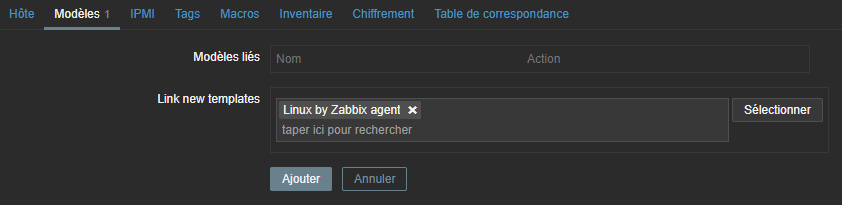

## Documentations

- Zabbix 5.4 - Licence GPL V2 - [Docs](https://www.zabbix.com/documentation/current/manual/introduction)
- Grafana 7.5.7 - Licence Apache 2.0 - [Docs](https://grafana.com/docs/?plcmt=footer)

## Présentation

ZABBIX est un logiciel libre permettant de surveiller l'état de divers services réseau, serveurs et autres matériels réseau et produisant des graphiques dynamiques de consommation des ressources. C'est un logiciel créé par Alexei Vladishev.

ZABBIX peut être décomposé en trois parties séparées: Le serveur de données, l'interface de gestion et le serveur de traitement. Chacune d'elles peut être disposée sur une machine différente pour répartir la charge et optimiser les performances.

Le système dont l'utilisation des ressources doit être analysée comporte un agent fonctionnant sous forme de daemon appelé zabbix-agentd et écoutant par défaut sur le port TCP 10050. Celui-ci intègre des fonctions permettant d'échantillonner l'état des ressources des différents composants du système (Mémoire, CPU, débit réseau, entrées-sorties, nombre de connexion à une application, etc.) et propose si nécessaire l'exécution de scripts. Le serveur Zabbix appelle donc régulièrement cet agent et lui demande les informations concernant telle ou telle ressource.

Grafana permet d'interroger, de visualiser, d'alerter et de comprendre les métriques, peu importe où elles sont stockées. Il est possible de créer, explorer et partager des tableaux de bord personnalisée.

## Mise en situation

L'objectif ici est d'installer un serveur de supervision Zabbix, de surveiller la machine cliente et ensuite d'installer Grafana pour obtenir de belles métriques et dashboard.

| Machine                       | OS          | Distribution | Version | Rôle                     | Nom d'hôte    | IP          |
| ----------------------------- | ----------- | ------------ | ------- | ------------------------ | ------------- | ----------- |
| Machine Virtuelle Virtual Box | GNU / Linux | Debian       | 10.5    | Serveur Zabbix & Grafana | zabbix        | 172.16.0.47 |
| Machine Virtuelle Virtual Box | GNU / Linux | Debian       | 10.5    | Client Zabbix            | client-zabbix | 172.16.0.46 |

## Installation de Zabbix & MariaDB

On commence par installer le dépôt Zabbix:

<AP>
  wget
  https://repo.zabbix.com/zabbix/5.4/debian/pool/main/z/zabbix-release/zabbix-release\_5.4-1+debian10\_all.deb
</AP>
<AP>dpkg -i zabbix-release_5.4-1+debian10_all.deb</AP>
<AP>apt update</AP>

On installe le serveur Zabbix, l'agent Zabbix et le front-end

<AP>
  apt install zabbix-server-mysql zabbix-frontend-php zabbix-apache-conf
  zabbix-sql-scripts zabbix-agent -y
</AP>

Une base de donnée est nécessaire, ici on choisit mariaDB:

<AP>apt install mariadb-server</AP>

On sécurise avec cette commande, on colle un mot de passe pour `root`:

<AP>mysql\_secure\_installation</AP>

On se connecte à MariaDB pour y créer la base de donnée Zabbix et l'utilisateur Zabbix:

<AP>mysql -uroot -p</AP>

<AP a="SQL $">CREATE DATABASE zabbix CHARACTER SET utf8 COLLATE utf8_bin;</AP>

<AP a="SQL $">
  GRANT ALL PRIVILEGES ON zabbix.&ast; TO zabbix@localhost IDENTIFIED BY
  'zabbix';
</AP>

On crée les tables grâce à un script fournit par Zabbix:

<AP>
  zcat /usr/share/doc/zabbix-sql-scripts/mysql/create.sql.gz | mysql -uzabbix -p
  zabbix
</AP>

On peut vérifier que les tables ont bien été crées avec:

<AP>mysql -uroot -p zabbix</AP>
<AP a="SQL $">show tables;</AP>

```sql
+----------------------------+
| Tables_in_zabbix           |
+----------------------------+
| acknowledges               |
| actions                    |
| alerts                     |
| auditlog                   |
| auditlog_details           |
| autoreg_host               |
| conditions                 |
| config                     |
| config_autoreg_tls         |
| corr_condition             |
| corr_condition_group       |
| corr_condition_tag         |
| corr_condition_tagpair     |
(...)
| users_groups               |
| usrgrp                     |
| valuemap                   |
| valuemap_mapping           |
| widget                     |
| widget_field               |
+----------------------------+
166 rows in set (0.001 sec)
```

On édite le fichier `/etc/zabbix/zabbix_server.conf` pour y ajouter le mot de passe de la bdd zabbix:

```
DBPassword=******
```

On va démarrer le serveur, l'agent et apache2 puis on les active au lancement de la machine:

<AP>systemctl restart zabbix-server zabbix-agent apache2</AP>
<AP>systemctl enable zabbix-server zabbix-agent apache2</AP>

### Configuration de Zabbix

La configuration se passr via le front-end. On se rend donc sur l'adresse `http://172.16.0.47/zabbix`:

On devrait avoir cette fenêtre, naturellement on choisit la langue par défaut en français.


On vérifie bien que tous les prérequis sont au verts.


On configure l'accès de l'application Zabbix à la base de données:


Si on a installer le serveur zabbix sur un autre hôte, on peut le renseigner ici sinon on laisse tout par défaut:


On choisit le fuseau horaire (UTC+2:00 pour la France) et le thème:


On récapitule la configuration:


Ecran de succès si toute la conf est correcte:


## Installation de l'agent sur une machine à superviser

### Agent pour Debian et Ubuntu

L’agent est un programme qui se lance en tant que service et qui va faire des remontés au serveur Zabbix.

<AP>apt install zabbix-agent</AP>

Puis on édite le fichier de configuration situé ici `/etc/zabbix/zabbix_agentd.conf`:

```make
Server=172.16.0.47
ServerActive=172.16.0.47
Hostname=client-zabbix
```

`Server`: L'adresse ou le nom du serveur Zabbix. Les connexions entrantes seront acceptées uniquement à partir des hôtes répertoriés ici.
`ServerActive`: L'adresse ou le nom du serveur Zabbix où seront envoyés les informations de l'agent. Plusieurs adresses délimitées par des virgules peuvent être fournies pour utiliser plusieurs serveurs Zabbix indépendants en parallèle.
`Hostname`: Doit correspondre au nom de la machine à superviser. Obligatoire pour les vérifications actives et doit correspondre aux noms d'hôte configurés sur le serveur.

### Agent pour MacOS

Se reporter à la procédure sur le [site officiel.](https://www.zabbix.com/documentation/current/manual/installation/install_from_packages/mac_pkg)

### Agent pour Windows

Se reporter à la procédure sur le [site officiel.](https://www.zabbix.com/documentation/current/manual/installation/install_from_packages/win_msi)

## Création d'un hôte dans Zabbix

Même si nous avons installer l'agent sur la machine à monitorer, l'apparition de celle-ci ne se fait pas tout seule, pour cela il faut se rendre dans `Configuration`, `hôtes` puis `Créer un hôte` en haut à droite. Voila les informations à remplir pour superviser une machine Debian:


Sur l'onglet `modèles`, on ajoute un template:



Puis on clique sur `Ajouter`. Après quelques secondes, la machine devrait être active dans l'onglet `Surveillance`, `Hôtes`:


## Installation de Grafana

### Ajout du dépôt

<AP>sudo apt-get install -y adduser libfontconfig1</AP>

<AP>wget https://dl.grafana.com/oss/release/grafana_7.5.7_amd64.deb</AP>

<AP>sudo dpkg -i grafana_7.5.7_amd64.deb</AP>

L'utilisateur `grafana` a été créé.

```make
Sélection du paquet grafana précédemment désélectionné.
(Lecture de la base de données... 32818 fichiers et répertoires déjà installés.)
Préparation du dépaquetage de grafana_7.5.7_amd64.deb ...
Dépaquetage de grafana (7.5.7) ...
Paramétrage de grafana (7.5.7) ...
Ajout de l'utilisateur système « grafana » (UID 110) ...
Ajout du nouvel utilisateur « grafana » (UID 110) avec pour groupe d'appartenance « grafana » ...
Le répertoire personnel « /usr/share/grafana » n'a pas été créé.
NOT starting on installation, please execute the following statements to configure grafana to start automatically using systemd
 sudo /bin/systemctl daemon-reload
 sudo /bin/systemctl enable grafana-server
You can start grafana-server by executing
 sudo /bin/systemctl start grafana-server
Traitement des actions différées (« triggers ») pour systemd (241-7~deb10u7) ...
```

On execute les commandes citées:

<AP>systemctl daemon-reload</AP>
<AP>systemctl enable grafana-server</AP>
<AP>systemctl start grafana-server</AP>

### Configuration du fichier grafana.ini

Le fichier de configuration principale se trouve ici: `/etc/grafana/grafana.ini`, voici la [documentation](https://grafana.com/docs/grafana/next/administration/configuration/) du site officiel.

Voici quelques exemples de configuration:

- `;http_port = 3000`: Définit le port d'écoute de l'application.
- `;cert_file = `: Chemin d'accès au fichier de certificat (si le protocole est défini sur https ou h2).
- `;cert_key = `: Chemin d'accès au fichier de la clé de certificat (si le protocole est défini sur https ou h2).

```make
[database]
# You can configure the database connection by specifying type, host, name, user and password
# as separate properties or as on string using the url properties.

# Either "mysql", "postgres" or "sqlite3", it's your choice
;type = mysql
;host = 127.0.0.1:3306
;name = grafana
;user = grafana
# If the password contains # or ; you have to wrap it with triple quotes. Ex """#password;"""
;password = grafana
```

A chaque changement du fichier de configuration, il faut relancer Grafana:

<AP>systemctl restart grafana-server</AP>

L'application devrait être accessible par défaut sur le port 3000: `http://172.16.0.47:3000`


Le mot de passe par défaut est `admin` et `admin`. La page d'accueil devrait resssembler à ça:


### Base de données

Grafana a besoin d'une base de données pour stocker les utilisateurs et les tableaux de bord (et d'autres choses). Par défaut, il est configuré pour utiliser _sqlite3_ qui est une base de données embarquée (incluse dans le binaire principal de Grafana).

On créé un utilisateur `grafana` et une base de donnée `grafana`:

<AP>mysql -uroot -p</AP>

<AP a="SQL $">CREATE DATABASE grafana CHARACTER SET utf8 COLLATE utf8_bin;</AP>

<AP a="SQL $">GRANT ALL PRIVILEGES ON grafana.* TO grafana@localhost IDENTIFIED BY 'grafana';</AP>

### Installer un plugin pour Zabbix

Par défaut, Grafana prend en charge un grand nombres de sources de données (data source) mais Zabbix n'en fait pas parti. Cependant, il est possible [d'installer un plugin](https://grafana.com/grafana/plugins/alexanderzobnin-zabbix-app/?tab=installation) pour le rendre compatible:

<AP>grafana-cli plugins install alexanderzobnin-zabbix-app</AP>

```shell
installing alexanderzobnin-zabbix-app @ 4.1.5
from: https://grafana.com/api/plugins/alexanderzobnin-zabbix-app/versions/4.1.5/download
into: /var/lib/grafana/plugins

Installed alexanderzobnin-zabbix-app successfully

Restart grafana after installing plugins . <service grafana-server restart>
```

<AP>service grafana-server restart</AP>

Il faut maintenant l'activer sur l'application, pour ce faire, sur le menu de gauche aller dans `Configuration`, `Plugins`, taper `zabbix` dans la barre de recherche, le plugin devrait apparaitre, cliquer dessus.


Toujours dans le menu `Configuration`, sélectionner `Data source` puis `Add data source`. Tapper `zabbix` dans la recherche. Pour une configuration de base, voici ce qu'il faut remplir:


Ne pas oublier d'importer les dashboards par défaut qui sont livrés avec le plugins:


Puis cliquer sur `test and Save`.

Les métriques devraient être disponible dans `Dashboard`, `Manage`.

### Mettre un dashboard par défaut sur la page d'accueil

Sur le menu de gauche, aller `Configuration`, puis `Preferences`. Dérouler la liste de `Home Dashboard`, les dashboard existant devraient apparaître. Cliquer sur `Save`.


Retourner sur la page d'accueil pour tester.


