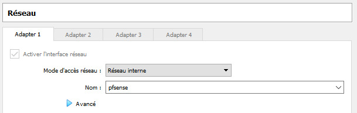

## Dépendances

Version pfSense-CE-2.5.0-RELEASE-amd64

## Présentation

PfSense est un routeur/pare-feu open source basé sur le système d'exploitation FreeBSD. À l'origine un fork de m0n0wall, il utilise le pare-feu à états Packet Filter, des fonctions de routage et de NAT lui permettant de connecter plusieurs réseaux informatiques. Il comporte l'équivalent libre des outils et services utilisés habituellement sur des routeurs professionnels propriétaires. PfSense convient pour la sécurisation d'un réseau domestique ou d'entreprise.

Après l'installation manuelle nécessaire pour assigner les interfaces réseaux, il s'administre ensuite à distance depuis l'interface web. pfSense gère nativement les VLAN (802.1q).

Comme sur les distributions Linux, pfSense intègre aussi un gestionnaire de paquets pour installer des fonctionnalités supplémentaires, comme un proxy ou un serveur de voix sur IP1.

Voici la topologie du réseau et des machines pour la mise en situation :

| Machine    | OS        | Distribution    | Version  | Rôle                     | IP                        |
| ---------- | --------- | --------------- | -------- | ------------------------ | ------------------------- |
| VM Pfsense | BSD       | freeBSD 64 bits | CE-2.5.0 | Pare-feu, router et DHCP | 172.16.0.87 & 192.168.1.1 |
| VM Debian  | Gnu-Linux | Debian Buster   | 10.8     | Client HTTP              | 192.168.1.x               |

## Installation et configuration

### Création de la machine sur Virtual Box

- Créer une nouvelle machine.
- Nommer la machine _PfSense_.
- Le type doit être _BSD_ et la version _FreeBSD (64 bit)_.
- Allouer 4096 MB en taille de mémoire.
- Créer un disque dur virtuel _VirtualBox Disk Image_ dynamiquement alloué de 8 Gio.

Avant de démarrer la machine, dans la configuration réseau, il faut :

- Une carte réseau en _accès par pont_ ou _bridge WAN_ vers l'extérieur.
- Une carte réseau en _réseau interne_ qui sera accessible via le pare-feu PfSense.

### Récupération de l'ISO et installation

Il faut télécharger l'ISO de pfsense disponible sur le [site officiel](https://www.pfsense.org/download/) et renseigner cette image au lancement de la machine sur Virtual Box.

Après plusieurs écran, il est demandé d'accepté les conditions d'utilisation puis d'installer l'application. Il faut choisir la langue pour le clavier :


Ensuite choisir l'option tester et/ou continuer. Choisir l'installation automatique via le BIOS.

Une fois l'installation terminée, il est demandé de redémarrer la machine, il faut auparavant éteindre la machine et enlever l'image ISO sous peine de relancer l'installation de PfSense. Pour cela sur Virtual Box, sélectionner _Machine_ et _extinction PAR ACPI_. Puis se rendre dans l'onglet _périphérique_, _lecteurs optiques_ puis décocher l'image de PfSense. Relancer la machine


Ce menu devrait apparaître :


- _WAN -> em0_ désigne la carte et le réseau externe, son IP peut être publique ou privée.
- _LAN -> em1_ désigne la carte et le réseau interne, son IP est privée. C'est dans ce réseau interne que vont se placer les machines gérées par PfSense. C'est également via cette interface que l'on pourra administrer PfSense dans un 1er temps.

Si on désire changer les adresses IP des cartes réseaux, il faut sélectionner l'option 2.

### Connexion via l'interface web

Pour administrer via l'interface web, il nous faut une machine présente dans le _LAN_, pour émuler cela dans Virtual Box, il faut qu'une machine ait le même réseau interne que Pfsense :



Ici on utilise une Debian Buster graphique, on lance Firefox et tape l'adresse *https://192.168.1.1* qui est celle de la carte réseau interne de PfSense. On devrait obtenir ça :


Il faut cliquer sur avancé, puis accepter le risque et poursuivre. Cet écran devrait s'afficher :


L'utilisateur par défaut est _admin_ et le mot de passe _pfsense_. A changer au plus vite bien évidemment. Une fois arrivé sur la page d'accueil, effectuer la configuration de base proposée par PfSense.

### Mettre le système en français

Pour passer en français, il faut se rendre sur l'onglet _system_ puis _General setup_ et aller à l'option _Language_, on peut aussi au passage changer la timezone pour _Europe/Paris_, puis cliquer sur _save_ tout en bas.

### DHCP

PfSense dispose d'un DHCP pour le coté LAN, pour y accéder cliquer sur _Services_ puis _Serveur DHCP_. Le DHCP devrait déjà être actif, on peut spécifier une ou plusieurs étendues d'adressage avec l'option _plage_.

## Règles de pare-feu

Par défaut, toute communication depuis l'extérieur est interdite, il va falloir créer une règle pour l'autoriser.

### Ping depuis l'extérieur

Pour effectuer un test de ping, il faut autoriser le protocole ICMP à pouvoir envoyer sa requête sur l'interface WAN. Etant donné que l'adresse IP de la carte WAN a une adresse IP privée en 172.16.0.87, il faut autoriser le traffic depuis les adresses IP privée (Cela ne serait pas nécéssaire si la WAN avait une adresse IP publique.)

Pour cela, il faut se rendre sur l'onglet _Pare-feu_ puis _Règles_ et modifier la règle existante avec la petite roue à droite sous les actions :


Puis tout en bas il faut désactiver la règle _Bloquer les réseaux privés et les adresses de loopback_, enregistrer puis valider.


Il reste la règle à créer pour autoriser le ping de la WAN depuis l'extérieur. Pour créer une règle, se rendre sur _Pare-feu_, _règles_ puis cliquer sur l'icone _ajouter_ :


Il faut autoriser le protocole ICMP sur la WAN depuis n'importe quelle adresse IP vers le parefeu. Puis cliquer sur _Enregistrer_ et _Valider_.


Le test de ping avec une machine présente dans le réseau 172.16.x.x devrait pouvoir se faire :

```make
ping 172.16.0.87

Envoi d’une requête 'Ping'  172.16.0.87 avec 32 octets de données :
Réponse de 172.16.0.87 : octets=32 temps<1ms TTL=64
Réponse de 172.16.0.87 : octets=32 temps<1ms TTL=64
Réponse de 172.16.0.87 : octets=32 temps<1ms TTL=64
Réponse de 172.16.0.87 : octets=32 temps<1ms TTL=64

Statistiques Ping pour 172.16.0.87:
    Paquets : envoyés = 4, reçus = 4, perdus = 0 (perte 0%),
Durée approximative des boucles en millisecondes :
    Minimum = 0ms, Maximum = 0ms, Moyenne = 0ms
```

Evidemment dans un environnement de production, ces règles sont dangereuses car elles donnent des informations sur le pare-feu, il ne doit pas pourvoir être pinger depuis l'extérieur.

### Autoriser les machines présentes dans le lan à sortir vers INTERNET

Actuellement, les machines sortent déjà avec la création de règles automatiques, mais en production on préfère avoir la main sur les régles sortantes car en manuel c'est plus rapide.

Se rendre sur _Pare-feu_, _NAT_ puis _Sortant_ et passer du mode _Création automatique de règles NAT sortantes_ à la _Création manuelle de règle NAT sortantes_. Ensuite dans plus bas dans la section _Mappages_, désactiver les 2 dernières règles qui ont attraient au réseau LAN, depuis _192.168.1.0_ vers toutes destinations en cliquant sur la petite flèche bleu pour commuter l'état de la règle.


A ce stade, le traffic depuis le LAN vers l'internet ne devrait plus se faire.

Pour créer une règle manuelle, cliquer sur _Ajouter_. Puis autoriser tout traffic a sortir vers Internet, comme ceci :


Cette manoeuvre est sécurisée car elle autorise le LAN à sortir vers Internet mais aucune connexion depuis l'Internet ne pourra traverser le WAN.

## Ajouts de services

### Installer un filtrage d'URL depuis la LAN vers INTERNET

Un des services incontournable est l'ajout d'un proxy entre les utilisateurs de la LAN et Internet, pour effectuer du cache, de la redirection, du filtrage et de la supervision de requêtes. Ces services sont rendus disponible au travers de :

- Squid : C'est une application proxy de cache haute performance.
- SquidGuard : Il permet d'effectuer du filtrage d'URL.
- LightSquid : C'est un outil de supervision pour les 2 services précédent au travers d'un page web.

Pour installer des paquets, se rendre sur l'onglet _Système_, _Gestionnaires de paquets_ et _paquets disponibles_. Taper _Squid_ dans la barre de recherche et installer les 3 services nommés ci-dessus.

### Création d'un certificat pour Squid

Il va falloir créer un certificat auto-signé pour Squid, Pour cela, se rendre sur _Système_, _Gestionnaire de certificats_ et enfin _Certificats_. Cliquer sur _Ajouter/Signer_.
Toutes les options peuvent rester par défauts, sauf le _Nom descriptif_ et le _Nom commun_. Une fois ceci fait, on enregistre.

### Configuration de Squid

Il faut configurer Squid, se rendre dans le menu _Services_ puis _Squid Proxy Server_ et sur l'onglet _Local Cache_. Configurer les paramètres comme ceci :

- Cache Replacement Policy : Heap LFUDA
- Hard Disk Cache Size : 500
- Hard Disk Cache System : ufs
- Level 1 Directories : 16
- Hard Disk Cache Location : /var/squid/cache
- Memory Cache Size : 64

Puis toujours sur la même page, dans l'onglet _General_ :

- Enable Squid Proxy : Cocher la case
- Resolve DNS IPv4 First : Cocher la case
- Transparent HTTP Proxy : Cocher la case
- HTTPS/SSL Interception : Cocher la case
- SSL/MITM Mode : Splice All
- AC : Selectionner le certificat précédemment créé.
- Enable Access Logging : Cocher la case
- Rotate Logs : 365
- Error Language : fr
- Suppress Squid Version : Cocher la case

### Configuration de SquidGuard

Au tour de SquidGuard pour mettre en place le filtrage, se rendre dans le menu _Services_ puis _SquidGuard Proxy Filter_.

Sur l'onglet _General settings_ :

Activer : Cocher la case pour démarrer le service.
Enable log : Cocher la case pour activer les logs
Enable log rotation : Pour effectuer la rotation des logs.
Blacklist : Activer cette option pour mettre en place une liste de site interdits.
Blacklist URL : Il faut spécifier le chemin pour la liste de sites interdits. [Par exemple](http://dsi.ut-capitole.fr/blacklists/download/blacklists_for_pfsense.tar.gz)

Sur l'onglet _blacklist_, cliquer sur le bouton download pour télécharger la liste des sites interdits depuis le lien inséré plus tôt.

Sur l'onglet _Common ACL_ :

- cliquer sur le _+_ de _Target Rules List_ puis interdir tous les sites voulus en choisissant _deny_.
- Do not allow IP-Addresses in URL : A cocher pour ne pas que le filtrage soit actif même si on joint les sites interdits avec leur adresse IP directement.
- Use SafeSearch engine : A cocher pour limiter les contenus matures sur les moteurs de recherche.

### Configuration de LightSquid

Pour accéder à la configuration de LightSquid, selectionner _Etats_ puis _Squid Proxy Reports_.

- Lightsquid Web SSL : Décocher pour un accès en HTTP.
- Définir un utilisateur et un mot de passe avec : _Lightsquid Web User_ et _Lightsquid Web Password_.
- Language : Sélectionner Français
- Ip Resolve Method : Squidauth
- Refresh Scheduler : 60 min

Puis cliquer sur _Enregistrer_ et _Resfresh Full_

### Ajout d'un antivirus

Il est possible d'installer un antivirus pour que ce dernier analyse les fichiers téléchargés depuis Internet vers le LAN. Pour ce faire, il faut se rendre dans : _Services_, _Squid Proxy Server_ et _Antivirus_ :

- Enable AV : A cocher pour activer l'antivirus.
- ClamAV Database Update : Permet de sélectionner le rafraichissment de la base de données de l'antivirus ClamAV.
- Regional ClamAV Database Update Mirror : Selectionner le mirroir le plus proche du serveur Pfsense pour accélerer le téléchargement, ici Europe.

Pour avoir une progression de l'installation de l'antivirus, il faut aller dans le _Etats_, _Système_ et _Général_.

### Planification de tâches

Pour maintenir à jour la base des signatures de l'antivirus, il est nécessaire d'automatiser cette tâche avec Cron. Télécharger ce dernier dans les _gestionnaires de paquets_. Puis le configurer dans _Services_ puis _SquidGuard Proxy Filter_...

## Notes

Voir : [pfsense-2-3-faire-nat-dune-connexion-internet-vers-lan](https://computerz.solutions/pfsense-2-3-faire-nat-dune-connexion-internet-vers-lan/)
