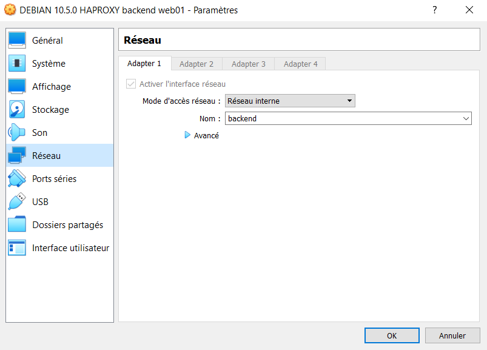

## Documentation et version

Licence open source - HAProxy v1.8.25 - [documentation](https://cbonte.github.io/haproxy-dconv/1.8/configuration.html)

## Présentation

HAProxy est un service de répartition d’un ensemble de tâches sur un ensemble de ressources, dans le but d’en rendre le traitement global plus efficace. Par exemple, cela permet de répartir la charge d'un seul applicatif http sur plusieurs serveurs http tout en étant transparent pour le client. En cas de défaillance de l'un, l'autre prendra entièrement la charge sur lui. On parle de Haute Disponibilité.

On désigne **Frontend** pour la partie publique que le client va joindre, et le **Backend** qui désigne l'ensemble des serveurs qui se répartissent la charge.

Ce genre d'infrastructure est aussi très utile pour faire du déploiement pendant la phase de production, en remplaçant petit à petit les serveurs par la nouvelle application, ce qui est bien sûr complètement transparent pour le client. On va sortir un serveur de la charge pour y mettre à jour l'applicatif, et le remettre en production une fois qu'il aura été mis à jour. S'il y a un problème de mise à jour, si l'application comporte un bug ou si un quelconque problème survient, la production n'est pas arrêtée et on peut prendre le temps pour étudier et résoudre le problème. On effectuera cette opération progressivement jusqu'à la mise à jour complète du backend.


#### Topologie :

| Machine                       | OS          | Distribution  | Version | Rôle                  | Nom d'hôte | IP                                       |
| ----------------------------- | ----------- | ------------- | ------- | --------------------- | ---------- | ---------------------------------------- |
| Machine Virtuelle Virtual Box | GNU / Linux | Debian        | 10.5    | Serveur Load Balancer | lb01       | Frontend 172.16.200.10  Backend 10.0.0.1 |
| Machine Virtuelle Virtual Box | GNU / Linux | Debian        | 10.5    | Serveur Web Backend   | web01      | 10.10.10.2                               |
| Machine Virtuelle Virtual Box | GNU / Linux | Debian        | 10.5    | Serveur Web Backend   | web02      | 10.10.10.3                               |
| Dell Latitude 3500            | Windows     | 10 Entreprise | 1903    | Client Web            | L019-163   | 172.16.1.68                            |

## Préalable réseau et installation

### Configuration du réseau sur Virtual Box

Pour que notre backend puisse fonctionner correctement, il va falloir que toutes les machines backend soient dans le même réseau. Si on utilise VirtualBox comme ici, on va devoir spécifier dans la configuration réseau de nos machines, le mode d'accès réseau en *réseau interne* et lui donné un nom, on utilisera *backend*.

On va ajouter une 2ème carte réseau au serveur HAProxy qui sera dans le réseau interne backend, on fera de même pour les serveurs webs. Comme ceci :


### Configuration réseau et Installation de HAProxy

Pour mettre en place l'infrastructure du réseau, il faut que le serveur HAProxy ait 2 cartes réseau car on veut segmenter notre infrastructure entre le frontend qui aura pour adresse *172.16.200.10* et notre backend qui aura pour adresse *10.0.0.1*. On ajoutera une 2ème carte réseau.

<AP>nano /etc/network/interfaces</AP>

```make
# The loopback network interface  
auto lo  
iface lo inet loopback  

# Frontend  
allow-hotplug enp0s3  
auto enp0s3  
iface enp0s3 inet static  
address 172.16.200.10/16  
gateway 172.16.0.1  

# Backend  
allow-hotplug enp0s8  
auto enp0s8  
iface enp0s8 inet static  
address 10.0.0.1/8
```

On peut installer HAProxy :

<AP>apt update</AP>

<AP>apt install haproxy</AP>

Pour connaître la version :

<AP>haproxy -v</AP>

## Configuration de HAProxy

Le service ne démarre pas car il faut obligatoirement renseigner la configuration. Le fichier de configuration principal se trouve dans */etc/haproxy/haproxy.cfg*. Il se décompose en 4 sections :

### Description générale des éléments de configuration

<div class="shadow-framed mt2">

<div class="framed">

*Global*  
En haut du fichier de configuration HAProxy se trouve la section globale. Les paramètres définissent la sécurité à l'échelle du processus et les réglages des performances qui affectent HAProxy à un bas niveau.  

*Defaults*  
Au fur et à mesure que la configuration se développe, l'utilisation d'une section par défaut aidera à réduire la duplication. Ses paramètres s'appliquent à toutes les sections frontend et backend qui viennent après. On est toujours libre de remplacer ces paramètres dans les sections suivantes.

*Frontend*  
Lorsque l'on place HAProxy en tant que reverse proxy devant les serveurs principaux, une section frontend définit les adresses IP et les ports auxquels les clients peuvent se connecter. On peux ajouter autant de sections frontend que nécessaire pour exposer divers sites Web à Internet. Chaque mot-clé frontend est suivi d'une étiquette, telle que www.monsite.com, pour le différencier des autres.

*Backend*  
Une section backend définit un groupe de serveurs qui seront équilibrés en charge et affectés pour gérer les demandes. On va ajouter une étiquette de notre choix à chaque backend, telle que web_servers. C'est généralement assez simple et on n'aura pas souvent besoin de nombreux paramètres ici.

</div>

</div>

### Exemple du fichier de configuration

Voici le fichier de configuration qui est utilisé dans notre exemple :

```make
global  
log /dev/log local0  
log /dev/log local1 notice  
chroot /var/lib/haproxy  
stats socket /run/haproxy/admin.sock mode 660 level admin expose-fd listeners  
stats timeout 30s  
user haproxy  
group haproxy  
daemon  

defaults  
log global  
mode http  
option httplog  
option dontlognull  
timeout connect 5000  
timeout client 50000  
timeout server 50000  
errorfile 400 /etc/haproxy/errors/400.http  
errorfile 403 /etc/haproxy/errors/403.http  
errorfile 408 /etc/haproxy/errors/408.http  
errorfile 500 /etc/haproxy/errors/500.http  
errorfile 502 /etc/haproxy/errors/502.http  
errorfile 503 /etc/haproxy/errors/503.http  
errorfile 504 /etc/haproxy/errors/504.http  

frontend test  
bind 172.16.200.10:80  
default_backend web_servers  
option httpclose  

backend web_servers  
balance roundrobin  
option httpchk HEAD / HTTP/1.0  
server ha-proxy-client1 10.10.10.2:80 check  
server ha-proxy-client2 10.10.10.3:80 check  
stats uri /statshaproxy  
stats auth admin:admin  
stats refresh 30s
```

### Description de global

*log* : Le paramètre de journal garantit que les avertissements émis lors du démarrage et les problèmes qui surviennent pendant l'exécution sont consignés dans syslog. Il enregistre également les demandes à mesure qu'elles arrivent. Vous pouvez cibler le socket UNIX traditionnel où Syslog ou journald, listen, / dev / log, ou spécifier un serveur rsyslog distant afin que les données de journal soient conservées en externe sur votre serveur d'équilibrage de charge

*chroot* : Le paramètre 'chroot' autorise à changer la racine du processus une fois le programme lancé, de sorte que ni le processus, ni l'un de ses descendants ne puissent remonter de nouveau à la racine.

*stats socket* : La ligne de socket stats active l'API Runtime, que vous pouvez utiliser pour désactiver dynamiquement les serveurs et les vérifications d'état, modifier les poids d'équilibrage de charge des serveurs et utiliser d'autres leviers utiles.

*user / group* : Les lignes utilisateur et groupe indiquent à HAProxy de supprimer les privilèges après l'initialisation. Linux exige que les processus soient root pour écouter sur les ports inférieurs à 1024\. Vous souhaiterez également généralement que vos clés privées TLS ne soient lisibles que par root. Sans définir un utilisateur et un groupe pour continuer le processus, HAProxy conservera les privilèges root, ce qui est une mauvaise pratique. Sachez que HAProxy lui-même ne crée pas l'utilisateur et le groupe et qu'ils doivent donc être créés au préalable.

### Description de defaults

*log global* : Le paramètre global de journal est un moyen d'indiquer à chaque interface suivante d'utiliser le paramètre de journal que vous avez défini dans la section globale. Cela n’est pas nécessaire pour la journalisation, car de nouvelles lignes de journal peuvent être ajoutées ici ou dans chaque interface. Cependant, dans la plupart des cas où un seul serveur syslog est utilisé, c'est courant.

*mode* : Le paramètre de mode définit si HAProxy fonctionne comme un simple proxy TCP ou s'il est capable d'inspecter les messages HTTP de niveau supérieur du trafic entrant. L'alternative à la spécification du mode http est d'utiliser le mode tcp.

*option httplog* : L'option httplog, ou plus rarement l'option tcplog, indique à HAProxy d'utiliser un format de journal plus détaillé lors de l'envoi de messages à Syslog. Vous préférerez généralement l'option httplog à l'option tcplog dans votre section par défaut car lorsque HAProxy rencontre un frontend qui utilise le mode tcp, il émettra un avertissement et le rétrogradera de toute façon vers l'option tcplog.

*option dontlognull* : HAProxy se connecte régulièrement aux systèmes pour s’assurer qu’ils sont toujours en vie. Par défaut, même une simple sonde ou analyse de port produira un journal. Si ces connexions polluent les logs trop, il est possible d'activer l'option "dontlognull" pour indiquer qu'une connexion sur laquelle aucune donnée n'a été transférée ne sera pas enregistrée, ce qui correspond généralement à ces sondes. Notez que les erreurs seront toujours retourné au client et pris en compte dans les statistiques. Si ce n'est pas ce que souhaité, l'option http-ignore-probes peut être utilisée à la place.

*timeout connect / timeout client / timeout server* : Le paramètre de connexion au délai d'expiration configure la durée pendant laquelle HAProxy attendra qu'une connexion TCP à un serveur principal soit établie. Le suffixe «s» désigne les secondes. Sans suffixe, l'heure est supposée être en millisecondes. Le paramètre de délai d'expiration du client mesure l'inactivité pendant les périodes pendant lesquelles on s'attend à ce que le client parle, ou en d'autres termes envoie des segments TCP. Le paramètre de serveur de temporisation mesure l'inactivité lorsque nous nous attendons à ce que le serveur principal parle. Lorsqu'un délai expire, la connexion est fermée. Le fait d'avoir des délais d'expiration raisonnables réduit le risque que des processus bloqués bloquent des connexions qui pourraient autrement être réutilisées.

*errorfile* : Spécifie les message d'erreurs à retourner en cas d'erreur http 400 ou 500.

### Description de frontend

*bind* : Un paramètre de liaison affecte un écouteur à une adresse IP et un port donnés. L'IP peut être omis pour se lier à toutes les adresses IP sur le serveur et un port peut être un port unique, une plage ou une liste délimitée par des virgules. Vous utiliserez souvent les arguments ssl et crt pour indiquer à HAProxy de gérer les terminaisons SSL / TLS, plutôt que de laisser vos serveurs Web le faire.

*use_backend* : Ce paramètre choisit un pool de serveurs backend pour répondre aux demandes entrantes si une condition donnée est vraie. Il est suivi d'une instruction ACL, telle que *if path_beg / api /*, qui permet à HAProxy de sélectionner un backend spécifique en fonction de certains critères, comme vérifier si le chemin commence par */ api /*. Ces lignes ne sont pas obligatoires et de nombreuses sections frontend n'ont qu'une ligne default_backend et aucune règle de sélection spéciale. (Cette option n'est pas utilisée dans l'exemple ci-dessus.)

*default_backend* : Le paramètre default_backend donne le nom d'un backend auquel envoyer le trafic si une règle use_backend ne l'envoie pas ailleurs en premier. Si une demande n’est pas acheminée par une directive use_backend ou default_backend, HAProxy renverra une erreur 503 Service non disponible.

*option httpclose* : Si cette option est défini, HAProxy fermera les connexions avec le serveur et le client dès réception de la demande et de la réponse. Il sera vérifié également si un en-tête "Connection: close" est déjà défini dans chaque direction, et en ajoutera un s'il manque. Tout en-tête "Connection" différent de "close" sera également supprimé.

### Description de backend

*balance* : Le paramètre de balance contrôle la manière dont HAProxy sélectionnera le serveur pour répondre à la demande si aucune méthode de persistance ne remplace cette sélection. Une méthode de persistance peut consister à toujours envoyer un client particulier au même serveur en fonction d'un cookie. Les valeurs d'équilibrage de charge courantes incluent roundrobin, qui sélectionne simplement le serveur suivant et recommence en haut de la liste, et leastconn, où HAProxy sélectionne le serveur avec le moins de sessions actives.

*option httpchk* : Le paramètre d'option httpchk oblige HAProxy à envoyer des vérifications de l'état de la couche 7 (HTTP) au lieu des vérifications de la couche 4 (TCP) à vos serveurs principaux. Les serveurs qui ne répondent pas ne reçoivent plus de demandes. Alors que les vérifications TCP réussissent s’ils sont en mesure de se connecter à l’IP et au port du serveur principal, les vérifications d’intégrité HTTP s'attendent à obtenir une réponse HTTP réussie. Des vérifications de l'état plus intelligentes sont essentielles pour supprimer les serveurs qui ne répondent pas, même s'ils ne répondent pas, cela signifie simplement obtenir une mauvaise réponse HTTP comme 500 Server Error.

*server* : Le paramètre du serveur est au cœur du backend. Son premier argument est un nom, suivi de l'adresse IP et du port du serveur principal. Vous pouvez spécifier un nom de domaine au lieu d'une adresse IP. Dans ce cas, il sera résolu au démarrage ou, si vous ajoutez un argument résolveurs, il sera mis à jour pendant l'exécution. Si l'entrée DNS contient un enregistrement SRV, le port et le poids seront également renseignés à partir de celui-ci. Si le port n’est pas spécifié, HAProxy utilisera le même port que celui sur lequel le client s’est connecté, ce qui est utile pour les ports utilisés de manière aléatoire, comme pour le FTP en mode actif.

*stats* : HAProxy permet d'obtenir une page web de statistique définit avec l'option stats. L'uri permet de spécifier avec quel nom d'url, on aura accès à cette ressource. Cet accès est protégé par un login et un mot de passe définit avec l'option "auth" et le "refresh" permet de déterminer le temps de rafraichissement. On pourra définir plusieurs pages de statistiques en fonction des backend.

sources : [haproxy.com](https://www.haproxy.com/fr/blog/the-four-essential-sections-of-an-haproxy-configuration/)


## Configuration des serveurs web et test

On va utiliser Apache2 pour nos 2 serveurs web, et leur donner les adresses suivantes : *10.10.10.2* et *10.10.10.3*. On vérifiera surtout qu'ils sont dans le réseau interne backend sur Virtual Box, comme ceci :



On va modifier les fichiers *index.html* différement sur chaque serveur pour bien montrer que l'on alterne d'un serveur à l'autre. Evidémment dans un environnement de production, il faudra faire pointer nos serveurs web vers la même ressource.

<AP>nano /var/www/html/index.html</AP>

Sur web01 :

```html
<!DOCTYPE html>  
<head>  
        <meta charset="UTF-8">  
</head>  
<body>  
        <h1>HAPROXY BACKEND 1</h1>  
</body>  
</html>
```

Sur web02 :

```html
<!DOCTYPE html>  
<head>  
        <meta charset="UTF-8">  
</head>  
<body>  
        <h1>HAPROXY BACKEND 2</h1>  
</body>  
</html>
```

On peut alors tester avec le client web l'adresse de notre frontend qui est *172.16.200.10* :


HAProxy fait bien l'alternance entre nos 2 serveurs web lorsque l'on rafraîchit la page.