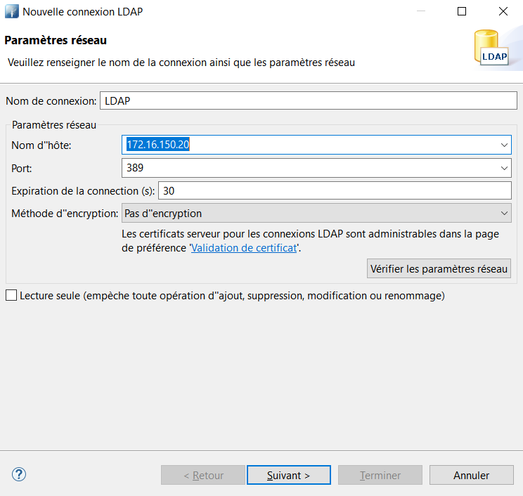
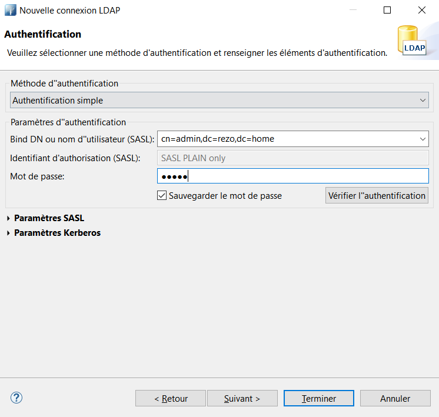
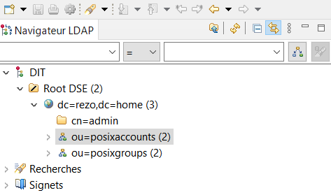

import video from "./img/install-slapd.mp4";

## Documentations et dépendances

OpenLDAP Version 2.4 - OpenLDAP Public Licence version 2.8 - [Documentation](https://www.openldap.org/doc/admin25/quickstart.html)

## Présentation

_LDAP_ pour *L*ightweight *D*irectory *A*ccess *P*rotocol est un annuaire qui est executé au dessus de la couche TCP/IP. LDAP est devenu une norme pour les systèmes d’annuaire, incluant un modèle de données, un modèle de nommage, un modèle fonctionnel basé sur le protocole LDAP, un modèle de sécurité et un modèle de réplication. C'est une structure arborescente dont chacun des nœuds est constitué d'attributs associés à leurs valeurs. LDAP fournit un méchanisme pour connecter, rechercher et modifier les annuaires multi-réseaux.

Le nommage des éléments constituant l'arbre (racine, branches, feuilles) reflète souvent le modèle politique, géographique ou d'organisation de la structure représentée. La tendance actuelle est d'utiliser le nommage DNS pour les éléments de base de l'annuaire (racine et premières branches, domain components ou DC). Les branches plus profondes de l'annuaire peuvent représenter des unités d'organisation ou des groupes (organizational units ou OU), des personnes (common name ou CN voir user identifier UID). L'assemblage de tous les composants (du plus précis au plus général) d'un nom forme son _distinguished name_.

LDAP utilise l’approche orienté objet ce qui implique de définir l’objet, la classe et le mécanisme d’héritage.

Un client commence une session LDAP en se connectant sur le port TCP 389 du serveur.

### Distinguished Name

L'api LDAP référence un objet LDAP par son distinguished name (ou DN). Un DN est une séquence de DN relatifs (ou RDN) connectés par des virgules.

Un RDN est un attribut associé à une valeur de la forme _attribute=value_, habituellement exprimé dans une chaine de charactère UTF-8. Le tableau suivant liste les différents attributs RDN et leur type :

| Type d'attribut        | Chaîne de caractère |
| ---------------------- | ------------------- |
| domainComponent        | DC                  |
| commonName             | CN                  |
| organizationalUnitName | OU                  |
| organizationName       | O                   |
| streetAddress          | STREET              |
| localityName           | L                   |
| stateOrProvinceName    | ST                  |
| countryName            | C                   |
| userid                 | UID                 |

Voici quelques exemples de Distinguished Name :

```make
CN=François Deloffre,OU=Marketing,DC=WholesaleSystem,DC=COM
```

```make
CN=Roselyne Bourcier,CN=admin,DC=corp,DC=WholesaleSystem,DC=COM
```

On remarque sur les 2 derniers DC tirent leur nom du nom de domaine de l'entreprise, ici **wholesalesystem.com**.

## Scénario

Dans notre exemple, nous allons créer pour la société **Rézo** le domaine _rezo.home_ avec un utilisateur nommé Jean Aimard ainsi qu'un administrateur LDAP nommé admin.

```
# organization for Rezo
    dn: dc=rezo,dc=home
    objectClass: dcObject
    objectClass: organization
    dc: rezo
    o: Rezo
```

```
        dc=home
            |
        dc=rezo
        /     \
cn=admin    ou=posixaccounts
                        \
                        uid=jean.aimard

```

## Topologie

| Machine        | OS          | Distribution | Version | Rôle         | Nom d'hôte | IP            |
| -------------- | ----------- | ------------ | ------- | ------------ | ---------- | ------------- |
| VM Virtual Box | GNU / Linux | Debian       | 10.5    | Serveur LDAP | ldap       | 172.16.150.20 |
| VM Virtual Box | GNU / Linux | Debian       | 10.5    | Client LDAP  | clientldap | 172.16.150.21 |

## Le daemon slapd - Serveur OpenLDAP

### Configuration du nom d'hôte

Sur une nouvelle machine Debian, modifier les noms d’hôte dans les fichiers suivants :

_/etc/hostname_

```make
ldap-server
```

_/etc/hosts_

```make
127.0.0.1       localhost
127.0.1.1       ldap    ldap.rezo.home
172.16.150.20   ldap    ldap.rezo.home
```

### Installation du paquet slapd

Cette commande permet d’éviter la configuration de slapd que l’on effectuera plus tard :

<AP>DEBIAN_FRONTEND=noninteractive apt -y install slapd</AP>

Les fichiers de la base de données sont situés dans ce dossier : _/var/lib/ldap_. À noter que ce dossier appartient à l’utilisateur _openldap_.

### Configuration OpenLDAP

Éditer le fichier : _/etc/ldap/ldap.conf_

```make
BASE dc=rezo,dc=home
URI ldap://ldap.rezo.home

# ou par l’ip directement, comme ceci :
# URI ldap://172.16.150.20
```

On execute la configuration de slapd qui avait été évitée lors de l’installation avec la commande suivante :

<AP>dpkg-reconfigure slapd</AP>

Voici la vidéo de la configuration slapd, on choisi le nom DNS, le nom de l'organisation, le mot de passe adminstrateur LDAP et la base de donnée :

<video controls>
  <source src={video} type="video/mp4">
    <p>
      Votre navigateur ne prend pas en charge les vidéos HTML5. Voici{" "}
      <a href={video}>un lien pour télécharger la vidéo</a>.
    </p>
  </source>
</video>

### Test du serveur LDAP

On active le daemon slapd au démarrage du serveur :

<AP>sudo systemctl enable slapd</AP>

On démarre slapd :

<AP>sudo systemctl start slapd</AP>

On vérifie que slapd écoute sur le port 389 par défaut, avec la commande suivante :

<AP>ss -lntpa</AP>

```make
State    Recv-Q   Send-Q     Local Address:Port      Peer Address:Port
LISTEN   0        128              0.0.0.0:389            0.0.0.0:*       users:(("slapd",pid=458,fd=8))
ESTAB    0        0          172.16.150.20:389      172.16.150.21:43768   users:(("slapd",pid=458,fd=12))
```

### Peuplement de l'annuaire

On installe un paquet utilitaire pou effectuer des commandes liées au service LDAP :

<AP>apt install ldap-utils</AP>

A l'aide d'un fichier ldif, on crée deux _unités d'organisations_ ou _OU_ puis un compte système avec son groupe primaire, le fichier s'appelera _ou.ldid_ :

<AP>touch ou.ldif</AP>

```
dn: ou=posixaccounts,dc=rezo,dc=home
objectclass: OrganizationalUnit

dn: ou=posixgroups,dc=rezo,dc=home
objectclass: OrganizationalUnit
```

Ce fichier contient deux OU : _posixaccounts_ (comptes Unix) et _posixgroups_ (groupes Unix). L'objet OU contient deux attributs : le DN et _l'objectclass_ qui indique que l'objet à ajouter est de type _OrganizationalUnit_. Les _objectclass_ sont définis dans les schémas.

On ajoute les _OrganizationalUnit_ dans l'annuaire :

<AP>ldapadd -x -H ldap://ldap.rezo.home -D 'cn=admin,dc=rezo,dc=home' -f ou.ldif -W</AP>

### Vérification de l'entrée

On vérifie que cela a bien été prise en compte avec la commande _ldapsearch_ permis par le paquet _ldaputils_ :

<AP>ldapsearch -xLLL</AP>

```
dn: dc=rezo,dc=home
objectClass: top
objectClass: dcObject
objectClass: organization
o: rezo.home
dc: rezo

dn: cn=admin,dc=rezo,dc=home
objectClass: simpleSecurityObject
objectClass: organizationalRole
cn: admin
description: LDAP administrator

dn: ou=posixaccounts,dc=rezo,dc=home
objectClass: organizationalUnit
ou: posixaccounts

dn: ou=posixgroups,dc=rezo,dc=home
objectClass: organizationalUnit
ou: posixgroups
```

## Administration du serveur LDAP

Pour administrer ou simplement consulter des serveurs LDAP, il est préférable d'utiliser un navigateur LDAP, bien plus agréable visuellement parlant qu’en mode texte et ne nécessitant pas de rentrer des commandes LDAP trop longues et trop complexes.

Ainsi, l'application Apache Directory Studio est un navigateur LDAP issu de la communauté libre, disponible sur plusieurs OS (Mac, Linux et Windows), s’appuyant sur Java. Voici le lien du site officiel : [directory.apache.org/studio](http://directory.apache.org/studio/)

Mais d'autres solutions existent comme FusionDirectory développée par une équipe française, voici le site : [fusiondirectory.org](https://www.fusiondirectory.org/)

## Apache Directory

Apache Directory Studio - Version 2.0.0 - Licensed under the Apache License, version 2.0.

### Connexion à l'annuaire

Après avoir installer l'application depuis ce [lien](http://directory.apache.org/studio/download/download-windows.html). Il faut configurer la connexion au serveur LDAP comme ceci :



L'authentification fait référence au compte de l'administrateur LDAP qui a été configuré lors de l'installation OpenLDAP :



### Création d'un utilisateur

A gauche dans le navigateur LDAP, nous retrouvons ce que nous avons créé précédemment :



Sur _OU=posixaccounts_, effectuer un clic-droit puis _nouveau_ et _nouvelle entrée_ puis _Créer l'entrée à partir de zéro_.

Ajouter les classes suivantes : _InetOrgPerson_, _organizationalPerson_, _Person_, _posixAccount_ et _top_.

Pour le _RDN_, sélectionner _uid_ et taper le nom de la personne séparé par un point : _jean.aimard_. Ensuite, il faut remplir les classes précédemment créés :

| Description d'attribut | Valeur            |
| ---------------------- | ----------------- |
| homeDirectory          | /home/jean.aimard |
| commonName ou cn       | jean.aimard       |
| gidNumber              | 2001              |
| sn                     | jeana             |
| uidNumber              | 2001              |

Puis _Terminer_.

On réexecute la même chose pour l'OU _posixgroups_. Ajout des classes suivantes : _posixGroup_ et _top_.

Pour le Relative Distinguished Name ou RDN, entrer _jean.aimard_. Il devrait manquer uniquement le gidNumber :

| Description d'attribut | Valeur      |
| ---------------------- | ----------- |
| commonName ou cn       | jean.aimard |
| gidNumber              | 2001        |

### Vérifier la création de l'utilisateur

Maintenant qu'un utilisateur a été créé, sur le serveur ldap on devrait pouvoir retrouver l'entrée correspondante avec la même commande que précédemment :

<AP>ldapsearch -xLLL</AP>

```
dn: dc=rezo,dc=home
objectClass: top
objectClass: dcObject
objectClass: organization
o: rezo.home
dc: rezo

dn: cn=admin,dc=rezo,dc=home
objectClass: simpleSecurityObject
objectClass: organizationalRole
cn: admin
description: LDAP administrator

dn: ou=posixaccounts,dc=rezo,dc=home
objectClass: organizationalUnit
ou: posixaccounts

dn: ou=posixgroups,dc=rezo,dc=home
objectClass: organizationalUnit
ou: posixgroups

dn: uid=jean.aimard,ou=posixaccounts,dc=rezo,dc=home
uid: jean.aimard
uidNumber: 2001
gecos: etudiant RT
mail: jean.aimard@rezo.home
homeDirectory: /home/jean.aimard
gidNumber: 2001
cn: jean.aimard
sn: jean.aimard
objectClass: inetOrgPerson
objectClass: organizationalPerson
objectClass: person
objectClass: top
objectClass: posixAccount
loginShell: /bin/bash

dn: cn=jean.aimard,ou=posixgroups,dc=rezo,dc=home
gidNumber: 2001
cn: jean.aimard
objectClass: posixGroup
objectClass: top
```
