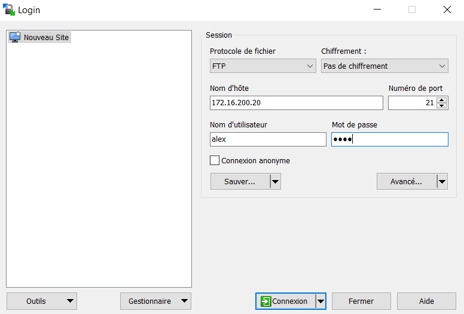
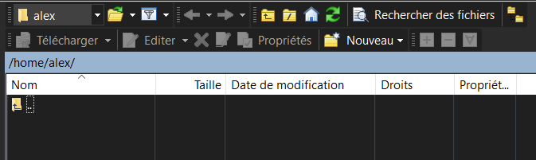
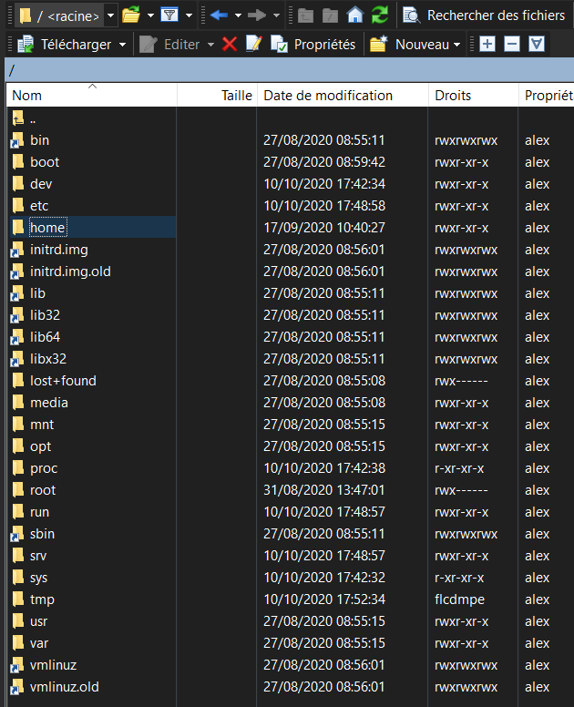
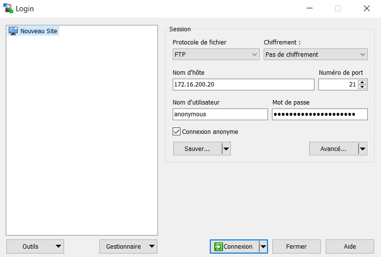
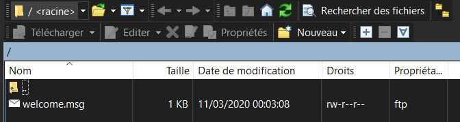

## Documentations

Licence open source - v1.3.6 - [Documentation](http://www.proftpd.org/docs/)

## Présentation

File Transfer Protocol (protocole de transfert de fichier), ou FTP, est un protocole de communication destiné au partage de fichiers sur un réseau TCP/IP. Il permet, depuis un ordinateur, de copier des fichiers vers un autre ordinateur du réseau, ou encore de supprimer ou de modifier des fichiers sur cet ordinateur. Ce mécanisme de copie est souvent utilisé pour alimenter un site web hébergé chez un tiers.

La variante de FTP protégée par les protocoles SSL ou TLS (SSL étant le prédécesseur de TLS) s'appelle FTPS.

FTP obéit à un modèle client-serveur, c'est-à-dire qu'une des deux parties, le client, envoie des requêtes auxquelles réagit l'autre, appelé serveur. En pratique, le serveur est un ordinateur sur lequel fonctionne un logiciel lui-même appelé serveur FTP, qui rend publique une arborescence de fichiers similaire à un système de fichiers UNIX. Pour accéder à un serveur FTP, on utilise un logiciel client FTP (possédant une interface graphique ou en ligne de commande).

FTP, qui appartient à la couche application du modèle OSI et du modèle ARPA, utilise une connexion TCP.

Par convention, deux ports sont attribués (well known ports) pour les connexions FTP : le port 21 pour les commandes et le port 20 pour les données. Pour le FTPS dit implicite, le port conventionnel est le 990.

Ce protocole peut fonctionner avec IPv4 et IPv6.

Il existe deux modes permettant d'établir une connexion au serveur FTP. Le mode passif et le mode actif :

En mode _actif_, c'est le client FTP qui détermine le port de connexion à utiliser pour permettre le transfert des données. Ainsi, pour que l'échange des données puisse se faire, le serveur FTP initialisera la connexion de son port de données (port 20) vers le port spécifié par le client. Le client devra alors configurer son pare-feu pour autoriser les nouvelles connexions entrantes afin que l'échange des données se fasse. De plus, il peut s'avérer problématique pour les utilisateurs essayant d'accéder à des serveurs FTP lorsque ces utilisateurs sont derrière une passerelle NAT. Étant donnée la façon dont fonctionne le NAT, le serveur FTP lance la connexion de données en se connectant à l'adresse externe de la passerelle NAT sur le port choisi. Certaines passerelles NAT n'ayant pas de correspondance pour le paquet reçu dans la table d'état, le paquet sera ignoré et ne sera pas délivré au client.

En mode _passif_, le serveur FTP détermine lui-même le port de connexion à utiliser pour permettre le transfert des données (data connexion) et le communique au client. En cas de présence d'un pare-feu devant le serveur, celui-ci devra être configuré pour autoriser la connexion de données. L'avantage de ce mode est que le serveur FTP n'initialise aucune connexion. Ce mode fonctionne sans problème avec des clients derrière une passerelle NAT. Dans les nouvelles implémentations, le client initialise et communique directement par le port 21 du serveur ; cela permet de simplifier les configurations des pare-feu serveur.

Source : [Wikipédia](https://fr.wikipedia.org/wiki/File_Transfer_Protocol)

Dans cet exemple, on utilisera ProFTPd qui est le serveur FTP libre, **puissant et parfaitement sécurisé**, comme l'annonce leur site web.

[Lien utile](https://wiki.visionduweb.fr/index.php?title=Installer_et_utiliser_un_serveur_proFTPd_pureFTPd_vsFTPd#Premi.C3.A8re_m.C3.A9thode_pour_ajouter_un_utilisateur_.C3.A0_ProFTPd)

#### Topologie

| Machine                       | OS          | Distribution  | Version | Rôle        | Nom d'hôte | IP            |
| ----------------------------- | ----------- | ------------- | ------- | ----------- | ---------- | ------------- |
| Machine Virtuelle Virtual Box | GNU / Linux | Debian        | 10.5    | Serveur FTP | ftp01      | 172.16.200.20 |
| Dell Latitude 3500            | Windows     | 10 Entreprise | 1903    | Client FTP  | L019-163   | 172.16.1.16   |

## Installation de ProFTPd

<AP>apt update</AP>

<AP>apt install proftpd-basic</AP>

Pour vérifier que le service a bien démarré :

<AP>systemctl status proftpd</AP>

Pour le lancer à chaque démarrage du système :

<AP>systemctl enable proftpd</AP>

Pour vérifier sur quel port écoute ProFTPd :

<AP>lsof -i -P</AP>

```makefile
COMMAND PID USER FD TYPE DEVICE SIZE/OFF NODE NAME
proftpd 1173 proftpd 0u IPv6 17361 0t0 TCP *:21 (LISTEN)
```

Le fichier de log se trouve là : _/var/log/proftpd/proftpd.log_

## Accès avec un utilisateur système

### Connexion simple

Pour l'instant, l'accès au serveur se fait avec un utilisateur présent dans le système. On effectue le test avec WinSCP avec notre client FTP. Par contre, l'accès avec root est refusé.





On est connecté dans le home d'Alex _/home/alex_, on peut donc créer et déposer des fichiers librement. Les droits sont repris des droits définis dans la debian. Si on essai de créer un fichier dans le dossier _/home_, on ne pourra pas contrairement à ce que nous affiche WinSCP car alex n'en est pas le propriétaire.



```makefile
lrwxrwxrwx 1 root root 7 août 27 08:55 bin -> usr/bin
drwxr-xr-x 3 root root 4096 août 27 08:59 boot
drwxr-xr-x 17 root root 3200 oct. 10 17:42 dev
drwxr-xr-x 75 root root 4096 oct. 10 17:48 etc
*drwxr-xr-x 5 root root 4096 sept. 17 10:40 home*
lrwxrwxrwx 1 root root 31 août 27 08:56 initrd.img -> boot/initrd.img-4.19.0-10-amd64
lrwxrwxrwx 1 root root 31 août 27 08:56 initrd.img.old -> boot/initrd.img-4.19.0-10-amd64
lrwxrwxrwx 1 root root 7 août 27 08:55 lib -> usr/lib
lrwxrwxrwx 1 root root 9 août 27 08:55 lib32 -> usr/lib32
lrwxrwxrwx 1 root root 9 août 27 08:55 lib64 -> usr/lib64
lrwxrwxrwx 1 root root 10 août 27 08:55 libx32 -> usr/libx32
(...)
```

_root_ est bien propriétaire du dossier _/home_.

### Enfermer l'utilisateur dans son home

Evidemment on ne veut pas que les utilisateurs puissent remonter à la racine du système, pour cela on va activer l'option pour enfermer les utilisateurs dans leur home respectif. Il va falloir modifier le fichier de configuration de ProFTPd :

<AP>nano /etc/proftpd/proftpd.conf</AP>

Et décommenter la ligne suivante :

```makefile
# Use this to jail all users in their homes
DefaultRoot ~
```

Le charactère tilde `~` dans le système Linux signifie le home de l'utilisateur courant.

<AP>systemctl restart proftpd</AP>

L'accès est maintenant limité au dossier _home_ de chaque utilisateur.

### Empêcher l'utilisateur de se connecter en ssh

En créant un utilisateur système sur la machine directement pour qu'il puisse accéder à son FTP, on rend possible pour ce même utilisateur la connexion en SSH, ce que l'on souhaite éviter. Pour remédier à cela, on va créer un utilisateur mais en lui associant un shell qui n'existe pas. Pour le créer on va se rendre dans _/etc/shells_ et ajouter un faux shell en ajoutant cette ligne : _/bin/false_.

```makefile
# /etc/shells: valid login shells
/bin/sh
/bin/bash
/usr/bin/bash
/bin/rbash
/usr/bin/rbash
/bin/dash
/usr/bin/dash
/bin/false
```

Lors de la création de l'utilisateur, on va spécifier ce faux shell :

<AP>adduser --shell /bin/false test</AP>

On déclare notre utilisateur normalement, mais lorsque l'on tente une connexion ssh :

<AP>ssh test@172.16.200.20</AP>

```makefile
test@172.16.200.20's password:
Linux ftp01 4.19.0-10-amd64 #1 SMP Debian 4.19.132-1 (2020-07-24) x86_64

The programs included with the Debian GNU/Linux system are free software;
the exact distribution terms for each program are described in thev individual files in /usr/share/doc/*/copyright.

Debian GNU/Linux comes with ABSOLUTELY NO WARRANTY, to the extent
permitted by applicable law.
Connection to 172.16.200.20 closed.
```

La connexion se ferme même si on a rentré le mot de passe.

## Accès avec un utilisateur virtuel

Si on ne souhaite pas créer des utilisateurs système pour ne pas poluer le fichier _/etc/passwd_, on peut créer des utilisateurs virtuels qui seront liés à ProFTPd. On va devoir ajouter ces lignes dans le fichier de configuration :

```makefile
AuthUserFile /etc/proftpd/ftpd.passwd
AuthGroupFile /etc/proftpd/ftpd.group
AuthOrder mod_auth_file.c
```

<AP>systemctl reload proftpd</AP>

On se rend dans le dossier _/etc/proftpd_ pour créer les dossiers _ftpd.passwd_ et _ftpd.group_.

<AP>touch ftpd.passwd && touch ftpd.group</AP>

On crée l'utilisateur virtuel avec la commande _ftpasswd_.

<AP>
  ftpasswd --passwd --name=asterix --uid=1100 --gid=1100
  --file=/etc/proftpd/ftpd.passwd --home=/home/virtualUsers/asterix
  --shell=/bin/false
</AP>

Création du groupe lié à cet utilisateur :

<AP>
  ftpasswd --group --name=asterix --gid=1100 file=/etc/proftpd/ftpd.group
  --member=asterix
</AP>

Il faut attribuer à l'utilisateur asterix les droits sur le dossier _/home/virtual.users/asterix_ avec cette commande :

<AP>chown 1100:1100 /home/virtual.users/asterix</AP>

On se connecte en FTP au serveur avec l'utilisateur Astérix et on crée un fichier nommé _helloworld_ puis on vérifie le fichier créé :

<AP>ls -l /home/virtual.users/asterix/</AP>

```makefile
-rw-r--r-- 1 1100 1100 10 oct. 12 11:04 helloworld
```

Les droits du fichier sont corrects.

## Accès en anonyme

On peut permettre à des clients n'ayant pas d'utilisateur créé sur le système du serveur ftp de se connecter en mode anonyme. Ce mode n'est pas enclenché par défaut, il faut décommenter ces lignes dans le fichier de configuration :

```makefile
<Anonymous ~ftp>
User ftp
Group nogroup
# We want clients to be able to login with "anonymous" as well as "ftp"
UserAlias anonymous ftp
# Cosmetic changes, all files belongs to ftp user
DirFakeUser on ftp
DirFakeGroup on ftp

RequireValidShell off

# Limit the maximum number of anonymous logins
MaxClients 10

# We want 'welcome.msg' displayed at login, and '.message' displayed
# in each newly chdired directory.
DisplayLogin welcome.msg
DisplayChdir .message

# Limit WRITE everywhere in the anonymous chroot
<Directory *>
<Limit WRITE>
DenyAll
</Limit>
</Directory>
# Uncomment this if you're brave.
# <Directory incoming>
# # Umask 022 is a good standard umask to prevent new files and dirs
# # (second parm) from being group and world writable.
# Umask 022 022
# <Limit READ WRITE>
# DenyAll
# </Limit>
# <Limit STOR>
# AllowAll
# </Limit>
# </Directory>
</Anonymous>
```

Puis redémarrer prodftp :

<AP>systemctl restart proftpd</AP>

On peut maintenant se connecter au serveur en mode anonyme en cochant l'option anonyme. A noter que les champs _Nom d'utilisateur_ et _Mot de passe_ sont remplis par WinSCP au moment ou la case _Connexion anonyme_ est cochée.



Le connexion anonyme est utile pour permettre au client de récupérer des fichiers sur le serveur sans avoir à créer d'utilisateur.



Nous arrivons dans un répertoire où est situé un fichier nommé _welcome.msg_. Ce fichier est situé ici : _/usr/share/proftpd/templates/welcome.msg_

Il est inclus dans la partie `<Anonymous ~ftp>` à cette ligne dans le fichier de configuration :

```makefile
DisplayLogin welcome.msg
```

## Sécuriser les dépôts avec l'antivirus ClamAV

### Installation et utilisation basique

[Documentation de ClamAV](https://www.clamav.net/documents/clam-antivirus-user-manual)

On va sécuriser notre serveur ftp avec l'ajout de l'antivirus ClamAV. Pour ce faire, on installe les paquets suivants :

<AP>apt install clamav clamav-freshclam</AP>

On arrête le service pour pouvoir mettre à jour l'antivirus :

<AP>systemctl stop clamav-freshclam</AP>

<AP>freshclam</AP>

```makefile
Mon Oct 12 14:03:14 2020 -> ClamAV update process started at Mon Oct 12 14:03:14 2020
Mon Oct 12 14:03:15 2020 -> daily.cvd database is up to date (version: 25954, sigs: 4330152, f-level: 63, builder: raynman)
Mon Oct 12 14:03:15 2020 -> main.cvd database is up to date (version: 59, sigs: 4564902, f-level: 60, builder: sigmgr)
Mon Oct 12 14:03:15 2020 -> bytecode.cvd database is up to date (version: 331, sigs: 94, f-level: 63, builder: anvilleg)
```

<AP>systemctl start clamav-freshclam</AP>

Pour scanner le home d'un utilisateur et supprimer un éventuel virus :

<AP>clamscan -r --remove /home/alex</AP>

```makefile
/home/alex/.bash_history: OK
/home/alex/.bashrc: OK
/home/alex/.bash_logout: OK
/home/alex/.profile: OK

----------- SCAN SUMMARY -----------
Known viruses: 8922999
Engine version: 0.102.4
Scanned directories: 4
Scanned files: 4
Infected files: 0
Data scanned: 0.00 MB
Data read: 0.00 MB (ratio 0.00:1)
Time: 81.609 sec (1 m 21 s)
```

On peut modifier la périodicité des mises à jour de la base antivirale avec dans le fichier de configuration : _/etc/clamav/freshclam.conf_

```makefile
# Check for new database 24 times a day
Checks 24
DatabaseMirror db.local.clamav.net
DatabaseMirror database.clamav.net
```

On peut mettre en place un scan automatique avec Crontab qui est le planificateur de tâches par défaut dans le système. On accède au fichier de configuration avec cette commande qui nous demande de choisir un éditeur :

<AP>crontab -e</AP>

Voici comment doit se constituer le fichier pour planifier les tâches :

```makefile
# Exemple d'une planification :
.---------------- minute (0 - 59)
| .------------- heure (0 - 23)
| | .---------- jour (1 - 31)
| | | .------- mois (1 - 12) OR jan,feb,mar,apr ...
| | | | .---- jour de la semaine (0 - 6) (Sunday=0 or 7) OR sun,mon,tue,wed,thu,fri,sat
| | | | |
* * * * * [Commande à utiliser]
```

Pour un scan tous les jours à 3h du matin du dossier des utilisateurs virtuels, faire :

```makefile
0 3 * * * clamscan -r --remove /home/virtual.users
```

On peut aussi déclencher cette commande au démarrage du système avec :

```makefile
@reboot clamscan -r --remove /home/virtual.users
```

### Scan automatique de l'antivirus à chaque dépôt dans le FTP

[Voir ce lien...](https://www.howtoforge.com/how-to-integrate-clamav-through-mod_clamav-into-proftpd-for-virus-scanning-on-debian-lenny)
