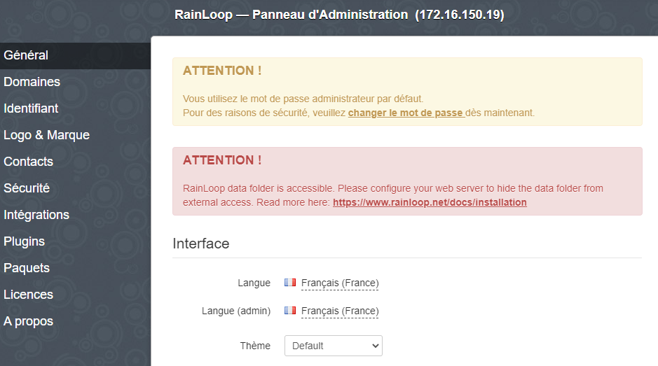
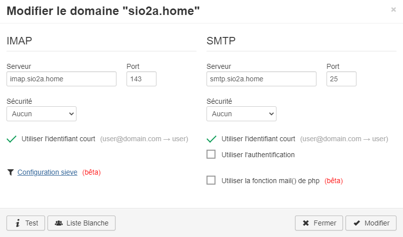
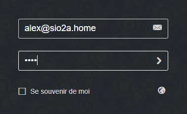
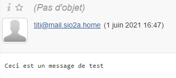
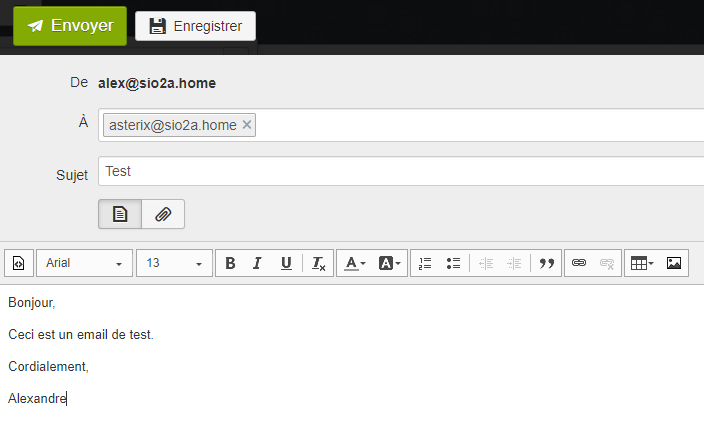
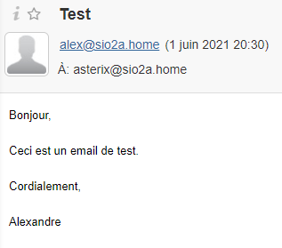
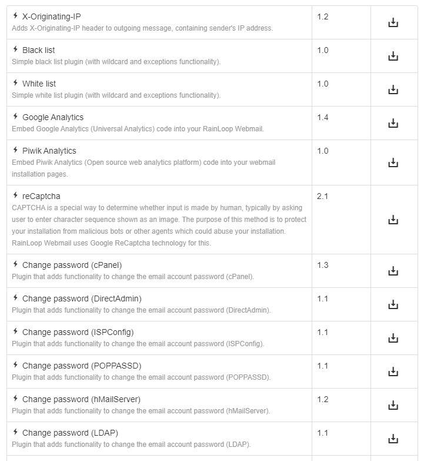

## Documentations

- POSTFIX 3.4.14 - licence IBM Public License 1.0 - [Doc](http://www.postfix.org/)
- DOVECOT 2.3.4.1 - double licence MIT et LGPL-2.1-only - [Doc](https://dovecot.org/documentation)
- RAINLOOP 1.16.0 - Community edition AGPLv3 - [Doc](https://www.rainloop.net/docs/)

## Présentation

Postfix est un serveur de messagerie électronique et un logiciel libre développé par Wietse Venema et plusieurs contributeurs. Il se charge de la livraison de courriels et a été conçu comme une alternative plus rapide, plus facile à administrer et plus sécurisée que l'historique Sendmail.

Il est le serveur de courriel par défaut dans plusieurs systèmes de type UNIX, comme Mac OS X, NetBSD3, diverses distributions GNU/Linux, etc.

Postfix utilise le protocole _SMTP_ pour _Simple Mail Transfer Protocol_ (à ne pas confondre avec SNTP pour Simple Network Time Protocol). C'est un protocole de communication utilisé pour transférer le courrier électronique vers les serveurs de messagerie électronique utilisant le port 25 sur la couche TCP. SMTP est un protocole assez simple.

## SMTP

SMTP est un protocole de livraison de courriel et ne s'occupe pas de délivrer le courriel à un client en particulier mais à l'acheminer vers un serveur. Les protocoles IMAP et POP3 ont été créé pour récupérer les courriels depuis un serveur de messagerie. Un serveur de messagerie complet se compose de plusieurs serveurs : le serveur de courrier entrant (SMTP) et celui sortant (POP ou IMAP).

### Principes

La session SMTP se compose de commandes émises par un client SMTP (l'agent initiateur, l'expéditeur ou l'émetteur) et les réponses correspondantes du serveur SMTP (l'agent d'écoute ou le récepteur) afin que la session soit ouverte et que les paramètres de session soient échangés. Une session peut inclure zéro ou plusieurs transactions SMTP. Une transaction SMTP se compose de trois séquences de commande / réponse :

_MAIL_, pour établir l'adresse de retour, également appelée return-path, reverse-path, bounce address, mfrom ou enveloppe sender.
_RCPT_, pour établir un destinataire du message. Cette commande peut être émise plusieurs fois, une pour chaque destinataire. Ces adresses font également partie de l'enveloppe.
_DATA_ pour signaler le début du texte du message, le contenu du message, par opposition à son enveloppe. Il se compose d'un en-tête de message et d'un corps de message séparés par une ligne vide. DATA est en fait un groupe de commandes, et le serveur répond deux fois: une fois à la commande DATA elle-même, pour confirmer qu'il est prêt à recevoir le texte, et la deuxième fois après la séquence de fin de données, pour accepter ou rejeter le message entier.

### Exemple

Un exemple typique d'envoi d'un message via SMTP à deux boîtes aux lettres (alice et theboss) situées dans le même domaine de messagerie (example.com ou localhost.com) est reproduit dans l'échange de session suivant. (Dans cet exemple, les parties de conversation sont préfixées avec S: et C :, respectivement pour le serveur et le client, ces étiquettes ne font pas partie de l'échange.)

Une fois que l'expéditeur du message (client SMTP) a établi un canal de communication fiable vers le récepteur du message (serveur SMTP), la session est ouverte avec un message d'accueil par le serveur, contenant généralement son nom de domaine complet (FQDN), dans ce cas smtp.example .com. Le client lance son dialogue en répondant avec une commande HELO s'identifiant dans le paramètre de la commande avec son FQDN (ou une adresse littérale si aucune n'est disponible).

```
S: 220 smtp.example.com ESMTP Postfix
C: HELO relay.example.com
S: 250 smtp.example.com, I am glad to meet you
C: MAIL FROM:<bob@example.com>
S: 250 Ok
C: RCPT TO:<alice@example.com>
S: 250 Ok
C: RCPT TO:<theboss@example.com>
S: 250 Ok
C: DATA
S: 354 End data with <CR><LF>.<CR><LF>
C: From: "Bob Example" <bob@example.com>
C: To: Alice Example <alice@example.com>
C: Cc: theboss@example.com
C: Date: Tue, 15 Jan 2008 16:02:43 -0500
C: Subject: Test message
C:
C: Hello Alice.
C: This is a test message with 5 header fields and 4 lines in the message body.
C: Your friend,
C: Bob
C: .
S: 250 Ok: queued as 12345
C: QUIT
S: 221 Bye
{The server closes the connection}
```

Le client informe le destinataire de l'adresse e-mail d'origine du message dans une commande _MAIL FROM_. Il s'agit également de l'adresse de retour ou de renvoi au cas où le message ne pourrait pas être livré. Dans cet exemple, le message électronique est envoyé à deux boîtes aux lettres sur le même serveur SMTP: une pour chaque destinataire répertorié dans les champs d'en-tête À et Cc. La commande SMTP correspondante est _RCPT TO_. Chaque réception et exécution réussies d'une commande est acquittée par le serveur avec un code de résultat et un message de réponse (par exemple, 250 Ok).

La transmission du corps du message électronique est initiée par une commande _DATA_ après quoi elle est transmise textuellement ligne par ligne et se termine par une séquence de fin de données. Cette séquence se compose d'une nouvelle ligne `<CR> <LF>`, d'un seul point (point), suivi d'une autre nouvelle ligne. Puisqu'un corps de message peut contenir une ligne avec juste un point dans le cadre du texte, le client envoie deux points à chaque fois qu'une ligne commence par un point; en conséquence, le serveur remplace chaque séquence de deux périodes au début d'une ligne par une seule. Une telle méthode d'échappement est appelée dot-stuffing.

La réponse positive du serveur à la fin des données, comme illustré, implique que le serveur a pris la responsabilité de délivrer le message. Un message peut être doublé s'il y a une panne de communication à ce moment, par ex. en raison d'une panne de courant: tant que l'expéditeur n'a pas reçu cette 250 réponse, il doit supposer que le message n'a pas été remis. En revanche, une fois que le destinataire a décidé d'accepter le message, il doit supposer que le message lui a été remis. Ainsi, pendant cette période, les deux agents ont des copies actives du message qu'ils essaieront de délivrer. La probabilité qu'un échec de communication se produise exactement à cette étape est directement proportionnelle à la quantité de filtrage que le serveur effectue sur le corps du message, le plus souvent à des fins anti-spam. Le délai d'expiration limite est spécifié à 10 minutes.

La commande _QUIT_ met fin à la session. Si l'e-mail a d'autres destinataires situés ailleurs, le client effectue un _QUIT_ et se connecte à un serveur SMTP approprié pour les destinataires suivants une fois que la ou les destinations actuelles ont été mises en file d'attente. Les informations que le client envoie dans les commandes _HELO_ et _MAIL FROM_ sont ajoutées (non vues dans l'exemple de code) en tant que champs d'en-tête supplémentaires au message par le serveur de réception. Il ajoute respectivement un champ d'en-tête _Received_ et _Return-Path_.

Certains clients sont implémentés pour fermer la connexion une fois le message accepté (250 Ok: mis en file d'attente comme 12345), de sorte que les deux dernières lignes peuvent en fait être omises. Cela provoque une erreur sur le serveur lors de la tentative d'envoi de la réponse 221.

## POP

Le protocole POP pour _Post Office Protocol_ permet de récupérer les courriers électroniques situés sur un serveur de messagerie électronique. Il se connecte au serveur de messagerie, s'authentifie, récupère le courrier, **peut** effacer le courrier sur le serveur, et se déconnecte. Cette opération transite sur un réseau TCP/IP et utilise le protocole de transfert TCP via le port 110. Ce protocole a été réalisé en plusieurs versions, respectivement POP1, POP2 et actuellement POP3. Ce protocole est défini par la RFC 1939.

## IMAP

Le protocole _Interactive Message Access Protocol_ est un peu l’inverse du protocole POP, c’est à dire qu’il garde une connexion constante au serveur de messagerie pour pouvoir consulter ses mails. Ce protocole synchronise en permanence les messages contenus sur le serveur et sur le poste de travail. Son avantage réside donc dans la possibilité de consulter ses mails depuis n’importe quel endroit et de pouvoir synchroniser et sauvegarder ses messages sur le serveur.

## Choisir entre POP et IMAP

La grande différence entre les protocoles de messagerie POP et IMAP est que POP télécharge les messages sur le serveur et vient les stocker en local, sur votre poste de travail, alors que le protocole IMAP opère une synchronisation constante entre votre poste de travail et le serveur.

Le protocole IMAP s’avère souvent plus pertinent pour plusieurs raisons :

- Les messages restent stockés sur le serveur, ils donc sont sauvegardés dans la limite du stockage existant sur votre serveur.
- En cas de problème sur votre poste de travail, aucun de vos mails ne sera perdu.
- IMAP gère les sous-dossiers distants, c’est à dire que vous retrouvez votre organisation de boîte aux lettres partout.
- La synchronisation permanente permet une gestion très fine de vos messages. Par exemple, si sur votre mobile vous passez un message en « non lu », il le sera aussi automatiquement sur votre poste de travail.

## Mise en situation et pré-requis

Le but est de pouvoir envoyer des courriels avec Postfix puis de les récupérer avec un serveur IMAP/POP tel que Dovecot, puis Rainloop sera utilisé en tant que webmail IMAP/POP pour télécharger les courriels reçus. Le système de messagerie sera composé de :

- un MUA (Mail User Agent) chargé de poster et lire le courrier (Rainloop).
- un MTA (Mail Transfer Agent) chargé de transférer un message d’un ordinateur à l’autre (Postfix).
- Un MDA (Mail Delivery Agent) chargé de délivrer le message provenant du MTA dans une boîte aux lettres (Procmail).
- un serveur POP (Post Office Protocol) chargé du courrier sortant (Dovecot).

| Machine        | OS          | Distribution | Version | Rôle                    | Nom d'hôte | IP            |
| -------------- | ----------- | ------------ | ------- | ----------------------- | ---------- | ------------- |
| VM Virtual Box | GNU / Linux | Debian       | 10.5    | Serveur DNS             | ns1        | 172.16.150.16 |
| VM Virtual Box | GNU / Linux | Debian       | 10.5    | Serveur SMTP, POP, IMAP | mail       | 172.16.150.19 |

Avant de pouvoir mettre en place un serveur de courriel, il est nécessaire d'avoir un serveur DNS car il s'en servira pour l'acheminement des courriels.

[Ce lien est une procédure pour l'installation et la configuration d'un serveur DNS.](/blog/services-web/bind9-sous-debian-10-buster) Les parties suivantes montrent la configuration pour notre situation :

### Définition des hôtes

_etc/hosts_

```
127.0.0.1       localhost
127.0.1.1       ns1.sio2a.home  ns1
172.16.150.16   ns1.sio2a.home  ns1

# The following lines are desirable for IPv6 capable hosts
::1     localhost ip6-localhost ip6-loopback
ff02::1 ip6-allnodes
ff02::2 ip6-allrouters
```

### Déclaration des zones

_/etc/bind/named.conf.local_

```shell
// Résolution directe :
zone "sio2a.home" IN {
        type master;
        notify yes;
        file "db.sio2a.home";
        allow-update {none;};
};

// Résolution inversée :
zone "16.172.in-addr.arpa" IN {
        type master;
        notify yes;
        file "rev.sio2a.home";
        allow-update {none;};
};
```

### Enregistrement des résolutions directes

_/var/cache/bind/db.sio2a.home_

```
$TTL 86400
@   IN  SOA   dns.sio2a.home.   root.sio2a.home. (
        2020090302 ; numéro de série
        1w ; rafraîchissement
        1d ; nouvel essai
        4w ; expiration (quatre semaines)
        1d ; minimum dune journée
)
@               IN      NS      ns1.sio2a.home.
ns1             IN      A       172.16.150.16
mail            IN      A       172.16.150.19
webmail         IN      CNAME   mail
pop             IN      CNAME   mail
smtp            IN      CNAME   mail
imap            IN      CNAME   mail
sio2a.home.     IN      MX      10      mail
```

L'enregistrement de type _MX_ pour Mail eXchange est nécessaire pour spécifier au DNS à quel serveur SMTP il faudra envoyer les courriels. ici en conséquence, tous les courriels à destination de *nimporte-qui@sio2a.home* seront envoyé à la machine appelé _mail_.

### Enregistrement des résolutions inversées

_/var/cache/bind/rev.sio2a.home_

```
$TTL 86400
@ IN SOA dns.sio2a.home. root.sio2a.home. (
        2020090302 ; numéro de série AAAAMMDDSS
        1w ; rafraîchissement
        1d ; nouvel essai
        4w ; expiration (quatre semaines)
        1d ; minimum dune journée
)
@               IN      NS      ns1.sio2a.home.
ns1.sio2a.home. IN      A       172.16.150.16
16.150          IN      PTR     ns1.sio2a.home.
19.150          IN      PTR     mail.sio2a.home.
```

## Postfix

### Installation

L'installation se fait grâce à la commande suivante :

<AP>sudo apt install postfix -y</AP>

La configuration du paquet se fait avec :

<AP>dpkg-reconfigure postfix</AP>

Informations à renseigner lors de l'installation de Postfix

| Questions                                                          | Réponses                                                     |
| ------------------------------------------------------------------ | ------------------------------------------------------------ |
| Nom de courrier                                                    | mail.sio2a.home                                              |
| Destinataire des mails pour root                                   | admin@sio2a.home                                             |
| Autres destinataires                                               | mail.sio2a.home, localhost.sio2a.home, localhost, sio2a.home |
| Forcer la mise à jour de la synchronisation de la file d’attente ? | Oui                                                          |
| Utiliser Procmail ?                                                | Non                                                          |

### Configuration

Il s'agit d'éditer le fichier de configuration de Postfix situé ici _/etc/postfix/main.cf_ pour y ajouter les champs suivants :

- Nom du serveur pleinement qualité : _myhostname = mail.sio2a.home_
- Nom du courrier : _mydestination = mail, mail.sio2a.home, localhost.sio2a.home, localhost, sio2a.home_
- La portée de l’écoute : _inet_interfaces = localhost_
- On indique où sera stocké le courrier pour chaque utilisateur : _home_mailbox = MailDir/_

Voici le fichier de configuration édité :

```make
# See /usr/share/postfix/main.cf.dist for a commented, more complete version


# Debian specific:  Specifying a file name will cause the first
# line of that file to be used as the name.  The Debian default
# is /etc/mailname.
#myorigin = /etc/mailname

smtpd_banner = $myhostname ESMTP $mail_name (Debian/GNU)
biff = no

# appending .domain is the MUA's job.
append_dot_mydomain = no

# Uncomment the next line to generate "delayed mail" warnings
#delay_warning_time = 4h

readme_directory = no

# See http://www.postfix.org/COMPATIBILITY_README.html -- default to 2 on
# fresh installs.
compatibility_level = 2

# TLS parameters
smtpd_tls_cert_file=/etc/ssl/certs/ssl-cert-snakeoil.pem
smtpd_tls_key_file=/etc/ssl/private/ssl-cert-snakeoil.key
smtpd_use_tls=yes
smtpd_tls_session_cache_database = btree:${data_directory}/smtpd_scache
smtp_tls_session_cache_database = btree:${data_directory}/smtp_scache

# See /usr/share/doc/postfix/TLS_README.gz in the postfix-doc package for
# information on enabling SSL in the smtp client.

smtpd_relay_restrictions = permit_mynetworks permit_sasl_authenticated defer_unauth_destination
myhostname = mail.sio2a.home
alias_maps = hash:/etc/aliases
alias_database = hash:/etc/aliases
myorigin = /etc/mailname
mydestination = mail.sio2a.home, localhost.sio2a.home, localhost, sio2a.home
relayhost =
mynetworks = 127.0.0.0/8 [::ffff:127.0.0.0]/104 [::1]/128
mailbox_size_limit = 51200000
recipient_delimiter =
inet_interfaces = all
inet_protocols = all
home_mailbox = MailDir/
```

On relance le serveur avec :

<AP>systemctl restart postfix</AP>

Puis on affiche la configuration en cours avec :

<AP>postconf -n</AP>

Ce qui nous donne :

```make
alias_database = hash:/etc/aliases
alias_maps = hash:/etc/aliases
append_dot_mydomain = no
biff = no
compatibility_level = 2
home_mailbox = MailDir/
inet_interfaces = all
inet_protocols = all
mailbox_size_limit = 51200000
mydestination = mail.sio2a.home, localhost.sio2a.home, localhost, sio2a.home
myhostname = mail.sio2a.home
mynetworks = 127.0.0.0/8 [::ffff:127.0.0.0]/104 [::1]/128
myorigin = /etc/mailname
readme_directory = no
recipient_delimiter =
relayhost =
smtp_tls_session_cache_database = btree:${data_directory}/smtp_scache
smtpd_banner = $myhostname ESMTP $mail_name (Debian/GNU)
smtpd_relay_restrictions = permit_mynetworks permit_sasl_authenticated defer_unauth_destination
smtpd_tls_cert_file = /etc/ssl/certs/ssl-cert-snakeoil.pem
smtpd_tls_key_file = /etc/ssl/private/ssl-cert-snakeoil.key
smtpd_tls_session_cache_database = btree:${data_directory}/smtpd_scache
smtpd_use_tls = yes
```

## Test d'envoi de courriel

On va utiliser le protocole Telnet pour en localhost sur le port 25 pour envoyer un email à un utilisateur présent sur la machine :

### Envoi via Telnet

<AP>telnet 127.0.0.1 25</AP>

```
Trying 127.0.0.1...
Connected to 127.0.0.1.
Escape character is '^]'.
220 mail.sio2a.home ESMTP Postfix (Debian/GNU)
mail from: titi
250 2.1.0 Ok
rcpt to: alex
250 2.1.5 Ok
data
354 End data with <CR><LF>.<CR><LF>
Ceci est un message de test
.
250 2.0.0 Ok: queued as 966396F3A
quit
221 2.0.0 Bye
Connection closed by foreign host.
```

### Lecture du courrier

On a donc envoyer un mail en local à l'utilisateur Alex, l'email en question devrait se trouver dans son home :

<AP>ls /home/alex/MailDir/new/</AP>

```make
1622558919.V806IbbM590241.mail
```

Voici le contenu du fichier envoyé :

```make
Return-Path: <titi@mail.sio2a.home>
X-Original-To: alex
Delivered-To: alex@mail.sio2a.home
Received: from localhost (localhost [127.0.0.1])
        by mail.sio2a.home (Postfix) with SMTP id 966396F3A
        for <alex>; Tue,  1 Jun 2021 16:47:59 +0200 (CEST)
Message-Id: <20210601144817.966396F3A@mail.sio2a.home>
Date: Tue,  1 Jun 2021 16:47:59 +0200 (CEST)
From: titi@mail.sio2a.home

Ceci est un message de test
```

Le courrier est au format mbox ou Maildir, Postfix a créé 3 dossiers dans le home :

- new
- tmp
- cur

## Logs

Les journaux de logs de Postfix sont situés dans _/var/log/_. Entre l'envoi et le réception du mail, tous les fichiers suivants ont été modifiés :

```make
-rw-r-----  1 root  adm    5624 juin   1 16:28 debug
-rw-r-----  1 root  adm   36330 juin   1 16:28 messages
-rw-r-----  1 root  adm   41483 juin   1 16:28 kern.log
-rw-rw-r--  1 root  utmp  31488 juin   1 16:28 wtmp
-rw-rw-r--  1 root  utmp 293168 juin   1 16:28 lastlog
-rw-r-----  1 root  adm   34451 juin   1 16:39 auth.log
-rw-r-----  1 root  adm     226 juin   1 16:43 mail.warn
-rw-r-----  1 root  adm  144482 juin   1 16:43 daemon.log
-rw-r-----  1 root  adm  112631 juin   1 16:48 syslog
-rw-r-----  1 root  adm    1267 juin   1 16:48 mail.log
-rw-r-----  1 root  adm    1267 juin   1 16:48 mail.info
```

Dans _mail.info_ ou _mail.log_, on aperçoit l'envoi et la réception :

```make
Jun  1 16:47:34 mail postfix/smtpd[951]: connect from localhost[127.0.0.1]
Jun  1 16:48:17 mail postfix/smtpd[951]: 966396F3A: client=localhost[127.0.0.1]
Jun  1 16:48:39 mail postfix/cleanup[955]: 966396F3A: message-id=<20210601144817.966396F3A@mail.sio2a.home>
Jun  1 16:48:39 mail postfix/qmgr[736]: 966396F3A: from=<titi@mail.sio2a.home>, size=318, nrcpt=1 (queue active)
Jun  1 16:48:39 mail postfix/local[956]: 966396F3A: to=<alex@mail.sio2a.home>, orig_to=<alex>, relay=local, delay=40, delays=40/0.02/0/0.01, dsn=2.0.0, status=sent (delivered to maildir)
Jun  1 16:48:39 mail postfix/qmgr[736]: 966396F3A: removed
Jun  1 16:48:48 mail postfix/smtpd[951]: disconnect from localhost[127.0.0.1] mail=1 rcpt=1 data=1 quit=1 commands=4
```

## Dovecot

Notre serveur d'envoi et de réception de mail est fonctionnel, on se chargera d'installer un serveur POP en tant qu'agent d'accès de message dans un premier temps, puis on installera l'extension IMAP. Ici Dovecot, se connectera au serveur SMTP pour récupérer le courrier et le délivrer à l'utilisateur.

<AP>apt install dovecot-common</AP>

Ce paquet est l'installation de base, on y ajoutera les modules additionels.

### dovecot-pop3d

On installe l'extension dovecot pour pop3 :

<AP>apt install dovecot-pop3d</AP>

On utilise pour commencer une politique d’authentification simple en texte clair (sans sécurité).
On édite les fichiers suivants dans _/etc/dovecot/conf.d/_ :

- _10-auth.conf_

```make
disable_plaintext_auth = no
```

- _20-pop3.conf_

```make
pop3_uidl_format = %08Xu%08Xv
```

- _10-mail.conf_

```make
mail_location = maildir:/home/%u/MailDir
```

On relance le service Dovecot :

<AP>systemctl restart dovecot</AP>

On entre la commande suivante pour vérifier sur quels ports TCP Dovecot est-il en écoute :

<AP>ss -lntp | grep -e dovecot</AP>

```make
LISTEN    0         100                0.0.0.0:995              0.0.0.0:*        users:(("dovecot",pid=423,fd=23))
LISTEN    0         100                0.0.0.0:110              0.0.0.0:*        users:(("dovecot",pid=423,fd=21))
LISTEN    0         100                   [::]:995                 [::]:*        users:(("dovecot",pid=423,fd=24))
LISTEN    0         100                   [::]:110                 [::]:*        users:(("dovecot",pid=423,fd=22))
```

Les résultats sont doublés car on écoute en IPv4 et IPv6. _110_ est le port par défaut de POP3 et _995_ est sa version TLS/SSL chiffrés soit POP3S.

### Test POP avec Telnet

On effectue un test toujours avec Telnet mais cette fois ci sur le port 110 :

<AP>telnet 127.0.0.1 110</AP>

```
Trying 127.0.0.1...
Connected to 127.0.0.1.
Escape character is '^]'.
+OK Dovecot (Debian) ready.
USER alex
+OK
PASS alex
+OK Logged in.
LIST
+OK 2 messages:
1 400
2 412
.
RETR 1
+OK 400 octets
Return-Path: <titi@mail.sio2a.home>
X-Original-To: alex
Delivered-To: alex@mail.sio2a.home
Received: from localhost (localhost [127.0.0.1])
        by mail.sio2a.home (Postfix) with SMTP id 278EA5B08
        for <alex>; Tue, 29 Sep 2020 11:23:00 +0200 (CEST)
Message-Id: <20200929092315.278EA5B08@mail.sio2a.home>
Date: Tue, 29 Sep 2020 11:23:00 +0200 (CEST)
From: titi@mail.sio2a.home

Message de test
.
STAT
+OK 2 812
CAPA
+OK
CAPA
TOP
UIDL
RESP-CODES
PIPELINING
AUTH-RESP-CODE
.
quit
+OK Logging out.
Connection closed by foreign host.
```

Voici une description générale des commandes utilisables :

- _USER alex_ : Nom du compte
- _PASS alex_ : Le mot de passe associé à ce compte
- _LIST_ : Liste les messages présents sur la boite ainsi que leur taille
- _RETR 1_ : Récupère le message numéro 1 de la liste fournie par **LIST**
- _DEL 1_ : Supprime le message numéro 1.
- _STAT_ : Fournit le nombre de message et la taille occupée par l'ensemble de ceux-ci.
- _CAPA_ : Affiche lmes informations du serveur.

### dovecot-imapd

On installe l'extension imap pour dovecot :

<AP>apt install dovecot-imapd</AP>

On redémarre dovecot avec :

<AP>systemctl restart dovecot</AP>

On entre la commande suivante pour vérifier sur quels ports TCP Dovecot est-il en écoute :

<AP>ss -lntp | grep -e dovecot</AP>

```make
LISTEN    0         100                0.0.0.0:993             0.0.0.0:*         users:(("dovecot",pid=423,fd=40))
LISTEN    0         100                0.0.0.0:995             0.0.0.0:*         users:(("dovecot",pid=423,fd=23))
LISTEN    0         100                0.0.0.0:110             0.0.0.0:*         users:(("dovecot",pid=423,fd=21))
LISTEN    0         100                0.0.0.0:143             0.0.0.0:*         users:(("dovecot",pid=423,fd=38))
LISTEN    0         100                   [::]:993                [::]:*         users:(("dovecot",pid=423,fd=41))
LISTEN    0         100                   [::]:995                [::]:*         users:(("dovecot",pid=423,fd=24))
LISTEN    0         100                   [::]:110                [::]:*         users:(("dovecot",pid=423,fd=22))
LISTEN    0         100                   [::]:143                [::]:*         users:(("dovecot",pid=423,fd=39))
```

Dovecot écoute maintenant sur les ports POP3 et IMAP, _143_ étant le port par défaut IMAP et _993_ sa version TLS/SSL chiffrés soit IMAPS.

### Test IMAP avec Telnet

On effectue un test toujours avec Telnet mais cette fois ci sur le port 143 :

<AP>telnet 127.0.0.1 143</AP>

Toutes les commandes devront être précédées d'un point.

```make
Trying 127.0.0.1...
Connected to 127.0.0.1.
Escape character is '^]'.
* OK [CAPABILITY IMAP4rev1 SASL-IR LOGIN-REFERRALS ID ENABLE IDLE LITERAL+ STARTTLS AUTH=PLAIN AUTH=LOGIN] Dovecot (Debian) ready.
. LOGIN alex alex
. OK [CAPABILITY IMAP4rev1 SASL-IR LOGIN-REFERRALS ID ENABLE IDLE SORT SORT=DISPLAY THREAD=REFERENCES THREAD=REFS THREAD=ORDEREDSUBJECT MULTIAPPEND URL-PARTIAL CATENATE UNSELECT CHILDREN NAMESPACE UIDPLUS LIST-EXTENDED I18NLEVEL=1 CONDSTORE QRESYNC ESEARCH ESORT SEARCHRES WITHIN CONTEXT=SEARCH LIST-STATUS BINARY MOVE SNIPPET=FUZZY LITERAL+ NOTIFY SPECIAL-USE] Logged in
. NAMESPACE
* NAMESPACE (("" ".")) NIL NIL
. OK Namespace completed (0.001 + 0.000 secs).
```

Voir [ici](https://www.atmail.com/blog/imap-101-manual-imap-sessions/) pour plus de détails sur TELNET IMAP.

## Rainloop Webmail

RainLoop est un client webmail libre pour le protocole IMAP écrit en PHP avec une interface moderne supportant les protocoles IMAP, SMTP et leur version SSL/TLS. [Voici le site officiel](https://www.rainloop.net/) et [là](https://mail.rainloop.net/) pour un exemple. Nous aurons donc besoin d'un serveur Web tel qu'Apache2, php7.3 et mariadb pour le stockage des utilsateurs et la configuration.

<AP>apt update</AP>

<AP>
  apt install apache2 php7.3 libapache2-mod-php7.3 php7.3-curl php7.3-xml
  mariadb-server
</AP>

### Installation via un script

Une procédure pour l'installation se trouve sur le [site officiel](https://www.rainloop.net/docs/installation/). Pour une utilisation commerciale libre et gratuite, choisir la Community Edition. Pour une installation rapide sans archive ni décompression, on va executer un script php directment depuis le site officle et l'executer sur notre machine.

<AP>curl -sL https://repository.rainloop.net/installer.php | php</AP>

### Permissions

On autorise l'application à lire et à écrire sur les fichiers présent dans _/var/www/rainloop_ :

<AP>cd /var/www/rainloop</AP>
<AP>find . -type d -exec chmod 755 {} \;</AP>
<AP>find . -type f -exec chmod 644 {} \;</AP>

On met à jour le propriétaire des dossiers de manière récursives pour _www-data_:

<AP>cd /var/www/rainloop</AP>
<AP>chown -R www-data:www-data .</AP>

### Administration

L'administration de l'application devrait être accessible depuis cette adresse : *http://172.16.150.19/?admin*



L'utilisateur par défaut est : _admin_, et le mot de passe : _12345_. Ceci est à changer absolument au plus vite dans l'onglet _Sécurité_.

Dans _Domains_, il faut renseigner notre nom de domaine, les ports SMTP et IMAP comme ceci :



### Test

Après avoir configurer l'application, nous allons essayer de nous connecter à l'utilisateur Alex :



Dans la _Boîte de réception_, on peut apercevoir le mail de test effectué avec Telnet auparavant :



Après avoir créé un utilisateur asterix dans le système, on effectue un test d'envoi de courriel :

<AP>adduser asterix</AP>



On se déconnecte pour aller sur la boite d'Asterix pour vérifier que le courriel est bien arrivé :



### Plugins

Rainloop dispose de multiples plugins pour améliorer l'application et la sécurité :


