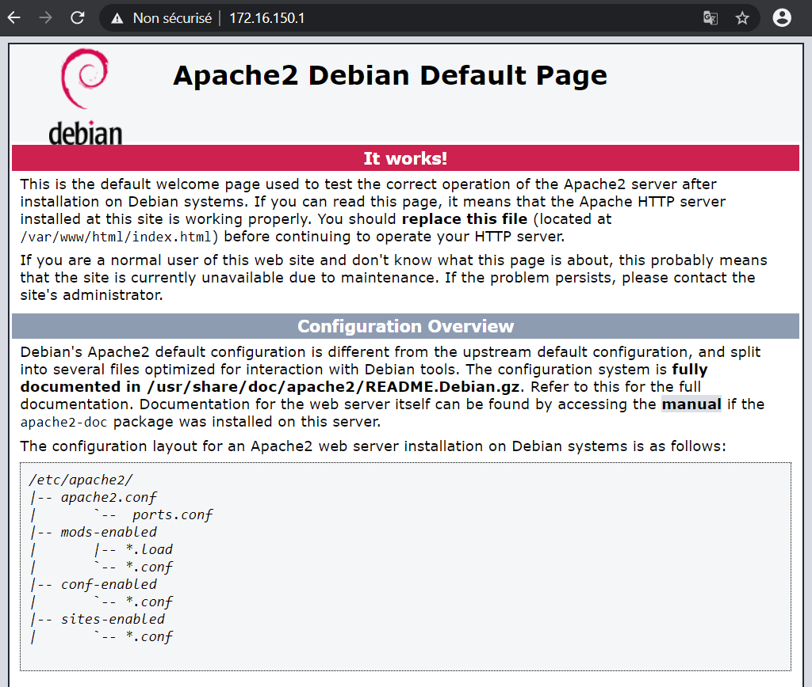
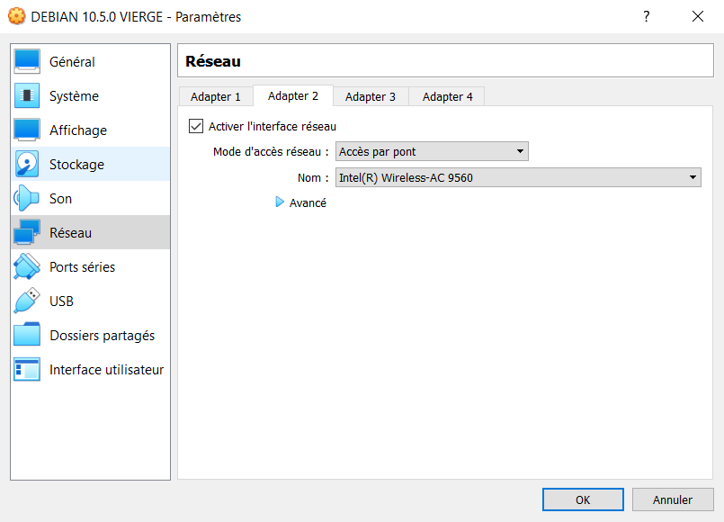
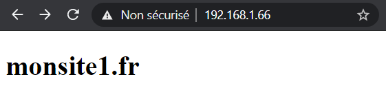
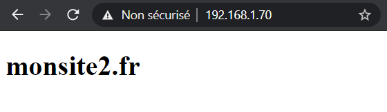
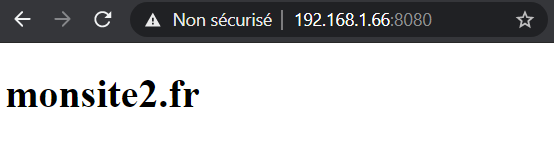

## Documentations

Version d'Apache2 2.4.38 - Licence open source - [Documentation](https://httpd.apache.org/docs/2.4/fr/)

## Présentation

[Apache2 est le serveur web le plus utilisé au monde](https://w3techs.com/technologies/overview/web_server), il utilise les protocoles de la couche application HTTP et HTTPS qui eux-mêmes utilisent le protocole TCP comme couche de transport. Par défaut, les ports 80 pour HTTP et 443 pour HTTPS sont utilisés. Apache2 est un logiciel libre et est maintenu par la [fondation Apache](https://httpd.apache.org). Il est connu pour prendre en charges des modules additifs lui donnant des fonctionnalités supplémentaires comme Perl, PHP, Python et Ruby.

#### Topologie

| Machine                       | OS          | Distribution  | Version | Rôle        | Nom d'hôte | IP           |
| ----------------------------- | ----------- | ------------- | ------- | ----------- | ---------- | ------------ |
| Machine Virtuelle Virtual Box | GNU / Linux | Debian        | 10.5    | Serveur Web | apache2    | 192.168.1.66 |
| Dell Latitude 3500            | Windows     | 10 Entreprise | 1903    | Client      | L019-163   | 192.168.1.29 |

## Installation

### Mise en route rapide

L'installation d'apache2 se fait très simplement avec la commande suivante :

<AP>apt install apache2</AP>

Le serveur est actif dés la fin de l'installation. Nous pouvons tester cela avec le client directement avec un navigateur comme Chrome ou Firefox en renseignant l'adresse ip du serveur.



C'est la page par défaut d'Apache2.

On peut vérifier la version d'Apache2 avec la commande suivante :

<AP>apache2 -v</AP>

### Descriptif des dossiers de configuration

Voici les principaux dossiers et fichiers à connaître ainsi qu'un descriptif pour chacun d'eux :

_/var/www/html/_ est le dossier par défaut qui contient la page index.html qui est disponible au lancement d'apache2. C'est dans ce dossier que l'on mettra les pages de nos sites. Pour gérer le multisite, nous créerons des sous-dossiers avec le nom de domaine de nos sites.

_/var/log/apache2/_ est le dossier où se trouve les logs répertoriés dans deux fichiers un fichier. Un nommé _access.log_, qui enregistre les hôtes visitant notre site et l'autre nommé _error.log_ qui nous renseigne sur les erreurs internes d'Apache2 notamment dues aux mauvaises configurations.

_/etc/apache2/_ est le dossier de configuration principal d'apache2, voici son contenu :

<Frame>
        *apache2.conf* est le fichier de configuration principal d'Apache2.

        *conf-available* est un dossier qui contient les fichiers de configuration disponibles et additionnels.

        *conf-enabled* est un dossier qui contient les [liens symboliques](https://wiki.debian.org/fr/SymLink) des fichiers activés dans *conf-available*.

        *envvars* contient les variables d'environnement d'Apache2. Elles ne sont pas les mêmes que celles du système Linux. Elles sont stockées et manipulées dans la structure interne d'Apache2.

        *magic* est un fichier texte qui contient les instructions MIME utilisées pour déterminer le type d'un fichier. Par exemple, video/mpeg est le type MIME pour un fichier mpeg.

        *mods-available* est un dossier qui contient les modules additionnels disponibles comme php.

        *mods-enabled* est un dossier qui contient les [liens symboliques](https://wiki.debian.org/fr/SymLink) des modules activés dans *mods-available*.

        *ports.conf* est un fichier qui spécifie à Apache2 les ports d'écoute. Par défaut, c'est le port 80 pour HTTP et le port 443 pour HTTPS.

        *sites-available* est un dossier qui contient les fichiers de configuration pour chaque site ou hôte virtuel disponible que l'administrateur activera par la suite.

        *sites-enabled* est dossier qui contient les liens symboliques vers les fichiers du dossier *sites-available* qui sont actuellement activés par Apache2.

</Frame>

## L'hébergement virtuel mutualisé

Le principe est de proposer plusieurs sites disponible à partir d'un seul serveur Apache2 ce qui permet de réaliser des économies d'adresse IP. Cette technique est largement utilisée par tous les hébergeurs web.

A la suite de l'installation d'Apache2, le site par défaut d'Apache2 est activé dans le dossier _/etc/apache2/sites-enabled_. Ce fichier s'appelle _000-default_. Nous pouvons vérifier que ce site est activé avec la commande suivante :

<AP>a2query -s</AP>

Ce qui nous donne :

```bash
000-default (enabled by site administrator)
```

Pour arrêter le site par défaut, on fera :

<AP>a2dissite /etc/apache2/sites-available/000-default</AP>

Apache2 nous répond :

```bash
Site 000-default disabled.
To activate the new configuration, you need ton run :
systemctl reload apache2
```

Faisons ce qu'Apache2 nous dit :

<AP>systemctl reload apache2</AP>

Réessayons la commande pour voir nos sites actifs :

```bash
No site matches (disabled by site administrator)
```

On va d'abord créer nos pages html pour servir les différentes méthodes d'hébergement mutualisées.

### Création des pages html

Créer un dossier pour chaque site dans le dossier _/var/www/html/_ :

<AP>cd /var/www/html</AP>

<AP>mkdir monsite1.fr && mkdir monsite2.fr</AP>

Dans le dossier _monsite1.fr_, on crée un fichier nommé _index.html_ dans lequel on inclura ce code html basique :

```html
<!DOCTYPE html>
<html lang="fr">
  <head>
    <meta charset="UTF-8" />
    <title>monsite1.fr</title>
  </head>
  <body>
    <h1>monsite1.fr</h1>
  </body>
</html>
```

Et de même pour le dossier _monsite2.fr_ :

```html
<!DOCTYPE html>
<html lang="fr">
  <head>
    <meta charset="UTF-8" />
    <title>monsite2.fr</title>
  </head>
  <body>
    <h1>monsite2.fr</h1>
  </body>
</html>
```

Pour chaque site, on n'oublie pas de créer les dossiers de logs :

<AP>mkdir monsite1.fr/logs && mkdir monsite2.fr/logs</AP>

### Par résolution de nom

Dans cet exemple, on suppose qu'il y a un DNS qui fait de la résolution de nom vers une adresse IP. [Voir ici pour la mise en place d'un serveur DNS.](/tutoriels/debian-bind9) Une autre solution serait de modifier le fichier _hosts_ de la machine cliente pour lui indiquer en dur de résoudre les noms de domaine vers une adresse IP. On créera deux fichiers de configuration, un par site dans le dossier _sites-available_. Il faudra impérativement terminer le nom du fichier par _.conf_ :

<AP>touch monsite1.fr.conf && touch monsite2.fr.conf</AP>

Configuration de _monsite1.fr.conf_ :

```makefile
<VirtualHost *:80>
        ServerName monsite1.fr
        ServerAlias www.monsite1.fr
        DocumentRoot /var/www/html/monsite1.fr
        ErrorLog /var/www/html/monsite1.fr/logs/error_log
        TransferLog /var/www/html/monsite1.fr/logs/access_log
</VirtualHost>
```

Configuration de _monsite2.fr.conf_ :

```makefile
<VirtualHost *:80>
        ServerName monsite2.fr
        ServerAlias www.monsite2.fr
        DocumentRoot /var/www/html/monsite2.fr
        ErrorLog /var/www/html/monsite2.fr/logs/error_log
        TransferLog /var/www/html/monsite2.fr/logs/access_log
</VirtualHost>
```

Dans ces 2 fichiers, on spécifie que pour tous les adresses IP arrivant avec une demande sur le port 80 définit par VirtualHost `*:80` , on regardera le nom de domaine pour savoir vers quel site rediriger la demande. Le _ServerName_ est le nom du serveur appelé par le client, ici c'est le nom de domaine. Le _ServerAlias_ est un nom de remplacement qui renvoie vers le nom du _ServerName_. Grâce à _DocumentRoot_, Apache sait où sont stocké les fichiers du site, et par défaut il affichera le contenu du fichier _index.html_. Enfin on précise le chemin pour les chemins de logs pour les accès et les erreurs.

Il ne nous reste plus qu'à activer nos sites :

<AP>a2ensite monsite1.fr.conf && a2ensite monsite2.fr.conf</AP>

On recharge Apache2 :

<AP>systemctl reload apache2</AP>

On teste :

### Par résolution d'adresse IP

Dans cet exemple, le serveur a 2 cartes réseaux avec 2 adresses IP différentes. Il ne nous restera plus qu'à spécifier pour chaque site l'adresse IP qui correspond dans le fichier de configuration. On ajoute une 2ème carte réseau à notre serveur grâce à Virtual Box mais cette manipulation pourra fonctionner sur d'autre machine virtuelle.

Il faudra tout d'abord éteindre notre VM, puis cliquer sur l'icône _configuration_, _réseau_, et l'onglet _adapter 2_. Sélectionner _Activer l'interface réseau_, choisir un mode d'accès _par pont_ et enfin choisir la carte réseau de l'ordinateur hôte sur lequel est installé Virtual Box :



Une fois notre machine virtuelle démarrée, on vérifie que l'on a bien nos 2 cartes réseaux :

<AP>ip a</AP>

```bash
1: lo: <LOOPBACK,UP,LOWER_UP> mtu 65536 qdisc noqueue state UNKNOWN group default qlen 1000
link/loopback 00:00:00:00:00:00 brd 00:00:00:00:00:00
inet 127.0.0.1/8 scope host lo
valid_lft forever preferred_lft forever
inet6 ::1/128 scope host
valid_lft forever preferred_lft forever
2: *enp0s3*: <BROADCAST,MULTICAST,UP,LOWER_UP> mtu 1500 qdisc pfifo_fast state UP group default qlen 1000
link/ether 08:00:27:3d:7f:f8 brd ff:ff:ff:ff:ff:ff
inet 192.168.1.66/24 brd 192.168.1.255 scope global dynamic enp0s3
valid_lft 86393sec preferred_lft 86393sec
inet6 fe80::a00:27ff:fe3d:7ff8/64 scope link
valid_lft forever preferred_lft forever
3: *enp0s8*: <BROADCAST,MULTICAST> mtu 1500 qdisc noop state DOWN group default qlen 1000
link/ether 08:00:27:ad:14:07 brd ff:ff:ff:ff:ff:ff
```

Ici notre 1ère carte réseau appelé _enp0s3_ est bien active mais la 2ème appelé _enp0s8_ est désactivée, aucune adresse IP ne lui a été attribuée. Il va falloir se rendre dans le fichier de configuration réseau de notre Debian :

<AP>nano /etc/network/interfaces</AP>

On modifiera le fichier comme ça :

```markdown
# This file describes the network interfaces available on your system

# and how to activate them. For more information, see interfaces(5).

source /etc/network/interfaces.d/\*

# The loopback network interface

auto lo  
iface lo inet loopback

# The primary network interface

auto enp0s3  
iface enp0s3 inet static  
address 192.168.1.66/24  
gateway 192.168.1.1

# The secondary network interface

auto enp0s8  
iface enp0s8 inet static  
address 192.168.1.70/24  
gateway 192.168.1.1
```

On spécifie pour les 2 cartes réseaux, l'adresse IP en dure sans passer par le DHCP avec le mot _static_. Ensuite on précise chaque adresse avec le masque de sous-réseau, elle doivent être différente ! Enfin l'adresse IP de la passerelle par défaut avec le mot _gateway_. On recharge notre fichier de configuration réseau avec la commande suivante :

<AP>systemctl restart networking</AP>

Si tout s'est bien passé, on n'obtient pas de retour. Si on tente notre commande d'inspection du réseau, on obtient :

<AP>ip a</AP>

```bash
1: lo: <LOOPBACK,UP,LOWER_UP> mtu 65536 qdisc noqueue state UNKNOWN group default qlen 1000
link/loopback 00:00:00:00:00:00 brd 00:00:00:00:00:00
inet 127.0.0.1/8 scope host lo
valid_lft forever preferred_lft forever
inet6 ::1/128 scope host
valid_lft forever preferred_lft forever
2: *enp0s3*: <BROADCAST,MULTICAST,UP,LOWER_UP> mtu 1500 qdisc pfifo_fast state UP group default qlen 1000
link/ether 08:00:27:3d:7f:f8 brd ff:ff:ff:ff:ff:ff
inet 192.168.1.66/24 brd 192.168.1.255 scope global dynamic enp0s3
valid_lft 86393sec preferred_lft 86393sec
inet6 fe80::a00:27ff:fe3d:7ff8/64 scope link
valid_lft forever preferred_lft forever
3: *enp0s8*: <BROADCAST,MULTICAST> mtu 1500 qdisc noop state DOWN group default qlen 1000
link/ether 08:00:27:ad:14:07 brd ff:ff:ff:ff:ff:ff
inet 192.168.1.70/24 brd 192.168.1.255 scope global enp0s8
valid_lft forever preferred_lft forever
inet6 fe80::a00:27ff:fead:1407/64 scope link
valid_lft forever preferred_lft forever
```

Nos 2 cartes réseaux disposent maintenant d'une adresse IP, on va pouvoir configurer Apache2 dans le dossier _/etc/apache2/sites-available_ :

<AP>touch monsite1.fr.conf && touch monsite2.fr.conf</AP>

Configuration de _monsite1.fr.conf_ :

```bash
<VirtualHost 192.168.1.66:80>
        DocumentRoot /var/www/html/monsite1.fr
        ErrorLog /var/www/html/monsite1.fr/logs/error_log
        TransferLog /var/www/html/monsite1.fr/logs/access_log
</VirtualHost>
```

Configuration de _monsite2.fr.conf_ :

```bash
<VirtualHost 192.168.1.70:80>
        DocumentRoot /var/www/html/monsite2.fr
        ErrorLog /var/www/html/monsite2.fr/logs/error_log
        TransferLog /var/www/html/monsite2.fr/logs/access_log
</VirtualHost>
```

Il suffit juste d'inscrire l'adresse IP pour lequel on souhaite rediriger notre site. Il ne nous reste plus qu'à activer nos sites :

<AP>a2ensite monsite1.fr.conf && a2ensite monsite2.fr.conf</AP>

On recharge Apache2 :

<AP>systemctl reload apache2</AP>

On teste avec notre navigateur client les 2 adresses IP :



### Par résolution de port

Pour la résolution de port, on va devoir spécifier à Apache2 que l'on souhaite écouter sur un port supplémentaire en plus du port 80 HTTP par défaut.

<AP>nano /etc/apache2/ports.conf</AP>

```markdown
# If you just change the port or add more ports here, you will likely also

# have to change the VirtualHost statement in

# /etc/apache2/sites-enabled/000-default.conf

Listen 80  
_Listen 8080_

<IfModule ssl_module>  
        Listen 443  
</IfModule>

<IfModule mod_gnutls.c>  
        Listen 443  
</IfModule>

# vim: syntax=apache ts=4 sw=4 sts=4 sr noet
```

Apache2 écoute maintenant sur le port 80 et 8080, on va pouvoir ajouter nos fichiers de configurations dans le dossier _/etc/apache2/sites-available_ :

<AP>touch monsite1.fr.conf && touch monsite2.fr.conf</AP>

Configuration de _monsite1.fr.conf_ :

```bash
<VirtualHost *:80>
        DocumentRoot /var/www/html/monsite1.fr
        ErrorLog /var/www/html/monsite1.fr/logs/error_log
        TransferLog /var/www/html/monsite1.fr/logs/access_log
</VirtualHost>
```

Configuration de _monsite2.fr.conf_ :

```bash
<VirtualHost *:8080>
        DocumentRoot /var/www/html/monsite2.fr
        ErrorLog /var/www/html/monsite2.fr/logs/error_log
        TransferLog /var/www/html/monsite2.fr/logs/access_log
</VirtualHost>`}
```

Cette méthode est simple, il suffit juste d'inscrire le numéro de port pour laquelle on souhaite rediriger notre site.

Il ne nous reste plus qu'à activer nos sites :

<AP>a2ensite monsite1.fr.conf && a2ensite monsite2.fr.conf</AP>

On recharge Apache2 :

<AP>systemctl reload apache2</AP>

On teste avec notre navigateur client les 2 ports attribués IP :



Le navigateur n'affiche pas le port 80 car c'est le port HTTP par défaut.

## Consultation des logs

En reprenant notre exemple ci-dessus, on peut regarder les logs présent dans le dossier _/var/www/html/monsite1.fr/logs/_, ce sont les fichiers de logs que nous avons inscrit dans le fichier de configuration _/etc/apache2/site-availables/monsite1.fr.conf_. Il y a 2 fichiers, un appelé _access_log_ qui nous donne les logs des accès qui ont été effectués pour cette page et le fichier _error_log_ qui nous donne les erreurs liés à la configuration du site.

On peut avoir un rapport en temps réel des consultations du site, cependant il faudra faire attention à ce que les logs soient régulièrement supprimés, car au fil du temps, il deviendront de plus en plus volumineux.

<AP>tail -f access\_log</AP>

```bash
192.168.1.29 - - [03/Oct/2020:11:47:43 +0200] "GET / HTTP/1.1" 200 127
192.168.1.29 - - [03/Oct/2020:12:30:48 +0200] "GET / HTTP/1.1" 200 127
192.168.1.29 - - [03/Oct/2020:12:30:52 +0200] "GET / HTTP/1.1" 200 127
192.168.1.29 - - [03/Oct/2020:12:31:39 +0200] "-" 408 -
192.168.1.29 - - [03/Oct/2020:12:33:45 +0200] "-" 408 -
192.168.1.29 - - [03/Oct/2020:12:33:45 +0200] "-" 408 -
192.168.1.29 - - [03/Oct/2020:12:43:44 +0200] "GET / HTTP/1.1" 200 127
192.168.1.29 - - [03/Oct/2020:12:44:37 +0200] "-" 408 -
192.168.1.29 - - [03/Oct/2020:12:55:26 +0200] "GET / HTTP/1.1" 200 127
192.168.1.29 - - [03/Oct/2020:12:56:19 +0200] "-" 408 -
```

On remarque ici que l'hôte _192.168.1.29_ a consulté notre site à plusieurs reprises, et que la page a été appelée en _get_ avec un code de réponse _200_ qui indique la réussite de la requête HTTP. On remarque aussi un code _408_ qui correspond à une fermeture de connexion du serveur suite à une trop longue inactivité de la part du client. [Voir ici pour une description des différents codes HTML.](https://developer.mozilla.org/fr/docs/Web/HTTP/Status)

On peut vérifier la configuration générale d'Apache2 avec la commande suivante :

<AP>apache2 -t</AP>
