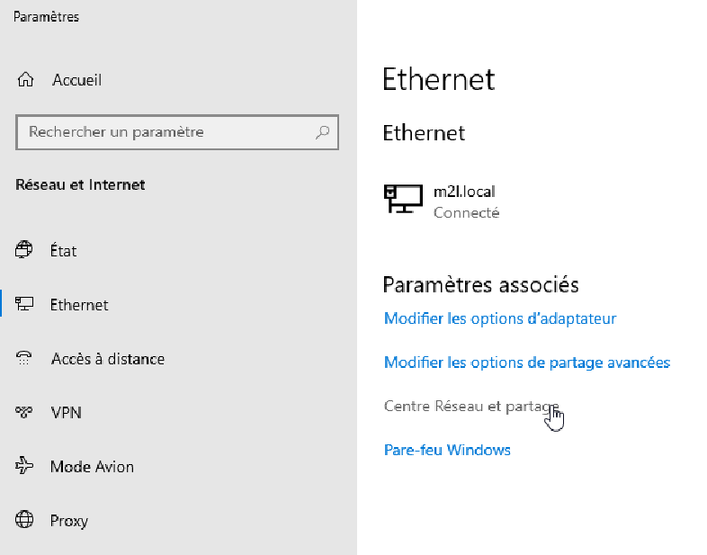
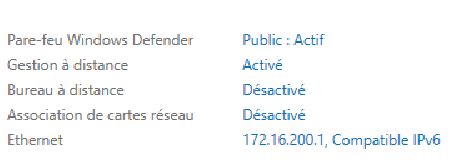

## Documentations et versions

Windows Server 2019 Version 1809 - Licence payante - [Docs](https://docs.microsoft.com/fr-fr/windows-server/)

## Présentation

Windows Server est un nom de marque pour un groupe de systèmes d'exploitation de serveur publié par Microsoft depuis 2003. La première édition de serveur de Windows à être publiée sous cette marque était Windows Server 2003. Cependant, la première édition de serveur de Windows était Windows NT 3.1 Advanced Server, suivi de Windows NT 3.5 Server, Windows NT 3.51 Server, Windows NT 4.0 Server et Windows 2000 Server. Windows 2000 Server a été la première édition de serveur à inclure Active Directory, serveur DNS, serveur DHCP, stratégie de groupe, ainsi que de nombreuses autres fonctionnalités populaires utilisées aujourd'hui.

## Récupérer l'ISO

L'image ISO de la version d'évaluation à récupérer sur le [site officiel](https://www.microsoft.com/fr-fr/evalcenter/evaluate-windows-server-2019?filetype=ISO) contre un formulaire. L'image pèse un peu moins de 5 Go.

## Installation dans Virtual Box

On crée une nouvelle machine en spécifiant *Microsoft Windows* en type et *Windows 2019 (64-bit)* en version.

Pour être à l'aise, on choisit un minimum de :

- 4096 de RAM
- 50 Go

Pour le réseau, on choisit un accès par pont pour que le serveur Windows soit considéré comme un hôte du réseau privée et non dépendant de la machine hôte sur laquelle tourne Virtual Box.

On choisit l'image préalablement téléchargée avant de démarrer.

## Démarrage de l'installation

### Préalable

- Choisir sa langue.


- Choisir sa langue.
- Cliquer sur Installer maintenant.
- Choisir *Windows Server 2019 Standard Evaluation (expérience de bureau)* sinon il faudra rentrer toutes les commandes en CLI !


- Lecture et acception du contrat de licence applicables

 

- Choisir *Personnalisé : Installer uniquement Windows (avancé)* pour une installation neuve :


### Partion des disques

- Partitionnement des disques (facultatif) :


- L'installation démarre...


### Administrateur

- Il est demandé de choisir un mot de passe administateur pour le serveur. Ce compte pourra servir plus tard pour administrer le domaine.


## Ecran d'accueil

Pour déverrouiller Windows sur Virtual Box, choisir dans le menu en haut : *Entrée*, *clavier*, *Envoyer Ctrl-Alt-Del*. Une fois le mot de passe administrateur entré, le *Gestionnaire de* serveur apparait :


## Prérequis - Gestion du serveur

### IP fixe

Toutes les principales fonctionnalités comme le domaine ADDS, DHCP et DNS nécessite une adresse IP fixe, c'est logique car si l'adresse bouge, les postes dans le domaine ne pourront plus utiliser ces services. De toute façon, Windows prévient si l'adresse ne l'est pas.

- Dans la barre des tâches à droite, effectuer un clic-droit sur l'icône réseau et choisir *Ouvrir les paramètres réseau et internet*.


- Sur la nouvelle fenêtre, choisir *Centre Réseau et partage*.



- Choisir *Modifier les paramètres de la carte*.


- Effectuer un clic-droit sur la carte réseau choisie et sélectionner *Propriétés*.


- Double cliquer sur *Protocole Internet version 4 (TCP/IPv4)*


- Passer les choix en manuels, entrer une adresse IP et son masque, la passerelle par défaut ainsi que l'adresse du serveur DNS.


### Nom d'hôte

Pour changer le nom du serveur:

- Rendez-vous sur le *Gestionnaire de serveur*. Cliquer sur le nom à droite du *Nom de l'ordinateur*.


- Donner une description à ce serveur et cliquer sur modifier :


- Donner un nom l'ordinateur, appeler la machine *DC-01* pour un contrôleur de domaine.


- Les groupes de travail sont adaptés aux réseaux plus petits tandis que les domaines sont utilisés dans les déploiements à grande échelle, comme dans les moyennes et grandes entreprises. Les groupes de travail sont faciles à implémenter alors que les domaines sont plus difficiles et prennent plus de temps à implémenter. **L'option groupe de travail est à bannir si vous voulez implémenter un contrôleur de domaine via l' ADDS**

- Le contrôle dans un domaine est centralisé sur le contrôleur de domaine, ce qui est plus sûr alors que les groupes de travail n'ont pas ce niveau de protection. **C'est l'option que l'on choisira plus tard.**

**Si le choix pose problème, d'abord activer l'ADDS et revenir ici changer le nom du serveur.**

### Bureau à distance

Pour plus de confort, on va activer le Bureau à distance pour ce serveur.

- Se rendre dans le *Gestionnaire de serveur*, *Serveur local* puis à droite du *Bureau à distance*, cliquer sur *Désactiver* en bleu.



- Choisir *Autoriser les connexions à distance à cet ordinateur* et si besoin *Sélectionnez des utilisateurs…* pour autoriser des personnes précises à se connecter au serveur en RDP.


Le bureau à distance Windows utilise le protocole Remote Desktop Protocol qui par défaut est sur le port TCP 3389.

## Active Directory Domain Service

Active Directory (AD) est un service d'annuaire développé par Microsoft pour les réseaux de domaine Windows. Il est inclus dans la plupart des systèmes d'exploitation Windows Server en tant qu'ensemble de processus et de services. Initialement, Active Directory n'était en charge que de la gestion centralisée des domaines. Cependant, Active Directory est devenu un titre générique pour un large éventail de services liés à l'identité basés sur des annuaires.

Un serveur exécutant le rôle du service de domaine Active Directory (AD DS) est appelé contrôleur de domaine. Il authentifie et autorise tous les utilisateurs et ordinateurs dans un réseau de type domaine Windows. Attribuer et appliquer des politiques de sécurité pour tous les ordinateurs et installer ou mettre à jour des logiciels. Par exemple, lorsqu'un utilisateur se connecte à un ordinateur qui fait partie d'un domaine Windows, Active Directory vérifie le mot de passe soumis et détermine si l'utilisateur est un administrateur système ou un utilisateur normal. En outre, il permet la gestion et le stockage des informations, fournit des mécanismes d'authentification et d'autorisation et établit un cadre pour déployer d'autres services connexes : services de certificats, services de fédération Active Directory, services d'annuaire légers et services de gestion des droits.

Active Directory utilise les versions 2 et 3 du protocole LDAP (Lightweight Directory Access Protocol), la version Microsoft de Kerberos et DNS.

ADDS permet la mise en place des services de domaines Active Directory, notamment par :

- Le contrôle d'accès au ressources.
- La gestion des objets (utilisateurs, ordinateurs, etc, ...).
- L'authentification des utilisateurs aux différentes ressources du domaine.

### Installation

Pour l'implémenter, se rendre dans le *Gestionnaire de serveur*, *Serveur local* puis à droite *Gérer* et *Ajouter des rôles et des fonctionnalités*.


Sur la fenêtre ouvrante, choisir *Rôle de serveurs* et sélectionner *AD DS*.


### Fonctionnalités requises

Ce choix ouvre une nouvelle fenêtre car il requiert des fonctionnalités supplémentaire comme *AD LDS* pour *Active Directory Lightweight Directory Services*. Continuer sur *Ajouter des fonctionalités*


Confirmer et cliquer sur *Suivant >*.


### DNS

ADDS nous informe qu'un service DNS est obligatoire pour son implémentation. Sur la fenêtre de confirmation, cliquer sur *Installer*.


### Contrôleur de domaine

Le contrôleur de domaine va répondre aux demandes d’authentification et contrôler les utilisateurs. Les domaines eux, sont un moyen hiérarchique d’organiser les utilisateurs et ordinateurs travaillant de concert sur le même réseau. Le contrôleur de domaine permet donc d’organiser et de sécuriser toutes les données.

Une fois l'installation terminer, on choisi de *promouvoir ce serveur en contrôleur de domaine*.


On choisi *Ajouter une nouvelle forêt* avec un nom de domaine racine de type *mondomaine.local*


Le récapitulatif :


### Script PS de déploiement ADDS

Voici le script Powershell pour le déploiement d'AD DS :

```powershell
Import-Module ADDSDeployment
Install-ADDSForest `
-CreateDnsDelegation:$false `
-DatabasePath "C:\Windows\NTDS" `
-DomainMode "WinThreshold" `
-DomainName "mondomaine.local" `
-DomainNetbiosName "MONDOMAINE" `
-ForestMode "WinThreshold" `
-InstallDns:$true `
-LogPath "C:\Windows\NTDS" `
-NoRebootOnCompletion:$false `
-SysvolPath "C:\Windows\SYSVOL" `
-Force:$true
```

Après l'installation, le serveur redémarre.

## Ajouter des utilisateurs dans le domaine

On va créer un nouvel utilisateur et lui donner tous les droits d'administration.

### Créer un utilisateur

- Dans le menu démarrer, taper *Utilisateurs et ordinateurs Active Directory*.


- Dérouler la liste du *mondomaine.local* puis dans le dossier *Users*, cliquer sur l'icône *utilisateur* en haut.


- On remplit ses informations personelles.


- On définit son mot de passe et la politique associé à celui-ci.


- L'utilisateur a bien été créé.


### Ajout de droits

Pour l'ajouter en tant qu'administrateur, il faut qu'il soit membre de certains groupes :

- Double-cliquer sur l'utilisateur.
- Aller à l'onglet *Membre de*.
- Cliquer sur *Ajouter*.
- Entrer *Admin* dans le champ puis *Vérifier les noms* pour avoir des suggestions.
- Sélectionner les groupes désirés, ajouter plusieurs groupes avec la touche *Majuscule + click*.
- Cliquer sur *OK*, puis *Appliquer* et *OK*.

Pour vérifier que l'utilisateur a bien été créé et rajouter au groupes des administrateurs, tenter de se connecter avec le *bureau à distance* en utilisant le NETBIOS : *MONDOMAINE\jean.dupont* et tenter une modification réservée aux administrateurs.


## DHCP

### Installation

Pour installer un service DHCP :

- Ouvrir le *Gestionnaire de serveur*, puis *Gérer* et *Ajouter des rôles et des fonctionnalités*.
- A l'étape *Sélection du serveur*, choisir notre serveur.
- A l'étape *Rôles de serveurs*, sélectionner *Serveur DHCP*


- une fenêtre s'ouvre, choisir *Ajouter des fonctionnalités*, puis *Suivant*.
- A l'étape *Confirmation*, cliquer sur *Installer*.


### Configuration

- Une fois l'installation terminée, sur le *Gestionnaire de serveur* en haut à droite, cliquer sur *Outils* puis *DHCP*.
- Dérouler le menu comme sur l'image, effectuer un clic-droit sur *IPv4* et choisir *Nouvelle étendue…*


- Donner un nom et une description à l'étendue.


- Choisir une étendue d'exception ou des adresses exclues.


- Sélectionner la durée du bail.


### Options

- On peut configurer des options de DHCP tels que les passerelles par défaut et les serveurs DNS. Sélectionner *Oui, je veux configurer ces options maintenant*.
- Paramétrer le ou les routeurs.


- Paramétrer le domaine parent.


- Paramétrer le serveur Wins. Une serveur de "nom" NetBIOS de Microsoft permet de maintenir et offrir aux clients la liste des ressources (machines,...) actives sur le réseau. En pratique, un serveur WINS gère une table de correspondance entre nom **Microsoft (NetBios)** et une *adresse IP* d'une machine du réseau.


- Enfin activer l'étendue, en choisissant *Oui, je veux activer cette étendue maintenant* puis *Terminer*.


